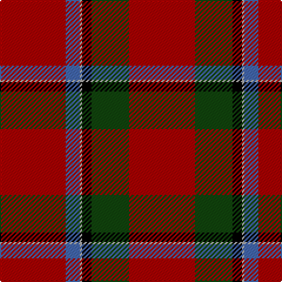

**Bands:** [RBYKGR](/stripes/rbykgr/) · **Stripes:** [R B LR K DG R](/stripes/stripes6/) R B LR K DG R

This was sourced from weddslist.  It is a [6 band tartan](/bands/bands6/).

Original link http://www.weddslist.com/cgi-bin/tartans/pg.pl?source=tinsel

## Attestations

This cloth appears in 2 source records; the oldest owns this page.

- undated — Sinclair Dress (weddslist, [record](http://www.weddslist.com/cgi-bin/tartans/pg.pl?source=tinsel))
- undated — Sinclair Dress (weddslist, [record](http://www.weddslist.com/cgi-bin/tartans/pg.pl?source=x))

## Register references

External register numbers recorded for this tartan.

- Scottish Register of Tartans: [1166](https://www.tartanregister.gov.uk/tartanDetails.aspx?ref=1166)
- Scottish Register of Tartans: [1510](https://www.tartanregister.gov.uk/tartanDetails.aspx?ref=1510)
- Scottish Register of Tartans: [1758](https://www.tartanregister.gov.uk/tartanDetails.aspx?ref=1758)
- Scottish Register of Tartans: [2307](https://www.tartanregister.gov.uk/tartanDetails.aspx?ref=2307)
- Scottish Register of Tartans: [2349](https://www.tartanregister.gov.uk/tartanDetails.aspx?ref=2349)
- Scottish Register of Tartans: [2540](https://www.tartanregister.gov.uk/tartanDetails.aspx?ref=2540)
- Scottish Register of Tartans: [2582](https://www.tartanregister.gov.uk/tartanDetails.aspx?ref=2582)
- Scottish Register of Tartans: [2585](https://www.tartanregister.gov.uk/tartanDetails.aspx?ref=2585)
- Scottish Register of Tartans: [2625](https://www.tartanregister.gov.uk/tartanDetails.aspx?ref=2625)
- Scottish Register of Tartans: [2730](https://www.tartanregister.gov.uk/tartanDetails.aspx?ref=2730)
- Scottish Register of Tartans: [2862](https://www.tartanregister.gov.uk/tartanDetails.aspx?ref=2862)
- Scottish Register of Tartans: [3072](https://www.tartanregister.gov.uk/tartanDetails.aspx?ref=3072)
- Scottish Register of Tartans: [3555](https://www.tartanregister.gov.uk/tartanDetails.aspx?ref=3555)
- Scottish Register of Tartans: [4925](https://www.tartanregister.gov.uk/tartanDetails.aspx?ref=4925)
- Scottish Register of Tartans: [696](https://www.tartanregister.gov.uk/tartanDetails.aspx?ref=696)
- Scottish Register of Tartans: [697](https://www.tartanregister.gov.uk/tartanDetails.aspx?ref=697)
- Scottish Register of Tartans: [982](https://www.tartanregister.gov.uk/tartanDetails.aspx?ref=982)
- Scottish Tartans Authority (ITI): 1277
- Scottish Tartans Authority (ITI): 1429
- Scottish Tartans Authority (ITI): 218
- Scottish Tartans Authority (ITI): 977
- Scottish Tartans World Register: 1042
- Scottish Tartans World Register: 127
- Scottish Tartans World Register: 1277
- Scottish Tartans World Register: 1399
- Scottish Tartans World Register: 1429
- Scottish Tartans World Register: 1593
- Scottish Tartans World Register: 218
- Scottish Tartans World Register: 2218
- Scottish Tartans World Register: 3061
- Scottish Tartans World Register: 441
- Scottish Tartans World Register: 737
- Scottish Tartans World Register: 858
- Scottish Tartans World Register: 864
- Scottish Tartans World Register: 873
- Scottish Tartans World Register: 897
- Scottish Tartans World Register: 977
- Scottish Tartans World Register: 978

## Variants

Other setts woven to the same stripe pattern.

- [Sinclair](/setts/s6/r30dg12k5lr2b6r30~x2/)
- [Sinclair](/setts/s6/r30dg12k5lr2b6r30/)

## Thread count
DR/56 B12 N2 K8 DG32 DR/56

## Palette
Each colour and its ΔE from the base-6 reference it is a variant of.

| Colour | Shade | Base | ΔE (OKLab) |
|---|---|---|---|
| B | <code style="background-color:#4367AE;">#4367AE</code> `#4367AE` | B <code style="background-color:#2A418A;">#2A418A</code> | 0.12 |
| DG | <code style="background-color:#11450D;">#11450D</code> `#11450D` | G <code style="background-color:#006100;">#006100</code> | 0.09 |
| DR | <code style="background-color:#AA0000;">#AA0000</code> `#AA0000` | R <code style="background-color:#CC0000;">#CC0000</code> | 0.07 |
| K | <code style="background-color:#000000;">#000000</code> `#000000` | K <code style="background-color:#000000;">#000000</code> | 0.00 |
| N | <code style="background-color:#AAAAAA;">#AAAAAA</code> `#AAAAAA` | Y <code style="background-color:#F2BF00;">#F2BF00</code> | 0.19 |

# Sample pattern

## Nearest tartans

The nearest existing variants by ΔTartan distance.

1. [Kinnaird (Name)](/setts/s6/g15k10r30dp2r20w1~x2/) — ΔT 0.49
1. [Sinclair (Logan)](/setts/s6/r28g16k4w1db6r28~x2/) — ΔT 0.62
1. [Sinclair](/setts/s6/r28g16k4w1t6r28~x2/) — ΔT 0.92
1. [Sinclair](/setts/s6/r30dg12k5lr2b6r30~x2/) — ΔT 1.04
1. [Sinclair](/setts/s6/r30dg12k5lr2b6r30/) — ΔT 1.04
1. [Sinclair](/setts/s6/r36t8w1k5g20r18~x4/) — ΔT 1.11
1. [AON](/setts/s6/r5db10r5dg5r25ly1~x4/) — ΔT 1.22
1. [Greig (Personal)](/setts/s6/r60k2w3dg20r10dg20~x2/) — ΔT 1.37
1. [Sinclair](/setts/s6/r30g12k5w2t6r30/) — ΔT 1.43
1. [MacGregor Hunting Glengyle Clan Tartan Tartan Number: 1285. Earliest known date: 1960 This is the usual MacGregor sett but with a darker crimson background colour. The story goes that Alasdair MacGregor of Cardney wanted to make tartan from the wool of his own sheep. His initial dyeing attempt produced a shocking pink colour, so he dyed the wool a second time to get this dark crimson colour. He liked the result so much that he had a bolt of cloth woven and the Cardney MacGregors have worn it ever since. The addition of the term 'Hunting' to the name is, apparently a commercial attribution. Notes from the STA, quoting Sir Malcolm MacGregor of MacGregor (2006) See products available Copyright © Blair Urquhart, Comrie, 2015](/setts/s6/m96g42m16g17k4lb6/) — ΔT 1.51

## Neighbour map

Every grey dot is one of 14313 variants placed by the first two principal components of the ΔTartan feature space (44% of its variance). Red is this tartan; blue dots are its nearest — click one to open its page.

<svg viewBox="0 0 640 380" role="img" style="max-width:100%;height:auto;border:1px solid #e0e0e0;border-radius:4px;display:block" xmlns="http://www.w3.org/2000/svg"><image href="/nn/cloud.v1.png" width="640" height="380"/><a href="/setts/s6/g15k10r30dp2r20w1~x2/"><circle cx="397.8" cy="161.7" r="4" fill="#3465a4"><title>Kinnaird (Name)</title></circle></a><a href="/setts/s6/r28g16k4w1db6r28~x2/"><circle cx="416.4" cy="156.6" r="4" fill="#3465a4"><title>Sinclair (Logan)</title></circle></a><a href="/setts/s6/r28g16k4w1t6r28~x2/"><circle cx="404.4" cy="151.9" r="4" fill="#3465a4"><title>Sinclair</title></circle></a><a href="/setts/s6/r30dg12k5lr2b6r30~x2/"><circle cx="420.1" cy="182.7" r="4" fill="#3465a4"><title>Sinclair</title></circle></a><a href="/setts/s6/r30dg12k5lr2b6r30/"><circle cx="420.1" cy="182.7" r="4" fill="#3465a4"><title>Sinclair</title></circle></a><a href="/setts/s6/r36t8w1k5g20r18~x4/"><circle cx="380.5" cy="147.5" r="4" fill="#3465a4"><title>Sinclair</title></circle></a><a href="/setts/s6/r5db10r5dg5r25ly1~x4/"><circle cx="454.3" cy="166.1" r="4" fill="#3465a4"><title>AON</title></circle></a><a href="/setts/s6/r60k2w3dg20r10dg20~x2/"><circle cx="420.0" cy="151.1" r="4" fill="#3465a4"><title>Greig (Personal)</title></circle></a><a href="/setts/s6/r30g12k5w2t6r30/"><circle cx="401.2" cy="169.4" r="4" fill="#3465a4"><title>Sinclair</title></circle></a><a href="/setts/s6/m96g42m16g17k4lb6/"><circle cx="430.1" cy="167.9" r="4" fill="#3465a4"><title>MacGregor Hunting Glengyle Clan Tartan Tartan Number: 1285. Earliest known date: 1960 This is the usual MacGregor sett but with a darker crimson background colour. The story goes that Alasdair MacGregor of Cardney wanted to make tartan from the wool of his own sheep. His initial dyeing attempt produced a shocking pink colour, so he dyed the wool a second time to get this dark crimson colour. He liked the result so much that he had a bolt of cloth woven and the Cardney MacGregors have worn it ever since. The addition of the term 'Hunting' to the name is, apparently a commercial attribution. Notes from the STA, quoting Sir Malcolm MacGregor of MacGregor (2006) See products available Copyright © Blair Urquhart, Comrie, 2015</title></circle></a><circle cx="424.4" cy="165.6" r="5" fill="#c00000"/></svg>

ID: /setts/s6/r28dg16k4lr1b6r28~x2/
