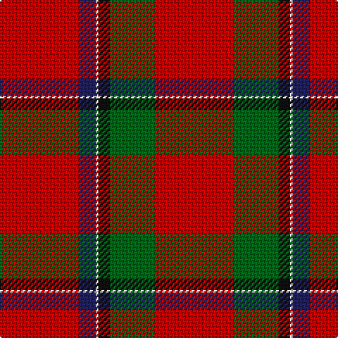

In pattern [RBWKGR](/stripes/rbwkgr/).

This was sourced from register-of-tartans.  It is a [6 stripe tartan](/stripes/stripes6/).

Original link https://www.tartanregister.gov.uk/tartanDetails.aspx?ref=3791

## Attestations

This cloth appears in 2 source records; the oldest owns this page.

- 01/01/1830 — Sinclair (Logan) (register-of-tartans, [record](https://www.tartanregister.gov.uk/tartanDetails.aspx?ref=3791))
- 1830 — Sinclair (Clan) (tartans-authority, [record](http://www.tartansauthority.com/tartan-ferret/display/1436/))

## Register references

External register numbers recorded for this tartan.

- Scottish Register of Tartans: [3791](https://www.tartanregister.gov.uk/tartanDetails.aspx?ref=3791)
- Scottish Tartans Authority (ITI): 1436
- Scottish Tartans World Register: 1436

## Thread count
R/56 G32 K8 LN2 DB12 R/56

## Palette
Each colour and the base-6 reference it is a variant of.

| Colour | Shade | Base |
|---|---|---|
| DB | <code style="background-color:#202060;">#202060</code> `oklch(28.9% 0.111 276.9)` <small>#202060</small> | B <code style="background-color:#2A418A;">#2A418A</code> |
| G | <code style="background-color:#006818;">#006818</code> `oklch(45.0% 0.142 145.0)` <small>#006818</small> | G <code style="background-color:#006100;">#006100</code> |
| K | <code style="background-color:#101010;">#101010</code> `oklch(17.3% 0.000 89.9)` <small>#101010</small> | K <code style="background-color:#000000;">#000000</code> |
| LN | <code style="background-color:#E0E0E0;">#E0E0E0</code> `oklch(90.7% 0.000 89.9)` <small>#E0E0E0</small> | W <code style="background-color:#F7F7F7;">#F7F7F7</code> |
| R | <code style="background-color:#C80000;">#C80000</code> `oklch(52.3% 0.215 29.2)` <small>#C80000</small> | R <code style="background-color:#CC0000;">#CC0000</code> |

# Sample pattern

## Nearest tartans

The nearest existing variants by ΔTartan distance.

1. [Sinclair](/setts/s6/r28g16k4w1t6r28~x2/) — ΔT 0.46
1. [Sinclair Dress](/setts/s6/r28dg16k4lr1b6r28~x2/) — ΔT 0.62
1. [Sinclair Dress](/setts/s6/r28dg16k4lr1b6r28/) — ΔT 0.62
1. [Kinnaird (Name)](/setts/s6/g15k10r30dp2r20w1~x2/) — ΔT 0.68
1. [Sinclair](/setts/s6/r36t8w1k5g20r18~x4/) — ΔT 0.96
1. [AON](/setts/s6/r5db10r5dg5r25ly1~x4/) — ΔT 1.10
1. [Sinclair](/setts/s6/r30g12k5w2t6r30/) — ΔT 1.12
1. [Sinclair](/setts/s6/r30dg12k5lr2b6r30~x2/) — ΔT 1.12
1. [Sinclair](/setts/s6/r30dg12k5lr2b6r30/) — ΔT 1.12
1. [Greig (Personal)](/setts/s6/r60k2w3dg20r10dg20~x2/) — ΔT 1.32

## Neighbour map

Every grey dot is one of 14299 variants placed by the first two principal components of the ΔTartan feature space (44% of its variance). Red is this tartan; blue dots are its nearest — click one to open its page.

<svg viewBox="0 0 640 380" role="img" style="max-width:100%;height:auto;border:1px solid #e0e0e0;border-radius:4px;display:block" xmlns="http://www.w3.org/2000/svg"><image href="/nn/cloud.v1.png" width="640" height="380"/><a href="/setts/s6/r28g16k4w1t6r28~x2/"><circle cx="404.0" cy="151.7" r="4" fill="#3465a4"><title>Sinclair</title></circle></a><a href="/setts/s6/r28dg16k4lr1b6r28~x2/"><circle cx="424.1" cy="165.5" r="4" fill="#3465a4"><title>Sinclair Dress</title></circle></a><a href="/setts/s6/r28dg16k4lr1b6r28/"><circle cx="424.1" cy="165.5" r="4" fill="#3465a4"><title>Sinclair Dress</title></circle></a><a href="/setts/s6/g15k10r30dp2r20w1~x2/"><circle cx="397.5" cy="161.6" r="4" fill="#3465a4"><title>Kinnaird (Name)</title></circle></a><a href="/setts/s6/r36t8w1k5g20r18~x4/"><circle cx="380.1" cy="147.4" r="4" fill="#3465a4"><title>Sinclair</title></circle></a><a href="/setts/s6/r5db10r5dg5r25ly1~x4/"><circle cx="453.9" cy="165.9" r="4" fill="#3465a4"><title>AON</title></circle></a><a href="/setts/s6/r30g12k5w2t6r30/"><circle cx="400.8" cy="169.2" r="4" fill="#3465a4"><title>Sinclair</title></circle></a><a href="/setts/s6/r30dg12k5lr2b6r30~x2/"><circle cx="419.7" cy="182.6" r="4" fill="#3465a4"><title>Sinclair</title></circle></a><a href="/setts/s6/r30dg12k5lr2b6r30/"><circle cx="419.7" cy="182.6" r="4" fill="#3465a4"><title>Sinclair</title></circle></a><a href="/setts/s6/r60k2w3dg20r10dg20~x2/"><circle cx="419.6" cy="150.9" r="4" fill="#3465a4"><title>Greig (Personal)</title></circle></a><circle cx="416.0" cy="156.4" r="5" fill="#c00000"/></svg>

ID: /setts/s6/r28g16k4w1db6r28~x2/
