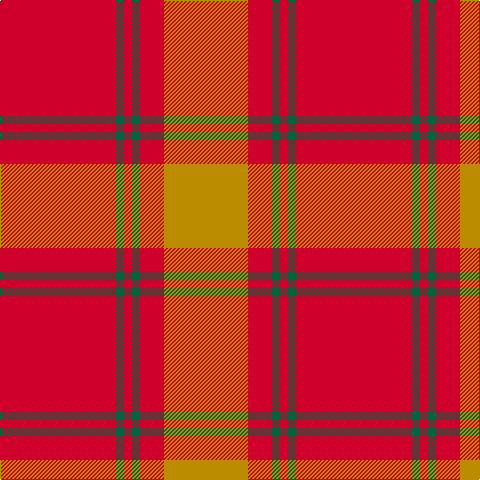

In pattern [RGRGRY](/stripes/rgrgry/).

This was sourced from tartans-authority.  It is a [6 stripe tartan](/stripes/stripes6/).

Original link http://www.tartansauthority.com/tartan-ferret/display/6812/

## Thread count
R/116 G8 R8 G8 R24 DY/84

## Palette
Each colour and the base-6 reference it is a variant of.

| Colour | Shade | Base |
|---|---|---|
| DY | <code style="background-color:#BC8C00;">#BC8C00</code> `oklch(66.8% 0.137 84.1)` <small>#BC8C00</small> | Y <code style="background-color:#F2BF00;">#F2BF00</code> |
| G | <code style="background-color:#00643C;">#00643C</code> `oklch(44.3% 0.104 157.7)` <small>#00643C</small> | G <code style="background-color:#006100;">#006100</code> |
| R | <code style="background-color:#D0002C;">#D0002C</code> `oklch(54.1% 0.218 22.6)` <small>#D0002C</small> | R <code style="background-color:#CC0000;">#CC0000</code> |

# Sample pattern

## Nearest tartans

The nearest existing variants by ΔTartan distance, with this tartan at the top so the swatches line up against it.

ΔTartan

Tartan

Sett

—

<a href="/ttd/edit/#slug=r29g2r2g2r6lo21~x4">Maguire, Black (Name)</a> <a class="nn-out" href="/setts/s6/r29g2r2g2r6lo21~x4/" title="open its dictionary page">↗</a>

1.46

<a href="/ttd/edit/#slug=r58n12r5y28r7lo5~x2">Cairn O'Mount (Personal)</a> <a class="nn-out" href="/setts/s6/r58n12r5y28r7lo5~x2/" title="open its dictionary page">↗</a>

1.79

<a href="/ttd/edit/#slug=r37o9r3g9o3~x2">Glen Shee</a> <a class="nn-out" href="/setts/s5/r37o9r3g9o3~x2/" title="open its dictionary page">↗</a>

1.82

<a href="/ttd/edit/#slug=r3o10r3o4r20lb1~x4">Monica</a> <a class="nn-out" href="/setts/s6/r3o10r3o4r20lb1~x4/" title="open its dictionary page">↗</a>

1.86

<a href="/ttd/edit/#slug=r1dy7o25dy7r1~x2">Unnamed Brown (Teddy Bear)</a> <a class="nn-out" href="/setts/s5/r1dy7o25dy7r1~x2/" title="open its dictionary page">↗</a>

1.86

<a href="/ttd/edit/#slug=r24g5r3g9r3db1~x4">MacKintosh, Red</a> <a class="nn-out" href="/setts/s6/r24g5r3g9r3db1~x4/" title="open its dictionary page">↗</a>

1.87

<a href="/ttd/edit/#slug=g4o4g13o13g4o36lo4~x2">Wolfe (Name)</a> <a class="nn-out" href="/setts/s7/g4o4g13o13g4o36lo4~x2/" title="open its dictionary page">↗</a>

1.87

<a href="/ttd/edit/#slug=r2g6r2g6r16ly1~x4">Cameron (Clan)</a> <a class="nn-out" href="/setts/s6/r2g6r2g6r16ly1~x4/" title="open its dictionary page">↗</a>

1.93

<a href="/ttd/edit/#slug=m37dy9m3g9dy3~x2">Glen Shee Trade Tartan Tartan Number: 1662. Earliest known date: pre 2003 May have been obtained from a hand made design procured in the Highlands for The Highland Society of London. See products available Copyright © Blair Urquhart, Comrie, 2015</a> <a class="nn-out" href="/setts/s5/m37dy9m3g9dy3~x2/" title="open its dictionary page">↗</a>

1.94

<a href="/ttd/edit/#slug=r16db6r2g6r2db1~x2">MacKintosh, Plaid</a> <a class="nn-out" href="/setts/s6/r16db6r2g6r2db1~x2/" title="open its dictionary page">↗</a>

1.95

<a href="/ttd/edit/#slug=r30y3db5y21r3y21db2~x2">Scottish Piping Soc. of London (Corp</a> <a class="nn-out" href="/setts/s7/r30y3db5y21r3y21db2~x2/" title="open its dictionary page">↗</a>

## Neighbour map

Every grey dot is one of 14299 variants placed by the first two principal components of the ΔTartan feature space (44% of its variance). Red is this tartan; blue dots are its nearest — click one to open its page.

<svg viewBox="0 0 640 380" role="img" style="max-width:100%;height:auto;border:1px solid #e0e0e0;border-radius:4px;display:block" xmlns="http://www.w3.org/2000/svg"><image href="/nn/cloud.v1.png" width="640" height="380"/><a href="/setts/s6/r58n12r5y28r7lo5~x2/"><circle cx="427.7" cy="215.5" r="4" fill="#3465a4"><title>Cairn O'Mount (Personal)</title></circle></a><a href="/setts/s5/r37o9r3g9o3~x2/"><circle cx="488.1" cy="239.7" r="4" fill="#3465a4"><title>Glen Shee</title></circle></a><a href="/setts/s6/r3o10r3o4r20lb1~x4/"><circle cx="462.0" cy="199.1" r="4" fill="#3465a4"><title>Monica</title></circle></a><a href="/setts/s5/r1dy7o25dy7r1~x2/"><circle cx="475.2" cy="200.4" r="4" fill="#3465a4"><title>Unnamed Brown (Teddy Bear)</title></circle></a><a href="/setts/s6/r24g5r3g9r3db1~x4/"><circle cx="489.9" cy="183.7" r="4" fill="#3465a4"><title>MacKintosh, Red</title></circle></a><a href="/setts/s7/g4o4g13o13g4o36lo4~x2/"><circle cx="448.2" cy="214.9" r="4" fill="#3465a4"><title>Wolfe (Name)</title></circle></a><a href="/setts/s6/r2g6r2g6r16ly1~x4/"><circle cx="421.8" cy="202.2" r="4" fill="#3465a4"><title>Cameron (Clan)</title></circle></a><a href="/setts/s5/m37dy9m3g9dy3~x2/"><circle cx="494.9" cy="241.4" r="4" fill="#3465a4"><title>Glen Shee Trade Tartan Tartan Number: 1662. Earliest known date: pre 2003 May have been obtained from a hand made design procured in the Highlands for The Highland Society of London. See products available Copyright © Blair Urquhart, Comrie, 2015</title></circle></a><a href="/setts/s6/r16db6r2g6r2db1~x2/"><circle cx="402.7" cy="201.7" r="4" fill="#3465a4"><title>MacKintosh, Plaid</title></circle></a><a href="/setts/s7/r30y3db5y21r3y21db2~x2/"><circle cx="390.2" cy="219.0" r="4" fill="#3465a4"><title>Scottish Piping Soc. of London (Corp</title></circle></a><circle cx="454.0" cy="206.2" r="5" fill="#c00000"/></svg>

ID: /setts/s6/r29g2r2g2r6lo21~x4/
