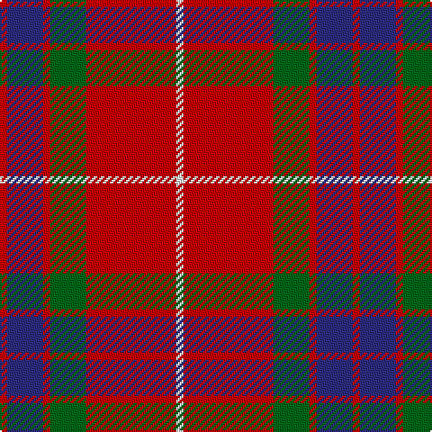

In pattern [RBRGRW](/patterns/rbrgrw/).

This was sourced from register-of-tartans.  It is a [6 stripes tartan](/stripes/stripes6/).

Original link https://www.tartanregister.gov.uk/tartanDetails.aspx?ref=1507

## Attestations

This cloth appears in 2 source records; the oldest owns this page.

- 01/01/1750 — Grant of Lurg (register-of-tartans, [record](https://www.tartanregister.gov.uk/tartanDetails.aspx?ref=1507))
- pre 1750 — Grant of Lurg (Clan) (tartans-authority, [record](http://www.tartansauthority.com/tartan-ferret/display/527/))

## Register references

External register numbers recorded for this tartan.

- Scottish Register of Tartans: [1507](https://www.tartanregister.gov.uk/tartanDetails.aspx?ref=1507)
- Scottish Tartans Authority (ITI): 527
- Scottish Tartans World Register: 527

## Thread count
R/4 DB20 R4 G20 R50 W/4

## Palette
Each colour and its ΔE from the base-6 reference it is a variant of.

| Colour | Shade | Base | ΔE (OKLab) |
|---|---|---|---|
| DB | <code style="background-color:#2C2C80;">#2C2C80</code> `#2C2C80` | B <code style="background-color:#2A418A;">#2A418A</code> | 0.06 |
| G | <code style="background-color:#006818;">#006818</code> `#006818` | G <code style="background-color:#006100;">#006100</code> | 0.02 |
| R | <code style="background-color:#C80000;">#C80000</code> `#C80000` | R <code style="background-color:#CC0000;">#CC0000</code> | 0.01 |
| W | <code style="background-color:#F8F8F8;">#F8F8F8</code> `#F8F8F8` | W <code style="background-color:#F7F7F7;">#F7F7F7</code> | 0.00 |

# Sample pattern

## Nearest tartans

The nearest existing variants by ΔTartan distance.

1. [Chisholm (Portrait) The.. Clan Tartan Tartan Number: 532. Earliest known date: 1800 This is without doubt the oldest of the Chisholm tartans, dating from around 1800 and which appears in a portrait of the clan heroine 'Mary Chisholm' of about that date. She was famous for having sided with the clansmen during the clearances. D.C.Stewart says it is a variation of one of the MacIntosh setts, said to have been found in a cave at Achnacarry in 1746. Cockburn Collection No.40 (1800 - 10). Logan (1831) See products available Copyright © Blair Urquhart, Comrie, 2015](/setts/s8/r12b2w1b2r3g8r3b1~b2c2c80-g006818-rc80000-we0e0e0~x2/) — ΔT 0.70
1. [Chisholm](/setts/s8/r12b2w1b2r3g8r3b1~b5a3094-g004c00-rc80000-wd0d0d0~x2/) — ΔT 0.77
1. [Fraser Red Clan Tartan Tartan Number: 1424. Earliest known date: 1842 Early references include Wilson's of Bannockburn, but Wilson did not name the sett. D W Stewart contends that this is in fact an early Grant tartan which he traced to a portrait of Robert Grant of Lurg (1678-1771), hanging at Troup House before it was closed around 1894. It is undoubtedly the most popular Fraser pattern today. See products available Copyright © Blair Urquhart, Comrie, 2015](/setts/s6/r1b6r1g6r12w1~b202060-g003820-rc80000-we0e0e0~x2/) — ΔT 0.78
1. [Chisholm, The](/setts/s8/r12b2w1b2r3g8r3b1~b1474b4-g006818-rc80000-wfcfcfc~x4/) — ΔT 0.86
1. [MacKintosh #4](/setts/s6/r5w2r28k12g16r3~g005020-k101010-rdc0000-we0e0e0~x2/) — ΔT 0.89
1. [Nisbet Family Tartan Tartan Number: 2115. Earliest known date: 1842 This is the sett that appears in the Vestiarium Scoticum as Mackintosh. There is no connection between the names, historically, to explain the position and it is interesting to note the similarity with the Dunbar tartan which also originates in the Vestiarium. The Nisbets came from the old barony of Nisbet in the parish of Edrom, Berwickshire, as early as 1160. See products available Copyright © Blair Urquhart, Comrie, 2015](/setts/s6/r5w2r28k12g16r3~g006818-k101010-rc80000-we0e0e0~x2/) — ΔT 0.91
1. [Chisholm, The](/setts/s8/r12b2w1b2r3g8r3b1~b304080-g008000-rc00000-we0e0e0~x2/) — ΔT 0.91
1. [MacDuff #4](/setts/s7/r4k2r24k6b6g16r3~b2c4084-g005020-k101010-rdc0000~x2/) — ΔT 0.93
1. [Fraser VS](/setts/s6/r1b6r1g6r12w1~b000064-g004c00-rc80000-wd0d0d0/) — ΔT 0.94
1. [Plummer (Personal)](/setts/s6/r100k15g48b5r7b16~b2c2c80-g006818-k101010-rc80000~x2/) — ΔT 0.95

## Neighbour map

Every grey dot is one of 15726 variants placed by the first two principal components of the ΔTartan feature space (44% of its variance). Red is this tartan; blue dots are its nearest — click one to open its page.

<svg viewBox="0 0 640 380" role="img" style="max-width:100%;height:auto;border:1px solid #e0e0e0;border-radius:4px;display:block" xmlns="http://www.w3.org/2000/svg"><image href="/nn/cloud.v1.png" width="640" height="380"/><a href="/setts/s8/r12b2w1b2r3g8r3b1~b2c2c80-g006818-rc80000-we0e0e0~x2/"><circle cx="322.7" cy="178.9" r="4" fill="#3465a4"><title>Chisholm (Portrait) The.. Clan Tartan Tartan Number: 532. Earliest known date: 1800 This is without doubt the oldest of the Chisholm tartans, dating from around 1800 and which appears in a portrait of the clan heroine 'Mary Chisholm' of about that date. She was famous for having sided with the clansmen during the clearances. D.C.Stewart says it is a variation of one of the MacIntosh setts, said to have been found in a cave at Achnacarry in 1746. Cockburn Collection No.40 (1800 - 10). Logan (1831) See products available Copyright © Blair Urquhart, Comrie, 2015</title></circle></a><a href="/setts/s8/r12b2w1b2r3g8r3b1~b5a3094-g004c00-rc80000-wd0d0d0~x2/"><circle cx="330.2" cy="180.3" r="4" fill="#3465a4"><title>Chisholm</title></circle></a><a href="/setts/s6/r1b6r1g6r12w1~b202060-g003820-rc80000-we0e0e0~x2/"><circle cx="292.8" cy="191.0" r="4" fill="#3465a4"><title>Fraser Red Clan Tartan Tartan Number: 1424. Earliest known date: 1842 Early references include Wilson's of Bannockburn, but Wilson did not name the sett. D W Stewart contends that this is in fact an early Grant tartan which he traced to a portrait of Robert Grant of Lurg (1678-1771), hanging at Troup House before it was closed around 1894. It is undoubtedly the most popular Fraser pattern today. See products available Copyright © Blair Urquhart, Comrie, 2015</title></circle></a><a href="/setts/s8/r12b2w1b2r3g8r3b1~b1474b4-g006818-rc80000-wfcfcfc~x4/"><circle cx="321.0" cy="178.5" r="4" fill="#3465a4"><title>Chisholm, The</title></circle></a><a href="/setts/s6/r5w2r28k12g16r3~g005020-k101010-rdc0000-we0e0e0~x2/"><circle cx="301.1" cy="186.0" r="4" fill="#3465a4"><title>MacKintosh #4</title></circle></a><a href="/setts/s6/r5w2r28k12g16r3~g006818-k101010-rc80000-we0e0e0~x2/"><circle cx="305.3" cy="189.8" r="4" fill="#3465a4"><title>Nisbet Family Tartan Tartan Number: 2115. Earliest known date: 1842 This is the sett that appears in the Vestiarium Scoticum as Mackintosh. There is no connection between the names, historically, to explain the position and it is interesting to note the similarity with the Dunbar tartan which also originates in the Vestiarium. The Nisbets came from the old barony of Nisbet in the parish of Edrom, Berwickshire, as early as 1160. See products available Copyright © Blair Urquhart, Comrie, 2015</title></circle></a><a href="/setts/s8/r12b2w1b2r3g8r3b1~b304080-g008000-rc00000-we0e0e0~x2/"><circle cx="324.0" cy="180.2" r="4" fill="#3465a4"><title>Chisholm, The</title></circle></a><a href="/setts/s7/r4k2r24k6b6g16r3~b2c4084-g005020-k101010-rdc0000~x2/"><circle cx="278.5" cy="185.4" r="4" fill="#3465a4"><title>MacDuff #4</title></circle></a><a href="/setts/s6/r1b6r1g6r12w1~b000064-g004c00-rc80000-wd0d0d0/"><circle cx="280.5" cy="188.2" r="4" fill="#3465a4"><title>Fraser VS</title></circle></a><a href="/setts/s6/r100k15g48b5r7b16~b2c2c80-g006818-k101010-rc80000~x2/"><circle cx="356.1" cy="165.8" r="4" fill="#3465a4"><title>Plummer (Personal)</title></circle></a><circle cx="328.2" cy="182.8" r="5" fill="#c00000"/></svg>

ID: /setts/s6/r2b10r2g10r25w2~b2c2c80-g006818-rc80000-wf8f8f8~x2/
