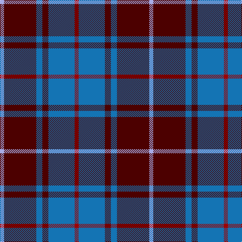

This page is one **sett** — a single exact thread-count. It belongs to the [tartan](/tartans/r2b13dr3b3dr16lb2/)
(the same proportion at any scale), whose colour order is pattern [RBBBBW](/stripes/rbbbbw/).

Sourced from register-of-tartans.  It is a [6 stripe tartan](/stripes/stripes6/).

Original link https://www.tartanregister.gov.uk/tartanDetails.aspx?ref=2283

2 attestations — the source records this cloth was collapsed from (oldest owns this page)

<ul>
<li>01/01/1997 — MacArthur-Fox Blue (Personal) (register-of-tartans, <a href="https://www.tartanregister.gov.uk/tartanDetails.aspx?ref=2283">record</a>)</li>
<li>1997 — MacArthur-Fox Blue (Personal) (tartans-authority, <a href="http://www.tartansauthority.com/tartan-ferret/display/459/">record</a>)</li>
</ul>

## Register references

External register numbers recorded for this tartan.

- Scottish Register of Tartans: [2283](https://www.tartanregister.gov.uk/tartanDetails.aspx?ref=2283)
- Scottish Tartans Authority (ITI): 459
- Scottish Tartans World Register: 459

## Thread count
LP/8 DR64 B12 DR12 B52 DRa/8

## Palette

Palette: <strong>Tartan Register</strong>
<table><thead><tr><th>Colour</th><th>Threads</th><th>Shade</th><th>Base</th><th>OKLCh</th></tr></thead><tbody><tr><td>LP/</td><td style="text-align:right;font-variant-numeric:tabular-nums">8</td><td><code style="background-color:#A8ACE8;">#A8ACE8</code> <small style="color:#888">#A8ACE8</small></td><td>W <code style="background-color:#F7F7F7;">#F7F7F7</code></td><td><small style="color:#888">oklch(76.3% 0.086 281.2)</small></td></tr><tr><td>DR</td><td style="text-align:right;font-variant-numeric:tabular-nums">64</td><td><code style="background-color:#4C0000;">#4C0000</code> <small style="color:#888">#4C0000</small></td><td>B <code style="background-color:#2A418A;">#2A418A</code></td><td><small style="color:#888">oklch(26.2% 0.107 29.2)</small></td></tr><tr><td>B</td><td style="text-align:right;font-variant-numeric:tabular-nums">12</td><td><code style="background-color:#1474B4;">#1474B4</code> <small style="color:#888">#1474B4</small></td><td>B <code style="background-color:#2A418A;">#2A418A</code></td><td><small style="color:#888">oklch(54.0% 0.129 245.1)</small></td></tr><tr><td>DR</td><td style="text-align:right;font-variant-numeric:tabular-nums">12</td><td><code style="background-color:#4C0000;">#4C0000</code> <small style="color:#888">#4C0000</small></td><td>B <code style="background-color:#2A418A;">#2A418A</code></td><td><small style="color:#888">oklch(26.2% 0.107 29.2)</small></td></tr><tr><td>B</td><td style="text-align:right;font-variant-numeric:tabular-nums">52</td><td><code style="background-color:#1474B4;">#1474B4</code> <small style="color:#888">#1474B4</small></td><td>B <code style="background-color:#2A418A;">#2A418A</code></td><td><small style="color:#888">oklch(54.0% 0.129 245.1)</small></td></tr><tr><td>DRa/</td><td style="text-align:right;font-variant-numeric:tabular-nums">8</td><td><code style="background-color:#A00000;">#A00000</code> <small style="color:#888">#A00000</small></td><td>R <code style="background-color:#CC0000;">#CC0000</code></td><td><small style="color:#888">oklch(44.3% 0.182 29.2)</small></td></tr></tbody></table>

# Sample pattern

## Nearest tartans

The nearest existing variants by ΔTartan distance, with this tartan at the top so the swatches line up against it.

ΔTartan

Tartan

Sett

—

<a href="/ttd/edit/#slug=r2b13dr3b3dr16lb2~x4">MacArthur-Fox Blue (Personal)</a> <a class="nn-out" href="/setts/s6/r2b13dr3b3dr16lb2~x4/" title="open its dictionary page">↗</a>

0.85

<a href="/ttd/edit/#slug=o11db1o3db1db9r1~x4">Dege, of Saville Row</a> <a class="nn-out" href="/setts/s6/o11db1o3db1db9r1~x4/" title="open its dictionary page">↗</a>

1.02

<a href="/ttd/edit/#slug=db18ly2dy6ly2dy19r3~x2">Balfour #2</a> <a class="nn-out" href="/setts/s6/db18ly2dy6ly2dy19r3~x2/" title="open its dictionary page">↗</a>

1.02

<a href="/ttd/edit/#slug=db18ly2dy6ly2dy19r3~x4">Balfour (Clan)</a> <a class="nn-out" href="/setts/s6/db18ly2dy6ly2dy19r3~x4/" title="open its dictionary page">↗</a>

1.03

<a href="/ttd/edit/#slug=db3g21db3o21db35w3~x2">Donnolly</a> <a class="nn-out" href="/setts/s6/db3g21db3o21db35w3~x2/" title="open its dictionary page">↗</a>

1.10

<a href="/ttd/edit/#slug=r5db35k25db8ly10r5~x2">University of Notre Dame</a> <a class="nn-out" href="/setts/s6/r5db35k25db8ly10r5~x2/" title="open its dictionary page">↗</a>

1.10

<a href="/ttd/edit/#slug=r5db25w5db3dg25db3~x2">Thayer USA</a> <a class="nn-out" href="/setts/s6/r5db25w5db3dg25db3~x2/" title="open its dictionary page">↗</a>

1.13

<a href="/ttd/edit/#slug=r12db3g5db16ly2g2~x2">Dunbog Primary (School)</a> <a class="nn-out" href="/setts/s6/r12db3g5db16ly2g2~x2/" title="open its dictionary page">↗</a>

1.18

<a href="/ttd/edit/#slug=db9r1db2r1r4w1~x12">McIntosh, Georgina (Personal)</a> <a class="nn-out" href="/setts/s6/db9r1db2r1r4w1~x12/" title="open its dictionary page">↗</a>

1.21

<a href="/ttd/edit/#slug=g22dp22g3dp11w3dp4w3~x2">O'Long (Personal)</a> <a class="nn-out" href="/setts/s7/g22dp22g3dp11w3dp4w3~x2/" title="open its dictionary page">↗</a>

1.28

<a href="/ttd/edit/#slug=r5db25w5db3g25db3~x2">Thayer USA (Name)</a> <a class="nn-out" href="/setts/s6/r5db25w5db3g25db3~x2/" title="open its dictionary page">↗</a>

## Neighbour map

Every grey dot is one of 14299 variants placed by the first two principal components of the ΔTartan feature space (44% of its variance). Red is this tartan; blue dots are its nearest — click one to open its page.

<svg viewBox="0 0 640 380" role="img" style="max-width:100%;height:auto;border:1px solid #e0e0e0;border-radius:4px;display:block" xmlns="http://www.w3.org/2000/svg"><image href="/nn/cloud.v1.png" width="640" height="380"/><a href="/setts/s6/o11db1o3db1db9r1~x4/"><circle cx="329.2" cy="208.3" r="4" fill="#3465a4"><title>Dege, of Saville Row</title></circle></a><a href="/setts/s6/db18ly2dy6ly2dy19r3~x2/"><circle cx="297.5" cy="218.4" r="4" fill="#3465a4"><title>Balfour #2</title></circle></a><a href="/setts/s6/db18ly2dy6ly2dy19r3~x4/"><circle cx="297.5" cy="218.4" r="4" fill="#3465a4"><title>Balfour (Clan)</title></circle></a><a href="/setts/s6/db3g21db3o21db35w3~x2/"><circle cx="265.1" cy="207.2" r="4" fill="#3465a4"><title>Donnolly</title></circle></a><a href="/setts/s6/r5db35k25db8ly10r5~x2/"><circle cx="220.8" cy="221.1" r="4" fill="#3465a4"><title>University of Notre Dame</title></circle></a><a href="/setts/s6/r5db25w5db3dg25db3~x2/"><circle cx="250.4" cy="215.6" r="4" fill="#3465a4"><title>Thayer USA</title></circle></a><a href="/setts/s6/r12db3g5db16ly2g2~x2/"><circle cx="223.9" cy="209.5" r="4" fill="#3465a4"><title>Dunbog Primary (School)</title></circle></a><a href="/setts/s6/db9r1db2r1r4w1~x12/"><circle cx="285.6" cy="201.3" r="4" fill="#3465a4"><title>McIntosh, Georgina (Personal)</title></circle></a><a href="/setts/s7/g22dp22g3dp11w3dp4w3~x2/"><circle cx="305.3" cy="222.8" r="4" fill="#3465a4"><title>O'Long (Personal)</title></circle></a><a href="/setts/s6/r5db25w5db3g25db3~x2/"><circle cx="251.8" cy="215.9" r="4" fill="#3465a4"><title>Thayer USA (Name)</title></circle></a><circle cx="279.1" cy="216.5" r="5" fill="#c00000"/></svg>

ID: /setts/s6/r2b13dr3b3dr16lb2~x4/
