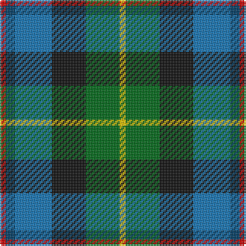

In pattern [RBBKGY](/patterns/rbbkgy/).

This was sourced from tartans-authority.  It is a [6 stripes tartan](/stripes/stripes6/).

Original link http://www.tartansauthority.com/tartan-ferret/display/2624/

## Thread count
R/4 DB6 B24 K22 G22 Y/4

## Palette
Each colour and its ΔE from the base-6 reference it is a variant of.

| Colour | Shade | Base | ΔE (OKLab) |
|---|---|---|---|
| B | <code style="background-color:#1474B4;">#1474B4</code> `#1474B4` | B <code style="background-color:#2A418A;">#2A418A</code> | 0.15 |
| DB | <code style="background-color:#003C64;">#003C64</code> `#003C64` | B <code style="background-color:#2A418A;">#2A418A</code> | 0.08 |
| G | <code style="background-color:#006818;">#006818</code> `#006818` | G <code style="background-color:#006100;">#006100</code> | 0.02 |
| K | <code style="background-color:#101010;">#101010</code> `#101010` | K <code style="background-color:#000000;">#000000</code> | 0.17 |
| R | <code style="background-color:#C80000;">#C80000</code> `#C80000` | R <code style="background-color:#CC0000;">#CC0000</code> | 0.01 |
| Y | <code style="background-color:#E8C000;">#E8C000</code> `#E8C000` | Y <code style="background-color:#F2BF00;">#F2BF00</code> | 0.02 |

# Sample pattern

## Nearest tartans

The nearest existing variants by ΔTartan distance.

1. [Scottish Odyssey](/setts/s7/b7ba11k3ba11g11ga22bb3x2~b3850c8-ba2c4084-bb000080-g663300-ga008800-k000000/) — ΔT 0.77
1. [Jamestown Parish Church (Corporate)](/setts/s6/r3y2g12k12b14w3x2~b2c2c80-g006818-k101010-rc80000-we0e0e0-ye8c000/) — ΔT 0.83
1. [Atlantic, Ancient](/setts/s6/w3b17r16ba2g17y2x2~b304080-ba000050-g003000-r806050-we0e0e0-yf0c000/) — ΔT 0.97
1. [Hogarth of Firhill](/setts/s7/b2g6y1k6ba6k1ba1x2~b5c8ca8-ba2c2c80-g006818-k101010-ye8c000/) — ΔT 1.12
1. [MacNeil Clan Tartan Tartan Number: 1767. Earliest known date: 1886 This version shows the narrow 'tramlines' about the yellow stripe, the usual modern form that differs from Logans earlier version. The MacNeils claim descent from Niall, King of Ireland, who came to Barra in 1049. The present chief, Professor Ian Roderick MacNeil of Barra, lives in Chicago, U.S.A. There is also a tartan for the MacNeils of Colonsay. MacNeils are hereditary pipers to the MacLeans of Duart. See products available Copyright © Blair Urquhart, Comrie, 2015](/setts/s6/w3b14k12g12k2y3x2~b2c2c80-g006818-k101010-we0e0e0-ye8c000/) — ΔT 1.14
1. [Birse Family Tartan Tartan Number: 1087. Earliest known date: 1930-50 This sample comes from the MacGregor-Hastie collection which forms the basis of the cloth archive of the Scottish Tartans Society. Some of the samples, including this one, were unmarked. One can assume that the sample dates between 1930 and 1950. See products available Copyright © Blair Urquhart, Comrie, 2015](/setts/s6/k4g16k14y3b16r4x2~b2c2c80-g006818-k101010-rc80000-ye8c000/) — ΔT 1.18
1. [Hawkes, Norman (Personal)](/setts/s6/g7w4k21b16ba16r5x2~b5c5c5c-ba2c2c80-g006818-k101010-rc80000-we0e0e0/) — ΔT 1.20
1. [Huntly Gordon 2000](/setts/s10/b3ba12k11g11y2g11k11ba12b3r2x2~b003c64-ba1474b4-g006818-k101010-rc80000-ye8c000/) — ΔT 1.21
1. [MacLean, Donald Personal Tartan Tartan Number: 3440. Earliest known date: pre 2002 From Pendleton Woolen Mills of Oregon, owners of the only copy of Clans Originaux. EBW 8.11.02. This is the same as MacTaggart #408 and #409!!! See products available Copyright © Blair Urquhart, Comrie, 2015](/setts/s7/g16w3g3k10b12r2ka3x2~b1c0070-g006818-k101010-ka000000-r880000-wa8ace8/) — ΔT 1.21
1. [MacNeil of Barra (Clan)](/setts/s6/w3b14k12g12k2y3x4~b1474b4-g006818-k101010-wfcfcfc-ye8c000/) — ΔT 1.23

## Neighbour map

Every grey dot is one of 15726 variants placed by the first two principal components of the ΔTartan feature space (44% of its variance). Red is this tartan; blue dots are its nearest — click one to open its page.

<svg viewBox="0 0 640 380" role="img" style="max-width:100%;height:auto;border:1px solid #e0e0e0;border-radius:4px;display:block" xmlns="http://www.w3.org/2000/svg"><image href="/nn/cloud.v1.png" width="640" height="380"/><a href="/setts/s7/b7ba11k3ba11g11ga22bb3x2~b3850c8-ba2c4084-bb000080-g663300-ga008800-k000000/"><circle cx="98.5" cy="209.6" r="4" fill="#3465a4"><title>Scottish Odyssey</title></circle></a><a href="/setts/s6/r3y2g12k12b14w3x2~b2c2c80-g006818-k101010-rc80000-we0e0e0-ye8c000/"><circle cx="71.5" cy="200.3" r="4" fill="#3465a4"><title>Jamestown Parish Church (Corporate)</title></circle></a><a href="/setts/s6/w3b17r16ba2g17y2x2~b304080-ba000050-g003000-r806050-we0e0e0-yf0c000/"><circle cx="116.4" cy="192.9" r="4" fill="#3465a4"><title>Atlantic, Ancient</title></circle></a><a href="/setts/s7/b2g6y1k6ba6k1ba1x2~b5c8ca8-ba2c2c80-g006818-k101010-ye8c000/"><circle cx="112.3" cy="221.2" r="4" fill="#3465a4"><title>Hogarth of Firhill</title></circle></a><a href="/setts/s6/w3b14k12g12k2y3x2~b2c2c80-g006818-k101010-we0e0e0-ye8c000/"><circle cx="93.6" cy="218.4" r="4" fill="#3465a4"><title>MacNeil Clan Tartan Tartan Number: 1767. Earliest known date: 1886 This version shows the narrow 'tramlines' about the yellow stripe, the usual modern form that differs from Logans earlier version. The MacNeils claim descent from Niall, King of Ireland, who came to Barra in 1049. The present chief, Professor Ian Roderick MacNeil of Barra, lives in Chicago, U.S.A. There is also a tartan for the MacNeils of Colonsay. MacNeils are hereditary pipers to the MacLeans of Duart. See products available Copyright © Blair Urquhart, Comrie, 2015</title></circle></a><a href="/setts/s6/k4g16k14y3b16r4x2~b2c2c80-g006818-k101010-rc80000-ye8c000/"><circle cx="104.1" cy="239.3" r="4" fill="#3465a4"><title>Birse Family Tartan Tartan Number: 1087. Earliest known date: 1930-50 This sample comes from the MacGregor-Hastie collection which forms the basis of the cloth archive of the Scottish Tartans Society. Some of the samples, including this one, were unmarked. One can assume that the sample dates between 1930 and 1950. See products available Copyright © Blair Urquhart, Comrie, 2015</title></circle></a><a href="/setts/s6/g7w4k21b16ba16r5x2~b5c5c5c-ba2c2c80-g006818-k101010-rc80000-we0e0e0/"><circle cx="61.6" cy="226.1" r="4" fill="#3465a4"><title>Hawkes, Norman (Personal)</title></circle></a><a href="/setts/s10/b3ba12k11g11y2g11k11ba12b3r2x2~b003c64-ba1474b4-g006818-k101010-rc80000-ye8c000/"><circle cx="70.5" cy="207.8" r="4" fill="#3465a4"><title>Huntly Gordon 2000</title></circle></a><a href="/setts/s7/g16w3g3k10b12r2ka3x2~b1c0070-g006818-k101010-ka000000-r880000-wa8ace8/"><circle cx="126.1" cy="192.4" r="4" fill="#3465a4"><title>MacLean, Donald Personal Tartan Tartan Number: 3440. Earliest known date: pre 2002 From Pendleton Woolen Mills of Oregon, owners of the only copy of Clans Originaux. EBW 8.11.02. This is the same as MacTaggart #408 and #409!!! See products available Copyright © Blair Urquhart, Comrie, 2015</title></circle></a><a href="/setts/s6/w3b14k12g12k2y3x4~b1474b4-g006818-k101010-wfcfcfc-ye8c000/"><circle cx="82.5" cy="214.3" r="4" fill="#3465a4"><title>MacNeil of Barra (Clan)</title></circle></a><circle cx="72.2" cy="212.8" r="5" fill="#c00000"/></svg>

ID: /setts/s6/r2b3ba12k11g11y2x2~b003c64-ba1474b4-g006818-k101010-rc80000-ye8c000/
