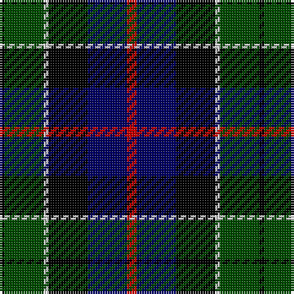

In pattern [KGWKBR](/patterns/kgwkbr/).

This was sourced from weddslist.  It is a [6 stripes tartan](/stripes/stripes6/).

Original link http://www.weddslist.com/cgi-bin/tartans/pg.pl?source=rb

## Thread count
K/2 G16 N2 K16 DB16 R/4

## Palette
Each colour and its ΔE from the base-6 reference it is a variant of.

| Colour | Shade | Base | ΔE (OKLab) |
|---|---|---|---|
| DB | <code style="background-color:#000064;">#000064</code> `#000064` | B <code style="background-color:#2A418A;">#2A418A</code> | 0.18 |
| G | <code style="background-color:#004C00;">#004C00</code> `#004C00` | G <code style="background-color:#006100;">#006100</code> | 0.07 |
| K | <code style="background-color:#000000;">#000000</code> `#000000` | K <code style="background-color:#000000;">#000000</code> | 0.00 |
| N | <code style="background-color:#D0D0D0;">#D0D0D0</code> `#D0D0D0` | W <code style="background-color:#F7F7F7;">#F7F7F7</code> | 0.12 |
| R | <code style="background-color:#C80000;">#C80000</code> `#C80000` | R <code style="background-color:#CC0000;">#CC0000</code> | 0.01 |

# Sample pattern

## Nearest tartans

The nearest existing variants by ΔTartan distance.

1. [Herd](/setts/s6/b4g25k24w3ba24w4x2~b300030-ba000050-g003000-k000000-we0e0e0/) — ΔT 0.39
1. [MacNiel of Barra](/setts/s6/y3k2g12k12b14ya3x2~b000052-g11450d-k000000-yaaaa00-yaaaaaaa/) — ΔT 0.42
1. [MacNiel of Barra](/setts/s6/y3k2g12k12b14ya3~b000052-g11450d-k000000-yaaaa00-yaaaaaaa/) — ΔT 0.42
1. [Campbell Cawdor](/setts/s7/r2k1b8k8g8k1w2~b00004c-g004c00-k000000-rc80000-wd0d0d0/) — ΔT 0.47
1. [Leslie Hunting](/setts/s6/r2b8k8y1g8k1x2~b000052-g11450d-k000000-raa0000-yaaaaaa/) — ΔT 0.49
1. [Leslie Hunting](/setts/s6/r2b8k8y1g8k1~b000052-g11450d-k000000-raa0000-yaaaaaa/) — ΔT 0.49
1. [Colquhoun](/setts/s7/r2g8y1k8b8k1b1x2~b000052-g11450d-k000000-raa0000-yaaaaaa/) — ΔT 0.72
1. [Colquhoun](/setts/s7/r2g8y1k8b8k1b1~b000052-g11450d-k000000-raa0000-yaaaaaa/) — ΔT 0.72
1. [Mitchell](/setts/s6/k2g12k12r1b12w2~b00004c-g004c00-k000000-rc80000-wd0d0d0/) — ΔT 0.72
1. [MacNeil of Barra](/setts/s6/w3b14k12g12k2y3~b000064-g004c00-k000000-wd0d0d0-yc8c800/) — ΔT 0.73

## Neighbour map

Every grey dot is one of 15726 variants placed by the first two principal components of the ΔTartan feature space (44% of its variance). Red is this tartan; blue dots are its nearest — click one to open its page.

<svg viewBox="0 0 640 380" role="img" style="max-width:100%;height:auto;border:1px solid #e0e0e0;border-radius:4px;display:block" xmlns="http://www.w3.org/2000/svg"><image href="/nn/cloud.v1.png" width="640" height="380"/><a href="/setts/s6/b4g25k24w3ba24w4x2~b300030-ba000050-g003000-k000000-we0e0e0/"><circle cx="111.4" cy="214.5" r="4" fill="#3465a4"><title>Herd</title></circle></a><a href="/setts/s6/y3k2g12k12b14ya3x2~b000052-g11450d-k000000-yaaaa00-yaaaaaaa/"><circle cx="96.0" cy="226.2" r="4" fill="#3465a4"><title>MacNiel of Barra</title></circle></a><a href="/setts/s6/y3k2g12k12b14ya3~b000052-g11450d-k000000-yaaaa00-yaaaaaaa/"><circle cx="96.0" cy="226.2" r="4" fill="#3465a4"><title>MacNiel of Barra</title></circle></a><a href="/setts/s7/r2k1b8k8g8k1w2~b00004c-g004c00-k000000-rc80000-wd0d0d0/"><circle cx="114.7" cy="203.2" r="4" fill="#3465a4"><title>Campbell Cawdor</title></circle></a><a href="/setts/s6/r2b8k8y1g8k1x2~b000052-g11450d-k000000-raa0000-yaaaaaa/"><circle cx="135.2" cy="222.9" r="4" fill="#3465a4"><title>Leslie Hunting</title></circle></a><a href="/setts/s6/r2b8k8y1g8k1~b000052-g11450d-k000000-raa0000-yaaaaaa/"><circle cx="135.2" cy="222.9" r="4" fill="#3465a4"><title>Leslie Hunting</title></circle></a><a href="/setts/s7/r2g8y1k8b8k1b1x2~b000052-g11450d-k000000-raa0000-yaaaaaa/"><circle cx="138.6" cy="208.7" r="4" fill="#3465a4"><title>Colquhoun</title></circle></a><a href="/setts/s7/r2g8y1k8b8k1b1~b000052-g11450d-k000000-raa0000-yaaaaaa/"><circle cx="138.6" cy="208.7" r="4" fill="#3465a4"><title>Colquhoun</title></circle></a><a href="/setts/s6/k2g12k12r1b12w2~b00004c-g004c00-k000000-rc80000-wd0d0d0/"><circle cx="154.5" cy="203.0" r="4" fill="#3465a4"><title>Mitchell</title></circle></a><a href="/setts/s6/w3b14k12g12k2y3~b000064-g004c00-k000000-wd0d0d0-yc8c800/"><circle cx="83.3" cy="221.0" r="4" fill="#3465a4"><title>MacNeil of Barra</title></circle></a><circle cx="120.8" cy="216.9" r="5" fill="#c00000"/></svg>

ID: /setts/s6/r2b8k8w1g8k1x2~b000064-g004c00-k000000-rc80000-wd0d0d0/
