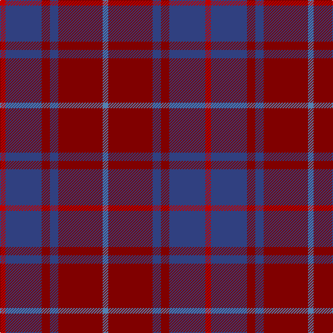

This page is one **sett** — a single exact thread-count. It belongs to the [tartan](/tartans/r2db13ri3db3ri16t2/)
(the same proportion at any scale), whose colour order is pattern [BRBRBR](/stripes/brbrbr/).

Sourced from weddslist.  It is a [6 stripe tartan](/stripes/stripes6/).

Original link http://www.weddslist.com/cgi-bin/tartans/pg.pl?source=sts

## Also known as

This cloth is also recorded under:

- MacArthur-Fox, dress

2 attestations — the source records this cloth was collapsed from (oldest owns this page)

<ul>
<li>undated — MacArthur-Fox, dress (weddslist, <a href="http://www.weddslist.com/cgi-bin/tartans/pg.pl?source=sts">record</a>)</li>
<li>undated — MacArthur-Fox Dress Personal Tartan Tartan Number: 459. Earliest known date: 1986 This is the older of the two MacArthur setts, which links the clan with the Campbells. See products available Copyright © Blair Urquhart, Comrie, 2015 (house-of-tartan, <a href="http://www.house-of-tartan.scotland.net/house/TartanViewjs.asp?colr=Def&tnam=459">record</a>)</li>
</ul>

## Thread count
R/8 B52 DR12 B12 DR64 Ba/8

## Palette

Palette: <strong>custom</strong>
<table><thead><tr><th>Colour</th><th>Threads</th><th>Shade</th><th>Base</th><th>OKLCh</th></tr></thead><tbody><tr><td>R/</td><td style="text-align:right;font-variant-numeric:tabular-nums">8</td><td><code style="background-color:#C00000;">#C00000</code> <small style="color:#888">#C00000</small></td><td>R <code style="background-color:#CC0000;">#CC0000</code></td><td><small style="color:#888">oklch(50.7% 0.208 29.2)</small></td></tr><tr><td>B</td><td style="text-align:right;font-variant-numeric:tabular-nums">52</td><td><code style="background-color:#304080;">#304080</code> <small style="color:#888">#304080</small></td><td>B <code style="background-color:#2A418A;">#2A418A</code></td><td><small style="color:#888">oklch(39.4% 0.109 270.2)</small></td></tr><tr><td>DR</td><td style="text-align:right;font-variant-numeric:tabular-nums">12</td><td><code style="background-color:#800000;">#800000</code> <small style="color:#888">#800000</small></td><td>R <code style="background-color:#CC0000;">#CC0000</code></td><td><small style="color:#888">oklch(37.7% 0.155 29.2)</small></td></tr><tr><td>B</td><td style="text-align:right;font-variant-numeric:tabular-nums">12</td><td><code style="background-color:#304080;">#304080</code> <small style="color:#888">#304080</small></td><td>B <code style="background-color:#2A418A;">#2A418A</code></td><td><small style="color:#888">oklch(39.4% 0.109 270.2)</small></td></tr><tr><td>DR</td><td style="text-align:right;font-variant-numeric:tabular-nums">64</td><td><code style="background-color:#800000;">#800000</code> <small style="color:#888">#800000</small></td><td>R <code style="background-color:#CC0000;">#CC0000</code></td><td><small style="color:#888">oklch(37.7% 0.155 29.2)</small></td></tr><tr><td>Ba/</td><td style="text-align:right;font-variant-numeric:tabular-nums">8</td><td><code style="background-color:#5480B0;">#5480B0</code> <small style="color:#888">#5480B0</small></td><td>B <code style="background-color:#2A418A;">#2A418A</code></td><td><small style="color:#888">oklch(58.8% 0.089 251.5)</small></td></tr></tbody></table>

# Sample pattern

## Nearest tartans

The nearest existing variants by ΔTartan distance, with this tartan at the top so the swatches line up against it.

ΔTartan

Tartan

Sett

—

<a href="/ttd/edit/#slug=r2db13ri3db3ri16t2~x4">MacArthur-Fox, dress</a> <a class="nn-out" href="/setts/s6/r2db13ri3db3ri16t2~x4/" title="open its dictionary page">↗</a>

1.21

<a href="/ttd/edit/#slug=db13n6r51db51n5~x2">Hillsdale (Corporate?)</a> <a class="nn-out" href="/setts/s5/db13n6r51db51n5~x2/" title="open its dictionary page">↗</a>

1.42

<a href="/ttd/edit/#slug=db1r3db1r3db6g1~x4">Robbins</a> <a class="nn-out" href="/setts/s6/db1r3db1r3db6g1~x4/" title="open its dictionary page">↗</a>

1.43

<a href="/ttd/edit/#slug=dy11db1dy3dbi1db9r1~x4">Dege of Saville Row</a> <a class="nn-out" href="/setts/s6/dy11db1dy3dbi1db9r1~x4/" title="open its dictionary page">↗</a>

1.43

<a href="/ttd/edit/#slug=o15r5o30db32o4ly3~x2">Cameron, hunting</a> <a class="nn-out" href="/setts/s6/o15r5o30db32o4ly3~x2/" title="open its dictionary page">↗</a>

1.47

<a href="/ttd/edit/#slug=r1dy8r2db8t1~x2">Unamed Riding cloak 1745</a> <a class="nn-out" href="/setts/s5/r1dy8r2db8t1~x2/" title="open its dictionary page">↗</a>

1.49

<a href="/ttd/edit/#slug=k4r5k4dp28k4g5k4~x2">Montgomrie/Montgomery of Eglinton</a> <a class="nn-out" href="/setts/s7/k4r5k4dp28k4g5k4~x2/" title="open its dictionary page">↗</a>

1.49

<a href="/ttd/edit/#slug=do2m2do17oi17o2oi2~x4">Cypress</a> <a class="nn-out" href="/setts/s6/do2m2do17oi17o2oi2~x4/" title="open its dictionary page">↗</a>

1.50

<a href="/ttd/edit/#slug=dy15r5dy30db32dy4ly3~x2">Cameron Hunting Brown Clan Tartan Tartan Number: 1745. Earliest known date: 1916 Nothing See products available Copyright © Blair Urquhart, Comrie, 2015</a> <a class="nn-out" href="/setts/s6/dy15r5dy30db32dy4ly3~x2/" title="open its dictionary page">↗</a>

1.53

<a href="/ttd/edit/#slug=dt2m2dt17r17o2r2~x4">Eglington</a> <a class="nn-out" href="/setts/s6/dt2m2dt17r17o2r2~x4/" title="open its dictionary page">↗</a>

1.54

<a href="/ttd/edit/#slug=db18ly2o6ly2o19r3~x2">Balfour blue &amp; brown</a> <a class="nn-out" href="/setts/s6/db18ly2o6ly2o19r3~x2/" title="open its dictionary page">↗</a>

## Neighbour map

Every grey dot is one of 14359 variants placed by the first two principal components of the ΔTartan feature space (44% of its variance). Red is this tartan; blue dots are its nearest — click one to open its page.

<svg viewBox="0 0 640 380" role="img" style="max-width:100%;height:auto;border:1px solid #e0e0e0;border-radius:4px;display:block" xmlns="http://www.w3.org/2000/svg"><image href="/nn/cloud.v1.png" width="640" height="380"/><a href="/setts/s5/db13n6r51db51n5~x2/"><circle cx="386.6" cy="268.2" r="4" fill="#3465a4"><title>Hillsdale (Corporate?)</title></circle></a><a href="/setts/s6/db1r3db1r3db6g1~x4/"><circle cx="364.5" cy="288.1" r="4" fill="#3465a4"><title>Robbins</title></circle></a><a href="/setts/s6/dy11db1dy3dbi1db9r1~x4/"><circle cx="399.4" cy="245.6" r="4" fill="#3465a4"><title>Dege of Saville Row</title></circle></a><a href="/setts/s6/o15r5o30db32o4ly3~x2/"><circle cx="378.5" cy="245.6" r="4" fill="#3465a4"><title>Cameron, hunting</title></circle></a><a href="/setts/s5/r1dy8r2db8t1~x2/"><circle cx="273.8" cy="254.0" r="4" fill="#3465a4"><title>Unamed Riding cloak 1745</title></circle></a><a href="/setts/s7/k4r5k4dp28k4g5k4~x2/"><circle cx="332.5" cy="228.3" r="4" fill="#3465a4"><title>Montgomrie/Montgomery of Eglinton</title></circle></a><a href="/setts/s6/do2m2do17oi17o2oi2~x4/"><circle cx="378.9" cy="251.6" r="4" fill="#3465a4"><title>Cypress</title></circle></a><a href="/setts/s6/dy15r5dy30db32dy4ly3~x2/"><circle cx="355.4" cy="235.9" r="4" fill="#3465a4"><title>Cameron Hunting Brown Clan Tartan Tartan Number: 1745. Earliest known date: 1916 Nothing See products available Copyright © Blair Urquhart, Comrie, 2015</title></circle></a><a href="/setts/s6/dt2m2dt17r17o2r2~x4/"><circle cx="323.3" cy="220.3" r="4" fill="#3465a4"><title>Eglington</title></circle></a><a href="/setts/s6/db18ly2o6ly2o19r3~x2/"><circle cx="316.9" cy="227.3" r="4" fill="#3465a4"><title>Balfour blue &amp; brown</title></circle></a><circle cx="347.6" cy="245.7" r="5" fill="#c00000"/></svg>

ID: /setts/s6/r2db13ri3db3ri16t2~x4/
