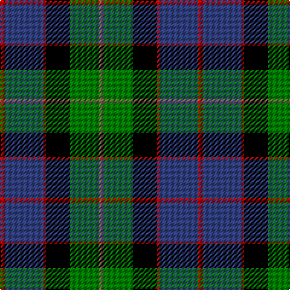

In pattern [RBRKGR](/stripes/rbrkgr/).

This was sourced from weddslist.  It is a [6 stripe tartan](/stripes/stripes6/).

Original link http://www.weddslist.com/cgi-bin/tartans/pg.pl?source=sts

## Thread count
R/4 B32 R2 K20 G24 LT/4

## Palette
Each colour and the base-6 reference it is a variant of.

| Colour | Shade | Base |
|---|---|---|
| B | <code style="background-color:#304080;">#304080</code> `oklch(39.4% 0.109 270.2)` <small>#304080</small> | B <code style="background-color:#2A418A;">#2A418A</code> |
| G | <code style="background-color:#008000;">#008000</code> `oklch(52.0% 0.177 142.5)` <small>#008000</small> | G <code style="background-color:#006100;">#006100</code> |
| K | <code style="background-color:#000000;">#000000</code> `oklch(0.0% 0.000 0.0)` <small>#000000</small> | K <code style="background-color:#000000;">#000000</code> |
| LT | <code style="background-color:#806050;">#806050</code> `oklch(51.7% 0.049 47.8)` <small>#806050</small> | R <code style="background-color:#CC0000;">#CC0000</code> |
| R | <code style="background-color:#C00000;">#C00000</code> `oklch(50.7% 0.208 29.2)` <small>#C00000</small> | R <code style="background-color:#CC0000;">#CC0000</code> |

# Sample pattern

## Nearest tartans

The nearest existing variants by ΔTartan distance.

1. [Wilson's, No 221](/setts/s6/r1g14k14r2db14t1~x2/) — ΔT 0.68
1. [MacPhail, hunting](/setts/s6/r2db23k14g16k2w2~x2/) — ΔT 0.68
1. [MacLeod of Assynt](/setts/s6/r3k2g15k10db20ly2~x2/) — ΔT 0.77
1. [Ferguson - 1830 of Atholl (Clan)](/setts/s7/db18k10g6r4g6k1w2~x2/) — ΔT 0.77
1. [Russell, or Mitchell or Hunter or Galbraith](/setts/s6/k2g12k12r1db12w2~x2/) — ΔT 0.81
1. [Genet, Citizen (Commem)](/setts/s7/r2k9g12db8r1db1w1~x4/) — ΔT 0.81
1. [MacLeod, Macleod of Harris](/setts/s7/r3k2g15k10db20k2ly2~x2/) — ΔT 0.87
1. [MacCormick](/setts/s7/w3k1g20k16db20k1ly3~x2/) — ΔT 0.87
1. [Smith, Sir William (?)](/setts/s6/t3db18k20g20k1ly3~x2/) — ΔT 0.87
1. [MacPhadran](/setts/s7/g3db12lr1k12g13r2g2~x2/) — ΔT 0.89

## Neighbour map

Every grey dot is one of 14299 variants placed by the first two principal components of the ΔTartan feature space (44% of its variance). Red is this tartan; blue dots are its nearest — click one to open its page.

<svg viewBox="0 0 640 380" role="img" style="max-width:100%;height:auto;border:1px solid #e0e0e0;border-radius:4px;display:block" xmlns="http://www.w3.org/2000/svg"><image href="/nn/cloud.v1.png" width="640" height="380"/><a href="/setts/s6/r1g14k14r2db14t1~x2/"><circle cx="141.9" cy="181.7" r="4" fill="#3465a4"><title>Wilson's, No 221</title></circle></a><a href="/setts/s6/r2db23k14g16k2w2~x2/"><circle cx="167.2" cy="186.2" r="4" fill="#3465a4"><title>MacPhail, hunting</title></circle></a><a href="/setts/s6/r3k2g15k10db20ly2~x2/"><circle cx="154.2" cy="193.1" r="4" fill="#3465a4"><title>MacLeod of Assynt</title></circle></a><a href="/setts/s7/db18k10g6r4g6k1w2~x2/"><circle cx="189.6" cy="175.7" r="4" fill="#3465a4"><title>Ferguson - 1830 of Atholl (Clan)</title></circle></a><a href="/setts/s6/k2g12k12r1db12w2~x2/"><circle cx="136.7" cy="190.3" r="4" fill="#3465a4"><title>Russell, or Mitchell or Hunter or Galbraith</title></circle></a><a href="/setts/s7/r2k9g12db8r1db1w1~x4/"><circle cx="170.9" cy="183.2" r="4" fill="#3465a4"><title>Genet, Citizen (Commem)</title></circle></a><a href="/setts/s7/r3k2g15k10db20k2ly2~x2/"><circle cx="151.4" cy="179.5" r="4" fill="#3465a4"><title>MacLeod, Macleod of Harris</title></circle></a><a href="/setts/s7/w3k1g20k16db20k1ly3~x2/"><circle cx="172.3" cy="160.6" r="4" fill="#3465a4"><title>MacCormick</title></circle></a><a href="/setts/s6/t3db18k20g20k1ly3~x2/"><circle cx="179.9" cy="184.1" r="4" fill="#3465a4"><title>Smith, Sir William (?)</title></circle></a><a href="/setts/s7/g3db12lr1k12g13r2g2~x2/"><circle cx="168.9" cy="180.1" r="4" fill="#3465a4"><title>MacPhadran</title></circle></a><circle cx="170.5" cy="179.4" r="5" fill="#c00000"/></svg>

ID: /setts/s6/r2db16r1k10g12o2~x2/
