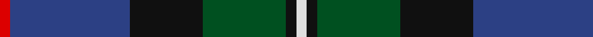
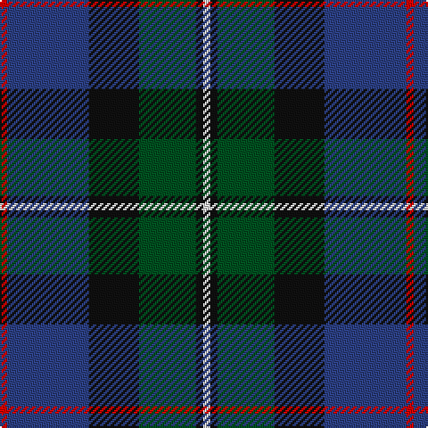

In pattern [RBKGKW](/stripes/rbkgkw/).

This was sourced from register-of-tartans.  It is a [6 stripe tartan](/stripes/stripes6/).

Original link https://www.tartanregister.gov.uk/tartanDetails.aspx?ref=2697

## Also known as

This cloth is also recorded under:

- MacPhail, hunting

## Register references

External register numbers recorded for this tartan.

- Scottish Register of Tartans: [2697](https://www.tartanregister.gov.uk/tartanDetails.aspx?ref=2697)
- Scottish Tartans World Register: 1367

## Thread count
R/4 B46 K28 G32 K4 LN/4

## Palette
Each colour and its ΔE from the base-6 reference it is a variant of.

| Colour | Shade | Base | ΔE (OKLab) |
|---|---|---|---|
| B | <code style="background-color:#2C4084;">#2C4084</code> `#2C4084` | B <code style="background-color:#2A418A;">#2A418A</code> | 0.01 |
| G | <code style="background-color:#005020;">#005020</code> `#005020` | G <code style="background-color:#006100;">#006100</code> | 0.07 |
| K | <code style="background-color:#101010;">#101010</code> `#101010` | K <code style="background-color:#000000;">#000000</code> | 0.17 |
| LN | <code style="background-color:#E0E0E0;">#E0E0E0</code> `#E0E0E0` | W <code style="background-color:#F7F7F7;">#F7F7F7</code> | 0.07 |
| R | <code style="background-color:#DC0000;">#DC0000</code> `#DC0000` | R <code style="background-color:#CC0000;">#CC0000</code> | 0.03 |

# Sample pattern

## Nearest tartans

The nearest existing variants by ΔTartan distance.

1. [MacWilliam Clan Tartan Tartan Number: 1417. Earliest known date: pre 1880 Mentioned in the pattern book 'Clans Originaux' produced in Paris in 1880 by J. Claude Fres Et Cie. It is similar in style and colour to the MacKay tartan both from Sutherland in the North of Scotland See products available Copyright © Blair Urquhart, Comrie, 2015](/setts/s6/dy2g12k10r1db16r2~x2/) — ΔT 0.65
1. [Russell or Mitchell or Hunter or Galbraith](/setts/s6/k2dg12k12r1db12w2~x2/) — ΔT 0.65
1. [Corey in Balachuirn](/setts/s5/b32do16dg3o4k28~x2/) — ΔT 0.66
1. [MacLeod Small Clan Tartan Tartan Number: 15833. Earliest known date: See products available Copyright © Blair Urquhart, Comrie, 2015](/setts/s7/r1k1g7k5db10k1ly1~x2/) — ΔT 0.69
1. [MacThomas Clan Tartan Tartan Number: 407. Earliest known date: 1975 Designed by David Thomas - former director of the Strathmore Woollen Co. in Forfar who still (in 2011) weave this tartan. Adopted by Clan Society in 1975, and registered with Lord Lyon in 1979. See products available Copyright © Blair Urquhart, Comrie, 2015](/setts/s7/db3m2db22k11g24lp2g3~x2/) — ΔT 0.71
1. [Paterson Blue (Personal)](/setts/s6/db22w2k10g11r3g4~x2/) — ΔT 0.72
1. [MacPhedran/MacFadzean](/setts/s7/dg3db12lb1k12dg13r2dg2~x2/) — ΔT 0.75
1. [MacThomas (Clan)](/setts/s7/dg5lp3dg32k16b32m3b5~x2/) — ΔT 0.75
1. [Deloughery, Paul](/setts/s7/db20k6o4db3k16g20w2~x2/) — ΔT 0.77
1. [Lyle and Scott](/setts/s6/dg5db2dg9db19dr9ly2~x2/) — ΔT 0.77

## Neighbour map

Every grey dot is one of 14299 variants placed by the first two principal components of the ΔTartan feature space (44% of its variance). Red is this tartan; blue dots are its nearest — click one to open its page.

<svg viewBox="0 0 640 380" role="img" style="max-width:100%;height:auto;border:1px solid #e0e0e0;border-radius:4px;display:block" xmlns="http://www.w3.org/2000/svg"><image href="/nn/cloud.v1.png" width="640" height="380"/><a href="/setts/s6/dy2g12k10r1db16r2~x2/"><circle cx="214.2" cy="200.7" r="4" fill="#3465a4"><title>MacWilliam Clan Tartan Tartan Number: 1417. Earliest known date: pre 1880 Mentioned in the pattern book 'Clans Originaux' produced in Paris in 1880 by J. Claude Fres Et Cie. It is similar in style and colour to the MacKay tartan both from Sutherland in the North of Scotland See products available Copyright © Blair Urquhart, Comrie, 2015</title></circle></a><a href="/setts/s6/k2dg12k12r1db12w2~x2/"><circle cx="180.5" cy="211.1" r="4" fill="#3465a4"><title>Russell or Mitchell or Hunter or Galbraith</title></circle></a><a href="/setts/s5/b32do16dg3o4k28~x2/"><circle cx="199.4" cy="229.4" r="4" fill="#3465a4"><title>Corey in Balachuirn</title></circle></a><a href="/setts/s7/r1k1g7k5db10k1ly1~x2/"><circle cx="196.3" cy="194.4" r="4" fill="#3465a4"><title>MacLeod Small Clan Tartan Tartan Number: 15833. Earliest known date: See products available Copyright © Blair Urquhart, Comrie, 2015</title></circle></a><a href="/setts/s7/db3m2db22k11g24lp2g3~x2/"><circle cx="233.8" cy="194.8" r="4" fill="#3465a4"><title>MacThomas Clan Tartan Tartan Number: 407. Earliest known date: 1975 Designed by David Thomas - former director of the Strathmore Woollen Co. in Forfar who still (in 2011) weave this tartan. Adopted by Clan Society in 1975, and registered with Lord Lyon in 1979. See products available Copyright © Blair Urquhart, Comrie, 2015</title></circle></a><a href="/setts/s6/db22w2k10g11r3g4~x2/"><circle cx="204.0" cy="204.8" r="4" fill="#3465a4"><title>Paterson Blue (Personal)</title></circle></a><a href="/setts/s7/dg3db12lb1k12dg13r2dg2~x2/"><circle cx="220.5" cy="203.4" r="4" fill="#3465a4"><title>MacPhedran/MacFadzean</title></circle></a><a href="/setts/s7/dg5lp3dg32k16b32m3b5~x2/"><circle cx="213.8" cy="200.8" r="4" fill="#3465a4"><title>MacThomas (Clan)</title></circle></a><a href="/setts/s7/db20k6o4db3k16g20w2~x2/"><circle cx="167.2" cy="215.9" r="4" fill="#3465a4"><title>Deloughery, Paul</title></circle></a><a href="/setts/s6/dg5db2dg9db19dr9ly2~x2/"><circle cx="202.9" cy="221.7" r="4" fill="#3465a4"><title>Lyle and Scott</title></circle></a><circle cx="214.9" cy="209.8" r="5" fill="#c00000"/></svg>

ID: /setts/s6/r2db23k14dg16k2w2~x2/
