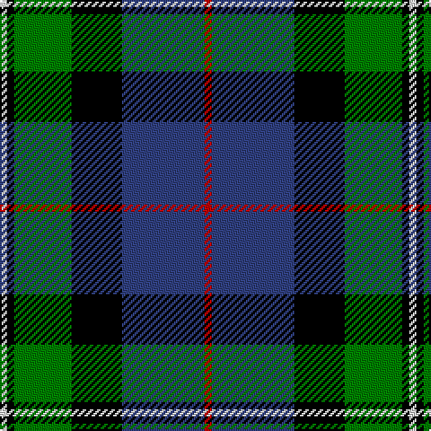

This page is one **sett** — a single exact thread-count. It belongs to the [tartan](/tartans/r2db23k14g16k2w2/)
(the same proportion at any scale), whose colour order is pattern [RBKGKW](/stripes/rbkgkw/).

Sourced from weddslist.  It is a [6 stripe tartan](/stripes/stripes6/).

Original link http://www.weddslist.com/cgi-bin/tartans/pg.pl?source=sts

## Also known as

This cloth is also recorded under:

- MacPhail, hunting

2 attestations — the source records this cloth was collapsed from (oldest owns this page)

<ul>
<li>undated — MacPhail, hunting (weddslist, <a href="http://www.weddslist.com/cgi-bin/tartans/pg.pl?source=sts">record</a>)</li>
<li>undated — MacPhail Hunting Clan Tartan Tartan Number: 1367. Earliest known date: 1880 In Clans Originaux as 'Macphail'. with this thread count: R8 B48 K24 G28 K8 LN6. (Does not divide by 4) This sample shown here comes from the MacGregor-Hastie collection which forms the basis of the cloth archive of the Scottish Tartans Society. See products available Copyright © Blair Urquhart, Comrie, 2015 (house-of-tartan, <a href="http://www.house-of-tartan.scotland.net/house/TartanViewjs.asp?colr=Def&tnam=1367">record</a>)</li>
</ul>

## Thread count
R/4 B46 K28 G32 K4 LN/4

## Palette

Palette: <strong>Tartan Register</strong> <small style="color:#888">(2 of 5 colours)</small>
<table><thead><tr><th>Colour</th><th>Threads</th><th>Shade</th><th>Base</th><th>OKLCh</th></tr></thead><tbody><tr><td>R/</td><td style="text-align:right;font-variant-numeric:tabular-nums">4</td><td><code style="background-color:#C00000;">#C00000</code> <small style="color:#888">#C00000</small></td><td>R <code style="background-color:#CC0000;">#CC0000</code></td><td><small style="color:#888">oklch(50.7% 0.208 29.2)</small></td></tr><tr><td>B</td><td style="text-align:right;font-variant-numeric:tabular-nums">46</td><td><code style="background-color:#304080;">#304080</code> <small style="color:#888">#304080</small></td><td>B <code style="background-color:#2A418A;">#2A418A</code></td><td><small style="color:#888">oklch(39.4% 0.109 270.2)</small></td></tr><tr><td>K</td><td style="text-align:right;font-variant-numeric:tabular-nums">28</td><td><code style="background-color:#000000;">#000000</code> <small style="color:#888">#000000</small></td><td>K <code style="background-color:#000000;">#000000</code></td><td><small style="color:#888">oklch(0.0% 0.000 0.0)</small></td></tr><tr><td>G</td><td style="text-align:right;font-variant-numeric:tabular-nums">32</td><td><code style="background-color:#008000;">#008000</code> <small style="color:#888">#008000</small></td><td>G <code style="background-color:#006100;">#006100</code></td><td><small style="color:#888">oklch(52.0% 0.177 142.5)</small></td></tr><tr><td>K</td><td style="text-align:right;font-variant-numeric:tabular-nums">4</td><td><code style="background-color:#000000;">#000000</code> <small style="color:#888">#000000</small></td><td>K <code style="background-color:#000000;">#000000</code></td><td><small style="color:#888">oklch(0.0% 0.000 0.0)</small></td></tr><tr><td>LN/</td><td style="text-align:right;font-variant-numeric:tabular-nums">4</td><td><code style="background-color:#E0E0E0;">#E0E0E0</code> <small style="color:#888">#E0E0E0</small></td><td>W <code style="background-color:#F7F7F7;">#F7F7F7</code></td><td><small style="color:#888">oklch(90.7% 0.000 89.9)</small></td></tr></tbody></table>

# Sample pattern

## Nearest tartans

The nearest existing variants by ΔTartan distance, with this tartan at the top so the swatches line up against it.

ΔTartan

Tartan

Sett

—

<a href="/ttd/edit/#slug=r2db23k14g16k2w2~x2">MacPhail, hunting</a> <a class="nn-out" href="/setts/s6/r2db23k14g16k2w2~x2/" title="open its dictionary page">↗</a>

0.41

<a href="/ttd/edit/#slug=r3k2g15k10db20ly2~x2">MacLeod of Assynt</a> <a class="nn-out" href="/setts/s6/r3k2g15k10db20ly2~x2/" title="open its dictionary page">↗</a>

0.52

<a href="/ttd/edit/#slug=r3k2g15k10db20k2ly2~x2">MacLeod, Macleod of Harris</a> <a class="nn-out" href="/setts/s7/r3k2g15k10db20k2ly2~x2/" title="open its dictionary page">↗</a>

0.62

<a href="/ttd/edit/#slug=k2g12k12r1db12w2~x2">Russell, or Mitchell or Hunter or Galbraith</a> <a class="nn-out" href="/setts/s6/k2g12k12r1db12w2~x2/" title="open its dictionary page">↗</a>

0.68

<a href="/ttd/edit/#slug=r2db16r1k10g12o2~x2">MacWilliam</a> <a class="nn-out" href="/setts/s6/r2db16r1k10g12o2~x2/" title="open its dictionary page">↗</a>

0.76

<a href="/ttd/edit/#slug=w1db8k9g9k1ly1~x4">MacNeil 4</a> <a class="nn-out" href="/setts/s6/w1db8k9g9k1ly1~x4/" title="open its dictionary page">↗</a>

0.77

<a href="/ttd/edit/#slug=w1db12k12g12k5ly1~x4">MacNeil 5</a> <a class="nn-out" href="/setts/s6/w1db12k12g12k5ly1~x4/" title="open its dictionary page">↗</a>

0.79

<a href="/ttd/edit/#slug=k2r1g15k15db15ly1k2~x2">MacCaskill</a> <a class="nn-out" href="/setts/s7/k2r1g15k15db15ly1k2~x2/" title="open its dictionary page">↗</a>

0.80

<a href="/ttd/edit/#slug=g3db12lr1k12g13r2g2~x2">MacPhadran</a> <a class="nn-out" href="/setts/s7/g3db12lr1k12g13r2g2~x2/" title="open its dictionary page">↗</a>

0.82

<a href="/ttd/edit/#slug=g9t2g1k6db6r1db1~x2">MacTaggert</a> <a class="nn-out" href="/setts/s7/g9t2g1k6db6r1db1~x2/" title="open its dictionary page">↗</a>

0.82

<a href="/ttd/edit/#slug=r1g14k14r2db14t1~x2">Wilson's, No 221</a> <a class="nn-out" href="/setts/s6/r1g14k14r2db14t1~x2/" title="open its dictionary page">↗</a>

## Neighbour map

Every grey dot is one of 14359 variants placed by the first two principal components of the ΔTartan feature space (44% of its variance). Red is this tartan; blue dots are its nearest — click one to open its page.

<svg viewBox="0 0 640 380" role="img" style="max-width:100%;height:auto;border:1px solid #e0e0e0;border-radius:4px;display:block" xmlns="http://www.w3.org/2000/svg"><image href="/nn/cloud.v1.png" width="640" height="380"/><a href="/setts/s6/r3k2g15k10db20ly2~x2/"><circle cx="153.9" cy="194.3" r="4" fill="#3465a4"><title>MacLeod of Assynt</title></circle></a><a href="/setts/s7/r3k2g15k10db20k2ly2~x2/"><circle cx="151.2" cy="180.6" r="4" fill="#3465a4"><title>MacLeod, Macleod of Harris</title></circle></a><a href="/setts/s6/k2g12k12r1db12w2~x2/"><circle cx="136.5" cy="191.5" r="4" fill="#3465a4"><title>Russell, or Mitchell or Hunter or Galbraith</title></circle></a><a href="/setts/s6/r2db16r1k10g12o2~x2/"><circle cx="170.2" cy="180.4" r="4" fill="#3465a4"><title>MacWilliam</title></circle></a><a href="/setts/s6/w1db8k9g9k1ly1~x4/"><circle cx="128.9" cy="197.7" r="4" fill="#3465a4"><title>MacNeil 4</title></circle></a><a href="/setts/s6/w1db12k12g12k5ly1~x4/"><circle cx="157.6" cy="199.9" r="4" fill="#3465a4"><title>MacNeil 5</title></circle></a><a href="/setts/s7/k2r1g15k15db15ly1k2~x2/"><circle cx="178.1" cy="168.4" r="4" fill="#3465a4"><title>MacCaskill</title></circle></a><a href="/setts/s7/g3db12lr1k12g13r2g2~x2/"><circle cx="168.6" cy="181.2" r="4" fill="#3465a4"><title>MacPhadran</title></circle></a><a href="/setts/s7/g9t2g1k6db6r1db1~x2/"><circle cx="144.8" cy="193.8" r="4" fill="#3465a4"><title>MacTaggert</title></circle></a><a href="/setts/s6/r1g14k14r2db14t1~x2/"><circle cx="141.8" cy="182.8" r="4" fill="#3465a4"><title>Wilson's, No 221</title></circle></a><circle cx="167.0" cy="187.4" r="5" fill="#c00000"/></svg>

ID: /setts/s6/r2db23k14g16k2w2~x2/
