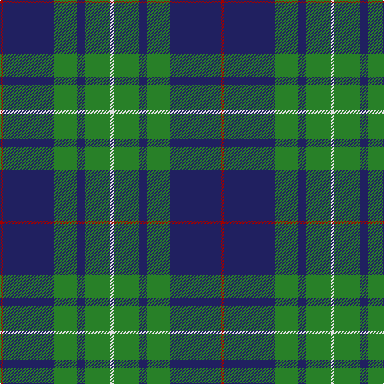

**Bands:** [RBGBGW](/stripes/rbgbgw/) · **Stripes:** [R DB G DB G W](/stripes/stripes6/) R DB G DB G W

This was sourced from house-of-tartan.  It is a [6 band tartan](/bands/bands6/).

Original link http://www.house-of-tartan.scotland.net/house/TartanViewjs.asp?colr=Def&tnam=4485

## Thread count
DR/4 DB64 Ga28 DB10 Ga32 LN/4

## Palette
Each colour and its ΔE from the base-6 reference it is a variant of.

| Colour | Shade | Base | ΔE (OKLab) |
|---|---|---|---|
| DB | <code style="background-color:#202060;">#202060</code> `#202060` | B <code style="background-color:#2A418A;">#2A418A</code> | 0.11 |
| DR | <code style="background-color:#A00000;">#A00000</code> `#A00000` | R <code style="background-color:#CC0000;">#CC0000</code> | 0.09 |
| G | <code style="background-color:#5C6428;">#5C6428</code> `#5C6428` | G <code style="background-color:#006100;">#006100</code> | 0.10 |
| Ga | <code style="background-color:#288028;">#288028</code> `#288028` | G <code style="background-color:#006100;">#006100</code> | 0.10 |
| LN | <code style="background-color:#E0E0E0;">#E0E0E0</code> `#E0E0E0` | W <code style="background-color:#F7F7F7;">#F7F7F7</code> | 0.07 |
| N | <code style="background-color:#C0C0C0;">#C0C0C0</code> `#C0C0C0` | W <code style="background-color:#F7F7F7;">#F7F7F7</code> | 0.17 |

# Sample pattern

## Nearest tartans

The nearest existing variants by ΔTartan distance.

1. [Gracie (Name)](/setts/s5/g47r3g6db35lo3~x2/) — ΔT 0.76
1. [St. Andrew Society, Sao Paulo (Corp)](/setts/s6/db5w3db36g38ly5g5~x2/) — ΔT 0.78
1. [MacIntyre L](/setts/s6/dg4db12r3db12dg32lb4/) — ΔT 0.91
1. [MacIntyre Hunting (VS)](/setts/s6/g4db12r3db12g32w4~x2/) — ΔT 0.93
1. [St. Andrews Old Course Hotel (Corp)](/setts/s6/g26db10k3db2dy2db10~x4/) — ΔT 0.97
1. [Unidentified Furnishing #2](/setts/s6/r4g40k21lo2k21g2~x2/) — ΔT 0.99
1. [Heritage Tartan, The](/setts/s6/db8r4db24g35lb4g8/) — ΔT 0.99
1. [Gracie](/setts/s8/g47r3g6db35lo3db35g6r3~x2/) — ΔT 0.99
1. [Greenways Marketing Intl (Corporate)](/setts/s7/db24g3db3g3lo2g18r2~x2/) — ΔT 0.99
1. [U.S. Border Patrol (Corporate)](/setts/s5/g40k15b10k10ly3~x2/) — ΔT 1.02

## Neighbour map

Every grey dot is one of 14313 variants placed by the first two principal components of the ΔTartan feature space (44% of its variance). Red is this tartan; blue dots are its nearest — click one to open its page.

<svg viewBox="0 0 640 380" role="img" style="max-width:100%;height:auto;border:1px solid #e0e0e0;border-radius:4px;display:block" xmlns="http://www.w3.org/2000/svg"><image href="/nn/cloud.v1.png" width="640" height="380"/><a href="/setts/s5/g47r3g6db35lo3~x2/"><circle cx="356.9" cy="210.6" r="4" fill="#3465a4"><title>Gracie (Name)</title></circle></a><a href="/setts/s6/db5w3db36g38ly5g5~x2/"><circle cx="294.0" cy="201.8" r="4" fill="#3465a4"><title>St. Andrew Society, Sao Paulo (Corp)</title></circle></a><a href="/setts/s6/dg4db12r3db12dg32lb4/"><circle cx="301.3" cy="218.6" r="4" fill="#3465a4"><title>MacIntyre L</title></circle></a><a href="/setts/s6/g4db12r3db12g32w4~x2/"><circle cx="295.2" cy="211.1" r="4" fill="#3465a4"><title>MacIntyre Hunting (VS)</title></circle></a><a href="/setts/s6/g26db10k3db2dy2db10~x4/"><circle cx="315.6" cy="217.6" r="4" fill="#3465a4"><title>St. Andrews Old Course Hotel (Corp)</title></circle></a><a href="/setts/s6/r4g40k21lo2k21g2~x2/"><circle cx="298.7" cy="185.3" r="4" fill="#3465a4"><title>Unidentified Furnishing #2</title></circle></a><a href="/setts/s6/db8r4db24g35lb4g8/"><circle cx="284.9" cy="228.4" r="4" fill="#3465a4"><title>Heritage Tartan, The</title></circle></a><a href="/setts/s8/g47r3g6db35lo3db35g6r3~x2/"><circle cx="326.3" cy="189.8" r="4" fill="#3465a4"><title>Gracie</title></circle></a><a href="/setts/s7/db24g3db3g3lo2g18r2~x2/"><circle cx="312.4" cy="197.0" r="4" fill="#3465a4"><title>Greenways Marketing Intl (Corporate)</title></circle></a><a href="/setts/s5/g40k15b10k10ly3~x2/"><circle cx="280.0" cy="216.5" r="4" fill="#3465a4"><title>U.S. Border Patrol (Corporate)</title></circle></a><circle cx="323.6" cy="202.3" r="5" fill="#c00000"/></svg>

ID: /setts/s6/r2db32g14db5g16w2~x2/
