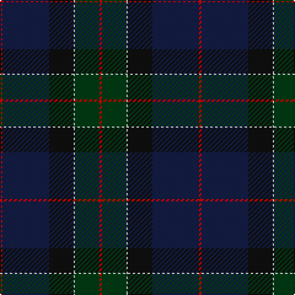

This page is one **sett** — a single exact thread-count. It belongs to the [tartan](/tartans/r2db38k20w1dg20r2/)
(the same proportion at any scale), whose colour order is pattern [RBKWGR](/stripes/rbkwgr/).

Sourced from register-of-tartans.  It is a [6 stripe tartan](/stripes/stripes6/).

Original link https://www.tartanregister.gov.uk/tartanDetails.aspx?ref=5995

## Register references

External register numbers recorded for this tartan.

- Scottish Register of Tartans: [5995](https://www.tartanregister.gov.uk/tartanDetails.aspx?ref=5995)
- Scottish Tartans World Register: 3286

## Thread count
R/2 DB38 K20 LN1 DG20 R/2

## Palette

Palette: <strong>Tartan Register</strong>
<table><thead><tr><th>Colour</th><th>Threads</th><th>Shade</th><th>Base</th><th>OKLCh</th></tr></thead><tbody><tr><td>R/</td><td style="text-align:right;font-variant-numeric:tabular-nums">2</td><td><code style="background-color:#DC0000;">#DC0000</code> <small style="color:#888">#DC0000</small></td><td>R <code style="background-color:#CC0000;">#CC0000</code></td><td><small style="color:#888">oklch(56.2% 0.230 29.2)</small></td></tr><tr><td>DB</td><td style="text-align:right;font-variant-numeric:tabular-nums">38</td><td><code style="background-color:#141E46;">#141E46</code> <small style="color:#888">#141E46</small></td><td>B <code style="background-color:#2A418A;">#2A418A</code></td><td><small style="color:#888">oklch(25.2% 0.076 269.7)</small></td></tr><tr><td>K</td><td style="text-align:right;font-variant-numeric:tabular-nums">20</td><td><code style="background-color:#101010;">#101010</code> <small style="color:#888">#101010</small></td><td>K <code style="background-color:#000000;">#000000</code></td><td><small style="color:#888">oklch(17.3% 0.000 89.9)</small></td></tr><tr><td>LN</td><td style="text-align:right;font-variant-numeric:tabular-nums">1</td><td><code style="background-color:#E0E0E0;">#E0E0E0</code> <small style="color:#888">#E0E0E0</small></td><td>W <code style="background-color:#F7F7F7;">#F7F7F7</code></td><td><small style="color:#888">oklch(90.7% 0.000 89.9)</small></td></tr><tr><td>DG</td><td style="text-align:right;font-variant-numeric:tabular-nums">20</td><td><code style="background-color:#003C14;">#003C14</code> <small style="color:#888">#003C14</small></td><td>G <code style="background-color:#006100;">#006100</code></td><td><small style="color:#888">oklch(31.1% 0.089 148.5)</small></td></tr><tr><td>R/</td><td style="text-align:right;font-variant-numeric:tabular-nums">2</td><td><code style="background-color:#DC0000;">#DC0000</code> <small style="color:#888">#DC0000</small></td><td>R <code style="background-color:#CC0000;">#CC0000</code></td><td><small style="color:#888">oklch(56.2% 0.230 29.2)</small></td></tr></tbody></table>

# Sample pattern

## Nearest tartans

The nearest existing variants by ΔTartan distance, with this tartan at the top so the swatches line up against it.

ΔTartan

Tartan

Sett

—

<a href="/ttd/edit/#slug=r2db38k20w1dg20r2">Waterfront</a> <a class="nn-out" href="/setts/s6/r2db38k20w1dg20r2/" title="open its dictionary page">↗</a>

1.07

<a href="/ttd/edit/#slug=dg28r3k28db8t1dg8r2k3~x2">Stansbury</a> <a class="nn-out" href="/setts/s8/dg28r3k28db8t1dg8r2k3~x2/" title="open its dictionary page">↗</a>

1.11

<a href="/ttd/edit/#slug=dg28r3k28dt8t1dg8r2k3~x2">Stansbury (2014)</a> <a class="nn-out" href="/setts/s8/dg28r3k28dt8t1dg8r2k3~x2/" title="open its dictionary page">↗</a>

1.12

<a href="/ttd/edit/#slug=db50dg26k9dg4w2r2dg10~x2">Java St Andrew Society hunting</a> <a class="nn-out" href="/setts/s7/db50dg26k9dg4w2r2dg10~x2/" title="open its dictionary page">↗</a>

1.23

<a href="/ttd/edit/#slug=k12g8ly1dg13t1db31k8~x2">Chesters, Eric (Personal)</a> <a class="nn-out" href="/setts/s7/k12g8ly1dg13t1db31k8~x2/" title="open its dictionary page">↗</a>

1.42

<a href="/ttd/edit/#slug=dp5db8dt13g21db34dt55o3">Bouncing Blackie (Personal)</a> <a class="nn-out" href="/setts/s7/dp5db8dt13g21db34dt55o3/" title="open its dictionary page">↗</a>

1.44

<a href="/ttd/edit/#slug=w2k2r1dt20k15dg30ly1~x2">Muir-Hill (Personal)</a> <a class="nn-out" href="/setts/s7/w2k2r1dt20k15dg30ly1~x2/" title="open its dictionary page">↗</a>

1.49

<a href="/ttd/edit/#slug=dg2k1db29k2dg9k27lo2~x2">Caledonian Canals (Corporate)</a> <a class="nn-out" href="/setts/s7/dg2k1db29k2dg9k27lo2~x2/" title="open its dictionary page">↗</a>

1.56

<a href="/ttd/edit/#slug=dt6o4dt2db25k30g2k2~x2">Passion of Scotland (Fashion)</a> <a class="nn-out" href="/setts/s7/dt6o4dt2db25k30g2k2~x2/" title="open its dictionary page">↗</a>

1.61

<a href="/setts/s8/dp3k16r3dg17ki16k26ly1dp3~x2/">Barton-Watson de Bavidge (Personal)</a>

1.61

<a href="/ttd/edit/#slug=r1dy2dt12dy8db16lo1~x2">Bobby Jones (Personal)</a> <a class="nn-out" href="/setts/s6/r1dy2dt12dy8db16lo1~x2/" title="open its dictionary page">↗</a>

## Neighbour map

Every grey dot is one of 14359 variants placed by the first two principal components of the ΔTartan feature space (44% of its variance). Red is this tartan; blue dots are its nearest — click one to open its page.

<svg viewBox="0 0 640 380" role="img" style="max-width:100%;height:auto;border:1px solid #e0e0e0;border-radius:4px;display:block" xmlns="http://www.w3.org/2000/svg"><image href="/nn/cloud.v1.png" width="640" height="380"/><a href="/setts/s8/dg28r3k28db8t1dg8r2k3~x2/"><circle cx="349.3" cy="184.4" r="4" fill="#3465a4"><title>Stansbury</title></circle></a><a href="/setts/s8/dg28r3k28dt8t1dg8r2k3~x2/"><circle cx="359.1" cy="191.1" r="4" fill="#3465a4"><title>Stansbury (2014)</title></circle></a><a href="/setts/s7/db50dg26k9dg4w2r2dg10~x2/"><circle cx="381.8" cy="196.5" r="4" fill="#3465a4"><title>Java St Andrew Society hunting</title></circle></a><a href="/setts/s7/k12g8ly1dg13t1db31k8~x2/"><circle cx="285.6" cy="177.9" r="4" fill="#3465a4"><title>Chesters, Eric (Personal)</title></circle></a><a href="/setts/s7/dp5db8dt13g21db34dt55o3/"><circle cx="344.7" cy="218.9" r="4" fill="#3465a4"><title>Bouncing Blackie (Personal)</title></circle></a><a href="/setts/s7/w2k2r1dt20k15dg30ly1~x2/"><circle cx="291.4" cy="161.3" r="4" fill="#3465a4"><title>Muir-Hill (Personal)</title></circle></a><a href="/setts/s7/dg2k1db29k2dg9k27lo2~x2/"><circle cx="360.7" cy="202.2" r="4" fill="#3465a4"><title>Caledonian Canals (Corporate)</title></circle></a><a href="/setts/s7/dt6o4dt2db25k30g2k2~x2/"><circle cx="335.1" cy="211.3" r="4" fill="#3465a4"><title>Passion of Scotland (Fashion)</title></circle></a><a href="/setts/s8/dp3k16r3dg17ki16k26ly1dp3~x2/"><circle cx="307.4" cy="186.5" r="4" fill="#3465a4"><title>Barton-Watson de Bavidge (Personal)</title></circle></a><a href="/setts/s6/r1dy2dt12dy8db16lo1~x2/"><circle cx="306.3" cy="229.7" r="4" fill="#3465a4"><title>Bobby Jones (Personal)</title></circle></a><circle cx="355.7" cy="191.5" r="5" fill="#c00000"/></svg>

ID: /setts/s6/r2db38k20w1dg20r2/
