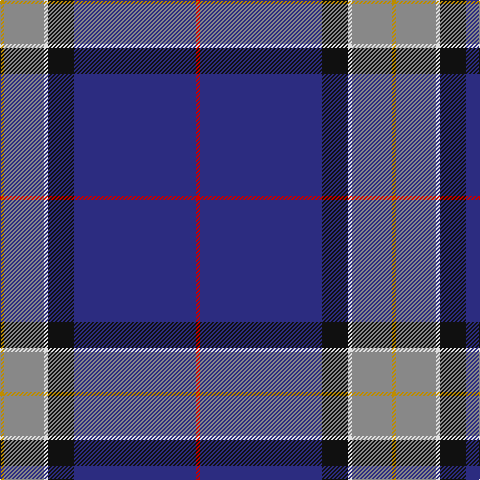

In pattern [RBKWRY](/stripes/rbkwry/).

This was sourced from register-of-tartans.  It is a [6 stripe tartan](/stripes/stripes6/).

Original link https://www.tartanregister.gov.uk/tartanDetails.aspx?ref=2139

## Attestations

This cloth appears in 2 source records; the oldest owns this page.

- 01/01/2001 — Lloyd of Astargus (register-of-tartans, [record](https://www.tartanregister.gov.uk/tartanDetails.aspx?ref=2139))
- 2001 — Lloyd of Astargus (Name) (tartans-authority, [record](http://www.tartansauthority.com/tartan-ferret/display/5771/))

## Register references

External register numbers recorded for this tartan.

- Scottish Register of Tartans: [2139](https://www.tartanregister.gov.uk/tartanDetails.aspx?ref=2139)
- Scottish Tartans Authority (ITI): 5771

## Thread count
DY/4 N40 LN4 K26 DB122 R/4

## Palette
Each colour and its ΔE from the base-6 reference it is a variant of.

| Colour | Shade | Base | ΔE (OKLab) |
|---|---|---|---|
| DB | <code style="background-color:#2C2C80;">#2C2C80</code> `#2C2C80` | B <code style="background-color:#2A418A;">#2A418A</code> | 0.06 |
| DY | <code style="background-color:#BC8C00;">#BC8C00</code> `#BC8C00` | Y <code style="background-color:#F2BF00;">#F2BF00</code> | 0.16 |
| K | <code style="background-color:#101010;">#101010</code> `#101010` | K <code style="background-color:#000000;">#000000</code> | 0.17 |
| LN | <code style="background-color:#E0E0E0;">#E0E0E0</code> `#E0E0E0` | W <code style="background-color:#F7F7F7;">#F7F7F7</code> | 0.07 |
| N | <code style="background-color:#888888;">#888888</code> `#888888` | R <code style="background-color:#CC0000;">#CC0000</code> | 0.24 |
| R | <code style="background-color:#C80000;">#C80000</code> `#C80000` | R <code style="background-color:#CC0000;">#CC0000</code> | 0.01 |

# Sample pattern

## Nearest tartans

The nearest existing variants by ΔTartan distance.

1. [St. Andrew Quebec City (Corporate)](/setts/s8/r2w1r5g5lo1g10db40ly2~x2/) — ΔT 1.13
1. [Kirkcaldy](/setts/s6/t23w3k10r2db45ly1~x2/) — ΔT 1.18
1. [Kirkcaldy Name Tartan Tartan Number: 9072. Earliest known date: 2008 Blue and white for the Scottish flag, the red and yellow is from William Kirkcaldy's shield (it is also my son's army colours). It is for general use. See products available Copyright © Blair Urquhart, Comrie, 2015](/setts/s6/t23w3k10r2dt45ly1~x2/) — ΔT 1.23
1. [Grahame Laurie Band (Corporate)](/setts/s7/k8ly2dp6ly2k36db84w7/) — ΔT 1.24
1. [MacLaurin of Broich (Clan)](/setts/s7/db36k8g3r3g6k1lo2~x2/) — ΔT 1.27
1. [Marion (Personal)](/setts/s6/p5g8k5db32w2r2~x2/) — ΔT 1.31
1. [MacCormick Festive](/setts/s9/w3db3k1t16k1db8r3db24ly3~x2/) — ΔT 1.35
1. [Wilton (Name)](/setts/s6/w2db45g9r1n9r1~x2/) — ΔT 1.35
1. [Guide Dogs (Corporate)](/setts/s7/db67w1lo6r5dg25db3k5~x2/) — ΔT 1.36
1. [St Andrew's College](/setts/s9/db18w2db2r3db21k28ly1k1g2~x2/) — ΔT 1.36

## Neighbour map

Every grey dot is one of 14299 variants placed by the first two principal components of the ΔTartan feature space (44% of its variance). Red is this tartan; blue dots are its nearest — click one to open its page.

<svg viewBox="0 0 640 380" role="img" style="max-width:100%;height:auto;border:1px solid #e0e0e0;border-radius:4px;display:block" xmlns="http://www.w3.org/2000/svg"><image href="/nn/cloud.v1.png" width="640" height="380"/><a href="/setts/s8/r2w1r5g5lo1g10db40ly2~x2/"><circle cx="381.3" cy="89.0" r="4" fill="#3465a4"><title>St. Andrew Quebec City (Corporate)</title></circle></a><a href="/setts/s6/t23w3k10r2db45ly1~x2/"><circle cx="326.2" cy="116.9" r="4" fill="#3465a4"><title>Kirkcaldy</title></circle></a><a href="/setts/s6/t23w3k10r2dt45ly1~x2/"><circle cx="332.3" cy="120.8" r="4" fill="#3465a4"><title>Kirkcaldy Name Tartan Tartan Number: 9072. Earliest known date: 2008 Blue and white for the Scottish flag, the red and yellow is from William Kirkcaldy's shield (it is also my son's army colours). It is for general use. See products available Copyright © Blair Urquhart, Comrie, 2015</title></circle></a><a href="/setts/s7/k8ly2dp6ly2k36db84w7/"><circle cx="387.2" cy="118.1" r="4" fill="#3465a4"><title>Grahame Laurie Band (Corporate)</title></circle></a><a href="/setts/s7/db36k8g3r3g6k1lo2~x2/"><circle cx="399.9" cy="132.5" r="4" fill="#3465a4"><title>MacLaurin of Broich (Clan)</title></circle></a><a href="/setts/s6/p5g8k5db32w2r2~x2/"><circle cx="318.5" cy="152.6" r="4" fill="#3465a4"><title>Marion (Personal)</title></circle></a><a href="/setts/s9/w3db3k1t16k1db8r3db24ly3~x2/"><circle cx="297.7" cy="114.6" r="4" fill="#3465a4"><title>MacCormick Festive</title></circle></a><a href="/setts/s6/w2db45g9r1n9r1~x2/"><circle cx="454.5" cy="121.6" r="4" fill="#3465a4"><title>Wilton (Name)</title></circle></a><a href="/setts/s7/db67w1lo6r5dg25db3k5~x2/"><circle cx="430.9" cy="113.4" r="4" fill="#3465a4"><title>Guide Dogs (Corporate)</title></circle></a><a href="/setts/s9/db18w2db2r3db21k28ly1k1g2~x2/"><circle cx="322.0" cy="120.9" r="4" fill="#3465a4"><title>St Andrew's College</title></circle></a><circle cx="371.5" cy="125.4" r="5" fill="#c00000"/></svg>

ID: /setts/s6/r2db61k13w2o20lo2~x2/
