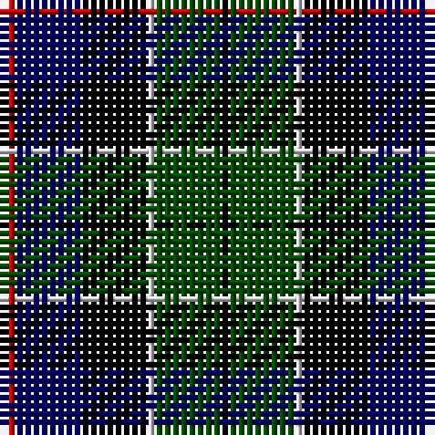

In pattern [KGWKBR](/stripes/kgwkbr/).

This was sourced from weddslist.  It is a [6 stripe tartan](/stripes/stripes6/).

Original link http://www.weddslist.com/cgi-bin/tartans/pg.pl?source=rb

## Thread count
R/2 DB8 K8 N1 G8 K/1

## Palette
Each colour and the base-6 reference it is a variant of.

| Colour | Shade | Base |
|---|---|---|
| DB | <code style="background-color:#000064;">#000064</code> `oklch(22.7% 0.158 264.1)` <small>#000064</small> | B <code style="background-color:#2A418A;">#2A418A</code> |
| G | <code style="background-color:#004C00;">#004C00</code> `oklch(36.1% 0.123 142.5)` <small>#004C00</small> | G <code style="background-color:#006100;">#006100</code> |
| K | <code style="background-color:#000000;">#000000</code> `oklch(0.0% 0.000 0.0)` <small>#000000</small> | K <code style="background-color:#000000;">#000000</code> |
| N | <code style="background-color:#D0D0D0;">#D0D0D0</code> `oklch(85.8% 0.000 89.9)` <small>#D0D0D0</small> | W <code style="background-color:#F7F7F7;">#F7F7F7</code> |
| R | <code style="background-color:#C80000;">#C80000</code> `oklch(52.3% 0.215 29.2)` <small>#C80000</small> | R <code style="background-color:#CC0000;">#CC0000</code> |

# Sample pattern

## Nearest tartans

The nearest existing variants by ΔTartan distance.

1. [Herd](/setts/s6/dp4dg25k24w3db24w4~x2/) — ΔT 0.39
1. [MacNiel of Barra](/setts/s6/lr3db14k12dg12k2ly3~x2/) — ΔT 0.43
1. [MacNiel of Barra](/setts/s6/lr3db14k12dg12k2ly3/) — ΔT 0.43
1. [Campbell Cawdor](/setts/s7/r2k1db8k8dg8k1lb2/) — ΔT 0.47
1. [Leslie Hunting](/setts/s6/r2db8k8lr1dg8k1~x2/) — ΔT 0.49
1. [Leslie Hunting](/setts/s6/r2db8k8lr1dg8k1/) — ΔT 0.49
1. [Colquhoun](/setts/s7/r2dg8lr1k8db8k1db1~x2/) — ΔT 0.71
1. [Mitchell](/setts/s6/k2dg12k12r1db12lb2/) — ΔT 0.72
1. [MacNeil of Barra](/setts/s6/ly3k2dg12k12db14lb3/) — ΔT 0.73
1. [Campbell of Cawdor](/setts/s7/r2k1db8k8dg8k1b2~x2/) — ΔT 0.76

## Neighbour map

Every grey dot is one of 14299 variants placed by the first two principal components of the ΔTartan feature space (44% of its variance). Red is this tartan; blue dots are its nearest — click one to open its page.

<svg viewBox="0 0 640 380" role="img" style="max-width:100%;height:auto;border:1px solid #e0e0e0;border-radius:4px;display:block" xmlns="http://www.w3.org/2000/svg"><image href="/nn/cloud.v1.png" width="640" height="380"/><a href="/setts/s6/dp4dg25k24w3db24w4~x2/"><circle cx="115.8" cy="217.3" r="4" fill="#3465a4"><title>Herd</title></circle></a><a href="/setts/s6/lr3db14k12dg12k2ly3~x2/"><circle cx="100.4" cy="228.5" r="4" fill="#3465a4"><title>MacNiel of Barra</title></circle></a><a href="/setts/s6/lr3db14k12dg12k2ly3/"><circle cx="100.4" cy="228.5" r="4" fill="#3465a4"><title>MacNiel of Barra</title></circle></a><a href="/setts/s7/r2k1db8k8dg8k1lb2/"><circle cx="118.8" cy="204.8" r="4" fill="#3465a4"><title>Campbell Cawdor</title></circle></a><a href="/setts/s6/r2db8k8lr1dg8k1~x2/"><circle cx="139.2" cy="226.5" r="4" fill="#3465a4"><title>Leslie Hunting</title></circle></a><a href="/setts/s6/r2db8k8lr1dg8k1/"><circle cx="139.2" cy="226.5" r="4" fill="#3465a4"><title>Leslie Hunting</title></circle></a><a href="/setts/s7/r2dg8lr1k8db8k1db1~x2/"><circle cx="142.7" cy="212.7" r="4" fill="#3465a4"><title>Colquhoun</title></circle></a><a href="/setts/s6/k2dg12k12r1db12lb2/"><circle cx="158.7" cy="205.5" r="4" fill="#3465a4"><title>Mitchell</title></circle></a><a href="/setts/s6/ly3k2dg12k12db14lb3/"><circle cx="87.8" cy="222.1" r="4" fill="#3465a4"><title>MacNeil of Barra</title></circle></a><a href="/setts/s7/r2k1db8k8dg8k1b2~x2/"><circle cx="143.9" cy="219.1" r="4" fill="#3465a4"><title>Campbell of Cawdor</title></circle></a><circle cx="124.9" cy="219.0" r="5" fill="#c00000"/></svg>

ID: /setts/s6/r2db8k8lb1dg8k1/
