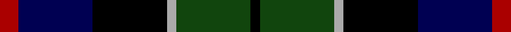
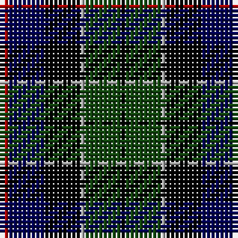

In pattern [KGYKBR](/stripes/kgykbr/).

This was sourced from weddslist.  It is a [6 stripe tartan](/stripes/stripes6/).

Original link http://www.weddslist.com/cgi-bin/tartans/pg.pl?source=x

## Register references

External register numbers recorded for this tartan.

- Scottish Register of Tartans: [1166](https://www.tartanregister.gov.uk/tartanDetails.aspx?ref=1166)
- Scottish Register of Tartans: [1758](https://www.tartanregister.gov.uk/tartanDetails.aspx?ref=1758)
- Scottish Register of Tartans: [2307](https://www.tartanregister.gov.uk/tartanDetails.aspx?ref=2307)
- Scottish Register of Tartans: [2540](https://www.tartanregister.gov.uk/tartanDetails.aspx?ref=2540)
- Scottish Register of Tartans: [2625](https://www.tartanregister.gov.uk/tartanDetails.aspx?ref=2625)
- Scottish Register of Tartans: [2862](https://www.tartanregister.gov.uk/tartanDetails.aspx?ref=2862)
- Scottish Register of Tartans: [982](https://www.tartanregister.gov.uk/tartanDetails.aspx?ref=982)
- Scottish Tartans Authority (ITI): 1429
- Scottish Tartans Authority (ITI): 218
- Scottish Tartans World Register: 1042
- Scottish Tartans World Register: 127
- Scottish Tartans World Register: 1429
- Scottish Tartans World Register: 218
- Scottish Tartans World Register: 2218
- Scottish Tartans World Register: 737
- Scottish Tartans World Register: 897

## Thread count
DR/2 DB8 K8 N1 DG8 K/1

## Palette
Each colour and its ΔE from the base-6 reference it is a variant of.

| Colour | Shade | Base | ΔE (OKLab) |
|---|---|---|---|
| DB | <code style="background-color:#000052;">#000052</code> `#000052` | B <code style="background-color:#2A418A;">#2A418A</code> | 0.20 |
| DG | <code style="background-color:#11450D;">#11450D</code> `#11450D` | G <code style="background-color:#006100;">#006100</code> | 0.09 |
| DR | <code style="background-color:#AA0000;">#AA0000</code> `#AA0000` | R <code style="background-color:#CC0000;">#CC0000</code> | 0.07 |
| K | <code style="background-color:#000000;">#000000</code> `#000000` | K <code style="background-color:#000000;">#000000</code> | 0.00 |
| N | <code style="background-color:#AAAAAA;">#AAAAAA</code> `#AAAAAA` | Y <code style="background-color:#F2BF00;">#F2BF00</code> | 0.19 |

# Sample pattern

## Nearest tartans

The nearest existing variants by ΔTartan distance.

1. [Leslie Hunting](/setts/s6/r2db8k8lr1dg8k1~x2/) — ΔT 0.00
1. [Campbell of Cawdor](/setts/s7/r2k1db8k8dg8k1b2~x2/) — ΔT 0.43
1. [Colquhoun](/setts/s7/r2dg8lr1k8db8k1db1~x2/) — ΔT 0.48
1. [Leslie Hunting](/setts/s6/r2db8k8lb1dg8k1/) — ΔT 0.49
1. [Herd](/setts/s6/dp4dg25k24w3db24w4~x2/) — ΔT 0.59
1. [Mitchell](/setts/s6/k2dg12k12r1db12lr2~x2/) — ΔT 0.70
1. [Mitchell](/setts/s6/k2dg12k12r1db12lr2/) — ΔT 0.70
1. [Royal College of Physicians of Edinburgh](/setts/s6/db28r4k14r4dg33ly4~x2/) — ΔT 0.71
1. [Rose Hunting](/setts/s6/k4lr1dg10k10db10r2~x2/) — ΔT 0.71
1. [Rose Hunting](/setts/s6/k4lr1dg10k10db10r2/) — ΔT 0.71

## Neighbour map

Every grey dot is one of 14299 variants placed by the first two principal components of the ΔTartan feature space (44% of its variance). Red is this tartan; blue dots are its nearest — click one to open its page.

<svg viewBox="0 0 640 380" role="img" style="max-width:100%;height:auto;border:1px solid #e0e0e0;border-radius:4px;display:block" xmlns="http://www.w3.org/2000/svg"><image href="/nn/cloud.v1.png" width="640" height="380"/><a href="/setts/s6/r2db8k8lr1dg8k1~x2/"><circle cx="139.2" cy="226.5" r="4" fill="#3465a4"><title>Leslie Hunting</title></circle></a><a href="/setts/s7/r2k1db8k8dg8k1b2~x2/"><circle cx="143.9" cy="219.1" r="4" fill="#3465a4"><title>Campbell of Cawdor</title></circle></a><a href="/setts/s7/r2dg8lr1k8db8k1db1~x2/"><circle cx="142.7" cy="212.7" r="4" fill="#3465a4"><title>Colquhoun</title></circle></a><a href="/setts/s6/r2db8k8lb1dg8k1/"><circle cx="124.9" cy="219.0" r="4" fill="#3465a4"><title>Leslie Hunting</title></circle></a><a href="/setts/s6/dp4dg25k24w3db24w4~x2/"><circle cx="115.8" cy="217.3" r="4" fill="#3465a4"><title>Herd</title></circle></a><a href="/setts/s6/k2dg12k12r1db12lr2~x2/"><circle cx="170.4" cy="211.3" r="4" fill="#3465a4"><title>Mitchell</title></circle></a><a href="/setts/s6/k2dg12k12r1db12lr2/"><circle cx="170.4" cy="211.3" r="4" fill="#3465a4"><title>Mitchell</title></circle></a><a href="/setts/s6/db28r4k14r4dg33ly4~x2/"><circle cx="169.2" cy="213.2" r="4" fill="#3465a4"><title>Royal College of Physicians of Edinburgh</title></circle></a><a href="/setts/s6/k4lr1dg10k10db10r2~x2/"><circle cx="169.3" cy="230.8" r="4" fill="#3465a4"><title>Rose Hunting</title></circle></a><a href="/setts/s6/k4lr1dg10k10db10r2/"><circle cx="169.3" cy="230.8" r="4" fill="#3465a4"><title>Rose Hunting</title></circle></a><circle cx="139.2" cy="226.5" r="5" fill="#c00000"/></svg>

ID: /setts/s6/r2db8k8lr1dg8k1/
