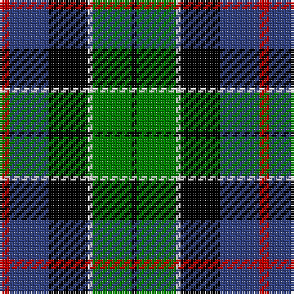

In pattern [KGWKBR](/stripes/kgwkbr/).

This was sourced from weddslist.  It is a [6 stripe tartan](/stripes/stripes6/).

Original link http://www.weddslist.com/cgi-bin/tartans/pg.pl?source=sts

## Also known as

This cloth is also recorded under:

- Leslie, hunting

## Attestations

This cloth appears in 2 source records; the oldest owns this page.

- undated — Leslie, hunting (weddslist, [record](http://www.weddslist.com/cgi-bin/tartans/pg.pl?source=sts))
- undated — Leslie Hunting Clan Tartan Tartan Number: 1113. Earliest known date: 1810-15 Said to have been worn by George 14th Earl of Rothes who died in 1841. This sett is shown by Smibert (1850) and by W & A Smith (1850) but without the definition of 'Hunting'. This sett is very similar to Duncan, the difference lies in the broad black present in the Leslie Hunting which is green in the Duncan See products available Copyright © Blair Urquhart, Comrie, 2015 (house-of-tartan, [record](http://www.house-of-tartan.scotland.net/house/TartanViewjs.asp?colr=Def&tnam=1113))

## Thread count
R/4 B16 K16 LN2 G16 K/2

## Palette
Each colour and the base-6 reference it is a variant of.

| Colour | Shade | Base |
|---|---|---|
| B | <code style="background-color:#304080;">#304080</code> `oklch(39.4% 0.109 270.2)` <small>#304080</small> | B <code style="background-color:#2A418A;">#2A418A</code> |
| G | <code style="background-color:#008000;">#008000</code> `oklch(52.0% 0.177 142.5)` <small>#008000</small> | G <code style="background-color:#006100;">#006100</code> |
| K | <code style="background-color:#000000;">#000000</code> `oklch(0.0% 0.000 0.0)` <small>#000000</small> | K <code style="background-color:#000000;">#000000</code> |
| LN | <code style="background-color:#E0E0E0;">#E0E0E0</code> `oklch(90.7% 0.000 89.9)` <small>#E0E0E0</small> | W <code style="background-color:#F7F7F7;">#F7F7F7</code> |
| R | <code style="background-color:#C00000;">#C00000</code> `oklch(50.7% 0.208 29.2)` <small>#C00000</small> | R <code style="background-color:#CC0000;">#CC0000</code> |

# Sample pattern

## Nearest tartans

The nearest existing variants by ΔTartan distance.

1. [MacWilliam](/setts/s6/r10db24r4k30g36db5/) — ΔT 0.43
1. [MacDonald, (Flora.. )](/setts/s7/g17ly2k14r2db9r2db10~x2/) — ΔT 0.46
1. [Junior Chamber International](/setts/s7/r4g16k16db4g3db12ly2~x2/) — ΔT 0.47
1. [Colquhoun](/setts/s7/r2g8w1k8db8k1db1~x4/) — ΔT 0.48
1. [Wellington](/setts/s6/db1r1db6k6g6w1~x2/) — ΔT 0.50
1. [MacNeil 6](/setts/s6/w3db14k12g12k2ly3~x2/) — ΔT 0.57
1. [MacNeil 4](/setts/s6/w1db8k9g9k1ly1~x4/) — ΔT 0.57
1. [Forsyth](/setts/s6/k2g11ly1k8db9r2~x4/) — ΔT 0.58
1. [Royal Highland](/setts/s6/lr4g17k17db17r3db3~x2/) — ΔT 0.61
1. [Hogarth, of Firhill](/setts/s7/b2g6ly1k6db6k1db1~x2/) — ΔT 0.67

## Neighbour map

Every grey dot is one of 14299 variants placed by the first two principal components of the ΔTartan feature space (44% of its variance). Red is this tartan; blue dots are its nearest — click one to open its page.

<svg viewBox="0 0 640 380" role="img" style="max-width:100%;height:auto;border:1px solid #e0e0e0;border-radius:4px;display:block" xmlns="http://www.w3.org/2000/svg"><image href="/nn/cloud.v1.png" width="640" height="380"/><a href="/setts/s6/r10db24r4k30g36db5/"><circle cx="109.5" cy="206.2" r="4" fill="#3465a4"><title>MacWilliam</title></circle></a><a href="/setts/s7/g17ly2k14r2db9r2db10~x2/"><circle cx="116.7" cy="199.0" r="4" fill="#3465a4"><title>MacDonald, (Flora.. )</title></circle></a><a href="/setts/s7/r4g16k16db4g3db12ly2~x2/"><circle cx="109.6" cy="200.9" r="4" fill="#3465a4"><title>Junior Chamber International</title></circle></a><a href="/setts/s7/r2g8w1k8db8k1db1~x4/"><circle cx="110.8" cy="192.2" r="4" fill="#3465a4"><title>Colquhoun</title></circle></a><a href="/setts/s6/db1r1db6k6g6w1~x2/"><circle cx="101.9" cy="217.1" r="4" fill="#3465a4"><title>Wellington</title></circle></a><a href="/setts/s6/w3db14k12g12k2ly3~x2/"><circle cx="78.0" cy="212.1" r="4" fill="#3465a4"><title>MacNeil 6</title></circle></a><a href="/setts/s6/w1db8k9g9k1ly1~x4/"><circle cx="129.1" cy="196.5" r="4" fill="#3465a4"><title>MacNeil 4</title></circle></a><a href="/setts/s6/k2g11ly1k8db9r2~x4/"><circle cx="127.4" cy="197.0" r="4" fill="#3465a4"><title>Forsyth</title></circle></a><a href="/setts/s6/lr4g17k17db17r3db3~x2/"><circle cx="93.4" cy="223.9" r="4" fill="#3465a4"><title>Royal Highland</title></circle></a><a href="/setts/s7/b2g6ly1k6db6k1db1~x2/"><circle cx="83.2" cy="209.8" r="4" fill="#3465a4"><title>Hogarth, of Firhill</title></circle></a><circle cx="107.6" cy="206.5" r="5" fill="#c00000"/></svg>

ID: /setts/s6/r2db8k8w1g8k1~x2/
