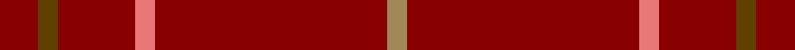

In pattern [RGRRRY](/stripes/rgrrry/).

This was sourced from tartans-authority.  It is a [6 stripe tartan](/stripes/stripes6/).

Original link http://www.tartansauthority.com/tartan-ferret/display/8683/

## Thread count
DR/4 T2 DR8 LR2 DR24 LT/2

## Palette
Each colour and its ΔE from the base-6 reference it is a variant of.

| Colour | Shade | Base | ΔE (OKLab) |
|---|---|---|---|
| DR | <code style="background-color:#880000;">#880000</code> `#880000` | R <code style="background-color:#CC0000;">#CC0000</code> | 0.15 |
| LR | <code style="background-color:#E87878;">#E87878</code> `#E87878` | R <code style="background-color:#CC0000;">#CC0000</code> | 0.19 |
| LT | <code style="background-color:#A08858;">#A08858</code> `#A08858` | Y <code style="background-color:#F2BF00;">#F2BF00</code> | 0.21 |
| T | <code style="background-color:#604000;">#604000</code> `#604000` | G <code style="background-color:#006100;">#006100</code> | 0.14 |

# Sample pattern

## Nearest tartans

The nearest existing variants by ΔTartan distance.

1. [Brooks Brothers Tattersall Red](/setts/s5/db1r9db2r9lo1~x4/) — ΔT 1.75
1. [Rannoch Red](/setts/s7/r10y3r24lb3r16k3r8~x2/) — ΔT 2.12
1. [KaDeWe (Corporate)](/setts/s5/r100dg4r8dg18r3~x2/) — ΔT 2.48
1. [Fitzgibbon Red](/setts/s9/r2dt6r24dg2r2r1r6dt1r2~x2/) — ΔT 2.61
1. [Inverness Augustus](/setts/s7/m18dg1k5dg1k1dg1m9~x2/) — ΔT 2.66
1. [Fitzgibbon Red (Name)](/setts/s9/r2k6r24g2r2r1r6k1r2~x2/) — ΔT 2.70
1. [Dunbar, John Telfer (Personal)](/setts/s7/o5k2o28k10o26k4o4~x2/) — ΔT 2.75
1. [Burnett of Leys Hunting](/setts/s8/r92db10r8w3r8g4r8r4~x2/) — ΔT 2.75
1. [Fernie (Personal)](/setts/s6/r25dt5o2r12o1w1~x2/) — ΔT 2.80
1. [Burnett of Leys Htg (Clan)](/setts/s8/r75db6r6w2r6g2r6r2~x2/) — ΔT 2.93

## Neighbour map

Every grey dot is one of 14299 variants placed by the first two principal components of the ΔTartan feature space (44% of its variance). Red is this tartan; blue dots are its nearest — click one to open its page.

<svg viewBox="0 0 640 380" role="img" style="max-width:100%;height:auto;border:1px solid #e0e0e0;border-radius:4px;display:block" xmlns="http://www.w3.org/2000/svg"><image href="/nn/cloud.v1.png" width="640" height="380"/><a href="/setts/s5/db1r9db2r9lo1~x4/"><circle cx="606.7" cy="273.8" r="4" fill="#3465a4"><title>Brooks Brothers Tattersall Red</title></circle></a><a href="/setts/s7/r10y3r24lb3r16k3r8~x2/"><circle cx="590.1" cy="243.9" r="4" fill="#3465a4"><title>Rannoch Red</title></circle></a><a href="/setts/s5/r100dg4r8dg18r3~x2/"><circle cx="626.0" cy="227.5" r="4" fill="#3465a4"><title>KaDeWe (Corporate)</title></circle></a><a href="/setts/s9/r2dt6r24dg2r2r1r6dt1r2~x2/"><circle cx="601.7" cy="178.6" r="4" fill="#3465a4"><title>Fitzgibbon Red</title></circle></a><a href="/setts/s7/m18dg1k5dg1k1dg1m9~x2/"><circle cx="588.1" cy="221.5" r="4" fill="#3465a4"><title>Inverness Augustus</title></circle></a><a href="/setts/s9/r2k6r24g2r2r1r6k1r2~x2/"><circle cx="564.4" cy="160.7" r="4" fill="#3465a4"><title>Fitzgibbon Red (Name)</title></circle></a><a href="/setts/s7/o5k2o28k10o26k4o4~x2/"><circle cx="602.2" cy="250.8" r="4" fill="#3465a4"><title>Dunbar, John Telfer (Personal)</title></circle></a><a href="/setts/s8/r92db10r8w3r8g4r8r4~x2/"><circle cx="626.0" cy="126.3" r="4" fill="#3465a4"><title>Burnett of Leys Hunting</title></circle></a><a href="/setts/s6/r25dt5o2r12o1w1~x2/"><circle cx="573.5" cy="161.4" r="4" fill="#3465a4"><title>Fernie (Personal)</title></circle></a><a href="/setts/s8/r75db6r6w2r6g2r6r2~x2/"><circle cx="626.0" cy="119.4" r="4" fill="#3465a4"><title>Burnett of Leys Htg (Clan)</title></circle></a><circle cx="626.0" cy="232.3" r="5" fill="#c00000"/></svg>

ID: /setts/s6/r2dy1r4r1r12lo1~x2/
