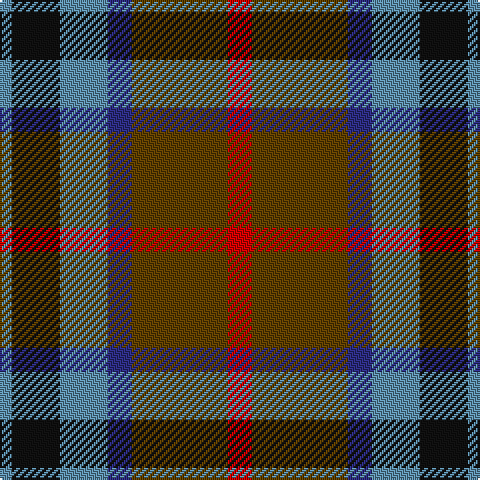

**Bands:** [BKBBGR](/stripes/bkbbgr/) · **Stripes:** [T K T DB DY R](/stripes/stripes6/) T K T DB DY R

This was sourced from house-of-tartan.  It is a [6 band tartan](/bands/bands6/).

Original link http://www.house-of-tartan.scotland.net/house/TartanViewjs.asp?colr=Def&tnam=286

## Thread count
B/6 K24 B24 DB12 T48 R/12

## Palette
Each colour and its ΔE from the base-6 reference it is a variant of.

| Colour | Shade | Base | ΔE (OKLab) |
|---|---|---|---|
| B | <code style="background-color:#5C8CA8;">#5C8CA8</code> `#5C8CA8` | B <code style="background-color:#2A418A;">#2A418A</code> | 0.23 |
| DB | <code style="background-color:#2C2C80;">#2C2C80</code> `#2C2C80` | B <code style="background-color:#2A418A;">#2A418A</code> | 0.06 |
| K | <code style="background-color:#101010;">#101010</code> `#101010` | K <code style="background-color:#000000;">#000000</code> | 0.17 |
| R | <code style="background-color:#C80000;">#C80000</code> `#C80000` | R <code style="background-color:#CC0000;">#CC0000</code> | 0.01 |
| T | <code style="background-color:#604000;">#604000</code> `#604000` | G <code style="background-color:#006100;">#006100</code> | 0.14 |

# Sample pattern

## Nearest tartans

The nearest existing variants by ΔTartan distance.

1. [Canine All Dogs (Fashion)](/setts/s6/r10db6g24db24r6ly3/) — ΔT 0.76
1. [MacLaren #2](/setts/s7/dp9k7dg5r4dg7k1ly1~x2/) — ΔT 0.93
1. [Patterson, John (Personal)](/setts/s6/g3db12w1dg12r12dg2~x2/) — ΔT 0.94
1. [Orkney](/setts/s8/m6y2db12k2y12m9k2lo2~x2/) — ΔT 1.00
1. [Thompson (J.C.'s Fancy) (Personal)](/setts/s6/r2lo8db2y4k4y1~x6/) — ΔT 1.00
1. [Thom(p)son's, Fancy](/setts/s6/r2o8db2t4k4t1~x6/) — ΔT 1.07
1. [Patterson, John (Personal)](/setts/s6/dg3db12w1dg12r12dg2~x2/) — ΔT 1.07
1. [Dundas](/setts/s7/db9r24dg24k24db24ly2db9/) — ΔT 1.07
1. [Selkirk (Personal)](/setts/s5/dp27db4k27g27lo4~x2/) — ΔT 1.10
1. [Swankie (Personal)](/setts/s7/k4b21dy10y4k20r6b3~x2/) — ΔT 1.10

## Neighbour map

Every grey dot is one of 14313 variants placed by the first two principal components of the ΔTartan feature space (44% of its variance). Red is this tartan; blue dots are its nearest — click one to open its page.

<svg viewBox="0 0 640 380" role="img" style="max-width:100%;height:auto;border:1px solid #e0e0e0;border-radius:4px;display:block" xmlns="http://www.w3.org/2000/svg"><image href="/nn/cloud.v1.png" width="640" height="380"/><a href="/setts/s6/r10db6g24db24r6ly3/"><circle cx="142.1" cy="214.0" r="4" fill="#3465a4"><title>Canine All Dogs (Fashion)</title></circle></a><a href="/setts/s7/dp9k7dg5r4dg7k1ly1~x2/"><circle cx="143.5" cy="220.9" r="4" fill="#3465a4"><title>MacLaren #2</title></circle></a><a href="/setts/s6/g3db12w1dg12r12dg2~x2/"><circle cx="169.1" cy="199.7" r="4" fill="#3465a4"><title>Patterson, John (Personal)</title></circle></a><a href="/setts/s8/m6y2db12k2y12m9k2lo2~x2/"><circle cx="141.3" cy="217.5" r="4" fill="#3465a4"><title>Orkney</title></circle></a><a href="/setts/s6/r2lo8db2y4k4y1~x6/"><circle cx="144.0" cy="211.9" r="4" fill="#3465a4"><title>Thompson (J.C.'s Fancy) (Personal)</title></circle></a><a href="/setts/s6/r2o8db2t4k4t1~x6/"><circle cx="135.3" cy="210.8" r="4" fill="#3465a4"><title>Thom(p)son's, Fancy</title></circle></a><a href="/setts/s6/dg3db12w1dg12r12dg2~x2/"><circle cx="163.2" cy="195.5" r="4" fill="#3465a4"><title>Patterson, John (Personal)</title></circle></a><a href="/setts/s7/db9r24dg24k24db24ly2db9/"><circle cx="148.1" cy="214.9" r="4" fill="#3465a4"><title>Dundas</title></circle></a><a href="/setts/s5/dp27db4k27g27lo4~x2/"><circle cx="135.9" cy="243.1" r="4" fill="#3465a4"><title>Selkirk (Personal)</title></circle></a><a href="/setts/s7/k4b21dy10y4k20r6b3~x2/"><circle cx="147.3" cy="213.4" r="4" fill="#3465a4"><title>Swankie (Personal)</title></circle></a><circle cx="163.2" cy="225.2" r="5" fill="#c00000"/></svg>

ID: /setts/s6/r2dy8db2t4k4t1~x6/
