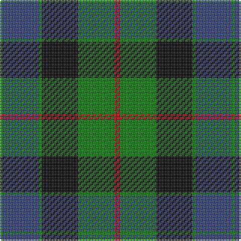

In pattern [GBGKGR](/stripes/gbgkgr/).

This was sourced from weddslist.  It is a [6 stripe tartan](/stripes/stripes6/).

Original link http://www.weddslist.com/cgi-bin/tartans/pg.pl?source=sts

## Attestations

This cloth appears in 2 source records; the oldest owns this page.

- undated — Gunn (weddslist, [record](http://www.weddslist.com/cgi-bin/tartans/pg.pl?source=sts))
- undated — Gunn Clan Tartan Tartan Number: 708. Earliest known date: c.1810-15 The Cockburn collection, housed in the Mitchell library in Glasgow, contains some of the oldest actual specimens of clan tartans in existance today. James Logan recorded the sett in his book 'The Scottish Gael' in 1831. The central blue stripes are often reproduced in black or very dark blue, giving the impression of four equally toned stripes. See products available Copyright © Blair Urquhart, Comrie, 2015 (house-of-tartan, [record](http://www.house-of-tartan.scotland.net/house/TartanViewjs.asp?colr=Def&tnam=708))

## Thread count
R/4 G24 K24 G2 B24 G/2

## Palette
Each colour and the base-6 reference it is a variant of.

| Colour | Shade | Base |
|---|---|---|
| B | <code style="background-color:#304080;">#304080</code> `oklch(39.4% 0.109 270.2)` <small>#304080</small> | B <code style="background-color:#2A418A;">#2A418A</code> |
| G | <code style="background-color:#008000;">#008000</code> `oklch(52.0% 0.177 142.5)` <small>#008000</small> | G <code style="background-color:#006100;">#006100</code> |
| K | <code style="background-color:#000000;">#000000</code> `oklch(0.0% 0.000 0.0)` <small>#000000</small> | K <code style="background-color:#000000;">#000000</code> |
| R | <code style="background-color:#C00000;">#C00000</code> `oklch(50.7% 0.208 29.2)` <small>#C00000</small> | R <code style="background-color:#CC0000;">#CC0000</code> |

# Sample pattern

## Nearest tartans

The nearest existing variants by ΔTartan distance.

1. [Ferguson of Balquhidder](/setts/s6/k2g12k12r1db12g2~x2/) — ΔT 0.30
1. [Unnamed, No 59](/setts/s6/t1db11k11g11k2t1~x2/) — ΔT 0.40
1. [Blair](/setts/s7/db3r1db10k8g10r1g3~x4/) — ΔT 0.61
1. [MacNeil 1](/setts/s6/w1db9k9g9k2w1~x4/) — ΔT 0.63
1. [Melville](/setts/s6/k4w2g18k13db12k2~x2/) — ΔT 0.68
1. [MacKirdy](/setts/s5/k2g12k11db12w1~x2/) — ΔT 0.74
1. [Graham of Montrose](/setts/s6/k4g19k16w2db15g4~x2/) — ΔT 0.75
1. [Wilson's No 158](/setts/s6/g21w2g4k17p14k3~x2/) — ΔT 0.87
1. [Unnamed, No 115](/setts/s8/db10k6t1g6k1~x2/) — ΔT 0.88
1. [Graham W](/setts/s6/dg21lb2dg4k17dp14k3/) — ΔT 0.90

## Neighbour map

Every grey dot is one of 14299 variants placed by the first two principal components of the ΔTartan feature space (44% of its variance). Red is this tartan; blue dots are its nearest — click one to open its page.

<svg viewBox="0 0 640 380" role="img" style="max-width:100%;height:auto;border:1px solid #e0e0e0;border-radius:4px;display:block" xmlns="http://www.w3.org/2000/svg"><image href="/nn/cloud.v1.png" width="640" height="380"/><a href="/setts/s6/k2g12k12r1db12g2~x2/"><circle cx="171.6" cy="211.8" r="4" fill="#3465a4"><title>Ferguson of Balquhidder</title></circle></a><a href="/setts/s6/t1db11k11g11k2t1~x2/"><circle cx="167.6" cy="212.4" r="4" fill="#3465a4"><title>Unnamed, No 59</title></circle></a><a href="/setts/s7/db3r1db10k8g10r1g3~x4/"><circle cx="167.4" cy="213.5" r="4" fill="#3465a4"><title>Blair</title></circle></a><a href="/setts/s6/w1db9k9g9k2w1~x4/"><circle cx="146.6" cy="216.6" r="4" fill="#3465a4"><title>MacNeil 1</title></circle></a><a href="/setts/s6/k4w2g18k13db12k2~x2/"><circle cx="159.8" cy="221.5" r="4" fill="#3465a4"><title>Melville</title></circle></a><a href="/setts/s5/k2g12k11db12w1~x2/"><circle cx="161.3" cy="227.2" r="4" fill="#3465a4"><title>MacKirdy</title></circle></a><a href="/setts/s6/k4g19k16w2db15g4~x2/"><circle cx="162.2" cy="224.2" r="4" fill="#3465a4"><title>Graham of Montrose</title></circle></a><a href="/setts/s6/g21w2g4k17p14k3~x2/"><circle cx="182.0" cy="208.3" r="4" fill="#3465a4"><title>Wilson's No 158</title></circle></a><a href="/setts/s8/db10k6t1g6k1~x2/"><circle cx="146.4" cy="214.8" r="4" fill="#3465a4"><title>Unnamed, No 115</title></circle></a><a href="/setts/s6/dg21lb2dg4k17dp14k3/"><circle cx="200.8" cy="222.2" r="4" fill="#3465a4"><title>Graham W</title></circle></a><circle cx="173.1" cy="206.0" r="5" fill="#c00000"/></svg>

ID: /setts/s6/r2g12k12g1db12g1~x2/
