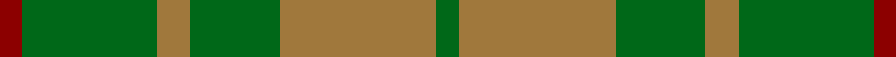
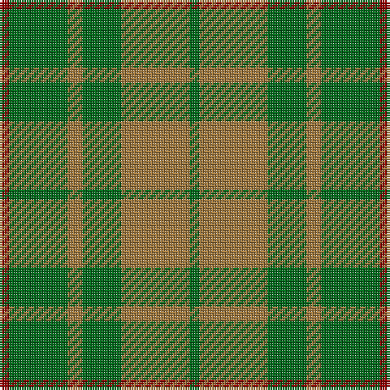

This page is one **sett** — a single exact thread-count. It belongs to the [tartan](/tartans/r2g12o3g8o14g2/)
(the same proportion at any scale), whose colour order is pattern [GRGRGR](/stripes/grgrgr/).

Sourced from tartans-authority.  It is a [6 stripe tartan](/stripes/stripes6/).

Original link http://www.tartansauthority.com/tartan-ferret/display/4566/

## Register references

External register numbers recorded for this tartan.

- Scottish Tartans Authority (ITI): 4566

## Thread count
DR/4 G24 LT6 G16 LT28 G/4

## Palette

Palette: <strong>Tartan Register</strong> <small style="color:#888">(1 of 3 colours)</small>
<table><thead><tr><th>Colour</th><th>Threads</th><th>Shade</th><th>Base</th><th>OKLCh</th></tr></thead><tbody><tr><td>DR/</td><td style="text-align:right;font-variant-numeric:tabular-nums">4</td><td><code style="background-color:#8C0000;">#8C0000</code> <small style="color:#888">#8C0000</small></td><td>R <code style="background-color:#CC0000;">#CC0000</code></td><td><small style="color:#888">oklch(40.2% 0.165 29.2)</small></td></tr><tr><td>G</td><td style="text-align:right;font-variant-numeric:tabular-nums">24</td><td><code style="background-color:#006818;">#006818</code> <small style="color:#888">#006818</small></td><td>G <code style="background-color:#006100;">#006100</code></td><td><small style="color:#888">oklch(45.0% 0.142 145.0)</small></td></tr><tr><td>LT</td><td style="text-align:right;font-variant-numeric:tabular-nums">6</td><td><code style="background-color:#A0783C;">#A0783C</code> <small style="color:#888">#A0783C</small></td><td>R <code style="background-color:#CC0000;">#CC0000</code></td><td><small style="color:#888">oklch(60.0% 0.092 75.5)</small></td></tr><tr><td>G</td><td style="text-align:right;font-variant-numeric:tabular-nums">16</td><td><code style="background-color:#006818;">#006818</code> <small style="color:#888">#006818</small></td><td>G <code style="background-color:#006100;">#006100</code></td><td><small style="color:#888">oklch(45.0% 0.142 145.0)</small></td></tr><tr><td>LT</td><td style="text-align:right;font-variant-numeric:tabular-nums">28</td><td><code style="background-color:#A0783C;">#A0783C</code> <small style="color:#888">#A0783C</small></td><td>R <code style="background-color:#CC0000;">#CC0000</code></td><td><small style="color:#888">oklch(60.0% 0.092 75.5)</small></td></tr><tr><td>G/</td><td style="text-align:right;font-variant-numeric:tabular-nums">4</td><td><code style="background-color:#006818;">#006818</code> <small style="color:#888">#006818</small></td><td>G <code style="background-color:#006100;">#006100</code></td><td><small style="color:#888">oklch(45.0% 0.142 145.0)</small></td></tr></tbody></table>

# Sample pattern

## Nearest tartans

The nearest existing variants by ΔTartan distance, with this tartan at the top so the swatches line up against it.

ΔTartan

Tartan

Sett

—

<a href="/ttd/edit/#slug=r2g12o3g8o14g2~x2">Confederate Artillery (Military)</a> <a class="nn-out" href="/setts/s6/r2g12o3g8o14g2~x2/" title="open its dictionary page">↗</a>

1.12

<a href="/ttd/edit/#slug=g1o8g8r1g8o8w1~x4">MacKinnon, hunting</a> <a class="nn-out" href="/setts/s7/g1o8g8r1g8o8w1~x4/" title="open its dictionary page">↗</a>

1.20

<a href="/ttd/edit/#slug=lo11gi5lo10g4gi26lo4~x2">North Dakota State University (Corp.</a> <a class="nn-out" href="/setts/s6/lo11gi5lo10g4gi26lo4~x2/" title="open its dictionary page">↗</a>

1.35

<a href="/ttd/edit/#slug=g1dy8g8r1g8dy8w1~x2">MacKinnon Hunting Clan Tartan Tartan Number: 917. Earliest known date: 1960 The modern hunting MacKinnon is based on the sett published in the Vestiarium Scoticum in 1842. The change is simply from red in the V.S. to brown in the modern version. The result was registered with Lord Lyon in 1960. See products available Copyright © Blair Urquhart, Comrie, 2015</a> <a class="nn-out" href="/setts/s7/g1dy8g8r1g8dy8w1~x2/" title="open its dictionary page">↗</a>

1.52

<a href="/ttd/edit/#slug=g22k3g3gi16g6k4~x2">Campbell Simpson (Dalgliesh)</a> <a class="nn-out" href="/setts/s6/g22k3g3gi16g6k4~x2/" title="open its dictionary page">↗</a>

1.53

<a href="/ttd/edit/#slug=g1y9g9lo1~x4">Spring Morning (Fashion)</a> <a class="nn-out" href="/setts/s4/g1y9g9lo1~x4/" title="open its dictionary page">↗</a>

1.57

<a href="/ttd/edit/#slug=y9g9lo1g9y9g1~x4">Spring Morning</a> <a class="nn-out" href="/setts/s6/y9g9lo1g9y9g1~x4/" title="open its dictionary page">↗</a>

1.60

<a href="/setts/s6/y3lo3y20lo20y20lo3~x2/">Barbie's Moss Plaid (Yellow &amp; Green)</a>

1.61

<a href="/ttd/edit/#slug=o20g40w5g40o20g9~x2">O'Neill (Australia)</a> <a class="nn-out" href="/setts/s6/o20g40w5g40o20g9~x2/" title="open its dictionary page">↗</a>

1.68

<a href="/ttd/edit/#slug=g56dy13lo13lo5~x2">Colonial Marine (Corporate)</a> <a class="nn-out" href="/setts/s4/g56dy13lo13lo5~x2/" title="open its dictionary page">↗</a>

1.78

<a href="/ttd/edit/#slug=g4dy25g6t12g12t3~x2">Canadian Fancy</a> <a class="nn-out" href="/setts/s6/g4dy25g6t12g12t3~x2/" title="open its dictionary page">↗</a>

## Neighbour map

Every grey dot is one of 14359 variants placed by the first two principal components of the ΔTartan feature space (44% of its variance). Red is this tartan; blue dots are its nearest — click one to open its page.

<svg viewBox="0 0 640 380" role="img" style="max-width:100%;height:auto;border:1px solid #e0e0e0;border-radius:4px;display:block" xmlns="http://www.w3.org/2000/svg"><image href="/nn/cloud.v1.png" width="640" height="380"/><a href="/setts/s7/g1o8g8r1g8o8w1~x4/"><circle cx="334.8" cy="268.6" r="4" fill="#3465a4"><title>MacKinnon, hunting</title></circle></a><a href="/setts/s6/lo11gi5lo10g4gi26lo4~x2/"><circle cx="345.3" cy="280.2" r="4" fill="#3465a4"><title>North Dakota State University (Corp.</title></circle></a><a href="/setts/s7/g1dy8g8r1g8dy8w1~x2/"><circle cx="353.1" cy="282.2" r="4" fill="#3465a4"><title>MacKinnon Hunting Clan Tartan Tartan Number: 917. Earliest known date: 1960 The modern hunting MacKinnon is based on the sett published in the Vestiarium Scoticum in 1842. The change is simply from red in the V.S. to brown in the modern version. The result was registered with Lord Lyon in 1960. See products available Copyright © Blair Urquhart, Comrie, 2015</title></circle></a><a href="/setts/s6/g22k3g3gi16g6k4~x2/"><circle cx="373.8" cy="286.2" r="4" fill="#3465a4"><title>Campbell Simpson (Dalgliesh)</title></circle></a><a href="/setts/s4/g1y9g9lo1~x4/"><circle cx="413.5" cy="313.6" r="4" fill="#3465a4"><title>Spring Morning (Fashion)</title></circle></a><a href="/setts/s6/y9g9lo1g9y9g1~x4/"><circle cx="402.3" cy="322.8" r="4" fill="#3465a4"><title>Spring Morning</title></circle></a><a href="/setts/s6/y3lo3y20lo20y20lo3~x2/"><circle cx="476.6" cy="317.8" r="4" fill="#3465a4"><title>Barbie's Moss Plaid (Yellow &amp; Green)</title></circle></a><a href="/setts/s6/o20g40w5g40o20g9~x2/"><circle cx="421.4" cy="295.7" r="4" fill="#3465a4"><title>O'Neill (Australia)</title></circle></a><a href="/setts/s4/g56dy13lo13lo5~x2/"><circle cx="458.9" cy="281.3" r="4" fill="#3465a4"><title>Colonial Marine (Corporate)</title></circle></a><a href="/setts/s6/g4dy25g6t12g12t3~x2/"><circle cx="302.4" cy="289.9" r="4" fill="#3465a4"><title>Canadian Fancy</title></circle></a><circle cx="384.8" cy="298.8" r="5" fill="#c00000"/></svg>

ID: /setts/s6/r2g12o3g8o14g2~x2/
