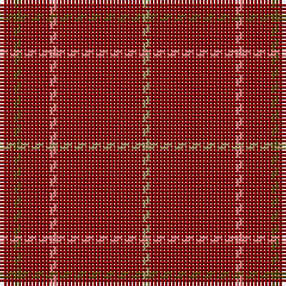

In pattern [RGRRRY](/patterns/rgrrry/).

This was sourced from tartans-authority.  It is a [6 stripes tartan](/stripes/stripes6/).

Original link http://www.tartansauthority.com/tartan-ferret/display/8683/

## Thread count
DR/4 T2 DR8 LR2 DR24 LT/2

## Palette
Each colour and its ΔE from the base-6 reference it is a variant of.

| Colour | Shade | Base | ΔE (OKLab) |
|---|---|---|---|
| DR | <code style="background-color:#880000;">#880000</code> `#880000` | R <code style="background-color:#CC0000;">#CC0000</code> | 0.15 |
| LR | <code style="background-color:#E87878;">#E87878</code> `#E87878` | R <code style="background-color:#CC0000;">#CC0000</code> | 0.19 |
| LT | <code style="background-color:#A08858;">#A08858</code> `#A08858` | Y <code style="background-color:#F2BF00;">#F2BF00</code> | 0.21 |
| T | <code style="background-color:#604000;">#604000</code> `#604000` | G <code style="background-color:#006100;">#006100</code> | 0.14 |

# Sample pattern

## Nearest tartans

The nearest existing variants by ΔTartan distance.

1. [Brooks Brothers Tattersall Red](/setts/s5/b1r9b2r9y1x4~b202060-r880000-ya08858/) — ΔT 1.75
1. [Rannoch Red](/setts/s7/r10g3r24w3r16k3r8x2~g8c7038-k101010-r880000-wc0c0c0/) — ΔT 2.12
1. [KaDeWe (Corporate)](/setts/s5/r100g4r8g18r3x2~g003820-r880000/) — ΔT 2.47
1. [Fitzgibbon Red](/setts/s9/r2b6r24g2r2ra1r6b1ra2x2~b2d2d2d-g1c5627-ra3262a-rabd2125/) — ΔT 2.61
1. [Inverness Augustus](/setts/s7/r18g1k5g1k1g1r9x2~g005020-k101010-r781c38/) — ΔT 2.66
1. [Fitzgibbon Red (Name)](/setts/s9/r2k6r24g2r2ra1r6k1ra2x2~g006818-k101010-r880000-rac80000/) — ΔT 2.71
1. [Dunbar, John Telfer (Personal)](/setts/s7/r5k2r28k10r26k4r4x2~k101010-r883000/) — ΔT 2.74
1. [Burnett of Leys Hunting](/setts/s8/r92b10r8w3r8g4r8ra4x2~b2c2c80-g006818-r800028-rac80000-wf8f8f8/) — ΔT 2.75
1. [Fernie (Personal)](/setts/s6/r25b5ra2r12rb1w1x2~b1c1c1c-r800028-rae86000-rb888888-wfcfcfc/) — ΔT 2.81
1. [MacKintosh (Moy Hall) Clan Tartan Tartan Number: 1509. Earliest known date: 1821 The Setts No: 253. Of the same pattern as a fragment in the Moy Hall collection claimed to be a part of a kilt worn by Prince Charles at the time of the '45. Author and weaver, James Scarlet, has investigated further and has found at least four other piec See products available Copyright © Blair Urquhart, Comrie, 2015](/setts/s7/r75g12r3k2r2k2r36x2~g006818-k101010-rc80000/) — ΔT 2.85

## Neighbour map

Every grey dot is one of 15726 variants placed by the first two principal components of the ΔTartan feature space (44% of its variance). Red is this tartan; blue dots are its nearest — click one to open its page.

<svg viewBox="0 0 640 380" role="img" style="max-width:100%;height:auto;border:1px solid #e0e0e0;border-radius:4px;display:block" xmlns="http://www.w3.org/2000/svg"><image href="/nn/cloud.v1.png" width="640" height="380"/><a href="/setts/s5/b1r9b2r9y1x4~b202060-r880000-ya08858/"><circle cx="608.8" cy="274.7" r="4" fill="#3465a4"><title>Brooks Brothers Tattersall Red</title></circle></a><a href="/setts/s7/r10g3r24w3r16k3r8x2~g8c7038-k101010-r880000-wc0c0c0/"><circle cx="592.4" cy="247.8" r="4" fill="#3465a4"><title>Rannoch Red</title></circle></a><a href="/setts/s5/r100g4r8g18r3x2~g003820-r880000/"><circle cx="626.0" cy="225.9" r="4" fill="#3465a4"><title>KaDeWe (Corporate)</title></circle></a><a href="/setts/s9/r2b6r24g2r2ra1r6b1ra2x2~b2d2d2d-g1c5627-ra3262a-rabd2125/"><circle cx="603.9" cy="172.3" r="4" fill="#3465a4"><title>Fitzgibbon Red</title></circle></a><a href="/setts/s7/r18g1k5g1k1g1r9x2~g005020-k101010-r781c38/"><circle cx="589.0" cy="218.5" r="4" fill="#3465a4"><title>Inverness Augustus</title></circle></a><a href="/setts/s9/r2k6r24g2r2ra1r6k1ra2x2~g006818-k101010-r880000-rac80000/"><circle cx="565.9" cy="159.2" r="4" fill="#3465a4"><title>Fitzgibbon Red (Name)</title></circle></a><a href="/setts/s7/r5k2r28k10r26k4r4x2~k101010-r883000/"><circle cx="603.5" cy="252.9" r="4" fill="#3465a4"><title>Dunbar, John Telfer (Personal)</title></circle></a><a href="/setts/s8/r92b10r8w3r8g4r8ra4x2~b2c2c80-g006818-r800028-rac80000-wf8f8f8/"><circle cx="626.0" cy="127.7" r="4" fill="#3465a4"><title>Burnett of Leys Hunting</title></circle></a><a href="/setts/s6/r25b5ra2r12rb1w1x2~b1c1c1c-r800028-rae86000-rb888888-wfcfcfc/"><circle cx="575.0" cy="164.2" r="4" fill="#3465a4"><title>Fernie (Personal)</title></circle></a><a href="/setts/s7/r75g12r3k2r2k2r36x2~g006818-k101010-rc80000/"><circle cx="626.0" cy="161.8" r="4" fill="#3465a4"><title>MacKintosh (Moy Hall) Clan Tartan Tartan Number: 1509. Earliest known date: 1821 The Setts No: 253. Of the same pattern as a fragment in the Moy Hall collection claimed to be a part of a kilt worn by Prince Charles at the time of the '45. Author and weaver, James Scarlet, has investigated further and has found at least four other piec See products available Copyright © Blair Urquhart, Comrie, 2015</title></circle></a><circle cx="626.0" cy="230.9" r="5" fill="#c00000"/></svg>

ID: /setts/s6/r2g1r4ra1r12y1x2~g604000-r880000-rae87878-ya08858/
