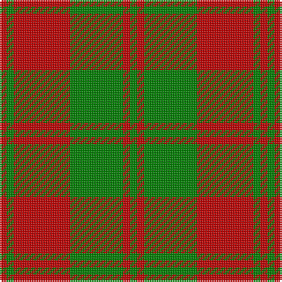

This page is one **sett** — a single exact thread-count. It belongs to the [tartan](/tartans/r2g2r16g15r2g2/)
(the same proportion at any scale), whose colour order is pattern [GRGRGR](/stripes/grgrgr/).

Sourced from weddslist.  It is a [6 stripe tartan](/stripes/stripes6/).

Original link http://www.weddslist.com/cgi-bin/tartans/pg.pl?source=sts

## Also known as

This cloth is also recorded under:

- Unidentified, NW Highlands

## Thread count
R/4 G4 R32 G30 R4 G/4

## Palette

Palette: <strong>custom</strong>
<table><thead><tr><th>Colour</th><th>Threads</th><th>Shade</th><th>Base</th><th>OKLCh</th></tr></thead><tbody><tr><td>R/</td><td style="text-align:right;font-variant-numeric:tabular-nums">4</td><td><code style="background-color:#C00000;">#C00000</code> <small style="color:#888">#C00000</small></td><td>R <code style="background-color:#CC0000;">#CC0000</code></td><td><small style="color:#888">oklch(50.7% 0.208 29.2)</small></td></tr><tr><td>G</td><td style="text-align:right;font-variant-numeric:tabular-nums">4</td><td><code style="background-color:#008000;">#008000</code> <small style="color:#888">#008000</small></td><td>G <code style="background-color:#006100;">#006100</code></td><td><small style="color:#888">oklch(52.0% 0.177 142.5)</small></td></tr><tr><td>R</td><td style="text-align:right;font-variant-numeric:tabular-nums">32</td><td><code style="background-color:#C00000;">#C00000</code> <small style="color:#888">#C00000</small></td><td>R <code style="background-color:#CC0000;">#CC0000</code></td><td><small style="color:#888">oklch(50.7% 0.208 29.2)</small></td></tr><tr><td>G</td><td style="text-align:right;font-variant-numeric:tabular-nums">30</td><td><code style="background-color:#008000;">#008000</code> <small style="color:#888">#008000</small></td><td>G <code style="background-color:#006100;">#006100</code></td><td><small style="color:#888">oklch(52.0% 0.177 142.5)</small></td></tr><tr><td>R</td><td style="text-align:right;font-variant-numeric:tabular-nums">4</td><td><code style="background-color:#C00000;">#C00000</code> <small style="color:#888">#C00000</small></td><td>R <code style="background-color:#CC0000;">#CC0000</code></td><td><small style="color:#888">oklch(50.7% 0.208 29.2)</small></td></tr><tr><td>G/</td><td style="text-align:right;font-variant-numeric:tabular-nums">4</td><td><code style="background-color:#008000;">#008000</code> <small style="color:#888">#008000</small></td><td>G <code style="background-color:#006100;">#006100</code></td><td><small style="color:#888">oklch(52.0% 0.177 142.5)</small></td></tr></tbody></table>

# Sample pattern

## Nearest tartans

The nearest existing variants by ΔTartan distance, with this tartan at the top so the swatches line up against it.

ΔTartan

Tartan

Sett

—

<a href="/ttd/edit/#slug=r2g2r16g15r2g2~x2">Unidentified, NW Highlands</a> <a class="nn-out" href="/setts/s6/r2g2r16g15r2g2~x2/" title="open its dictionary page">↗</a>

1.01

<a href="/ttd/edit/#slug=dg2r2dg15r16dg2r2~x2">Unidentified NW Highlands</a> <a class="nn-out" href="/setts/s6/dg2r2dg15r16dg2r2~x2/" title="open its dictionary page">↗</a>

1.34

<a href="/ttd/edit/#slug=g8r2g9r16g1~x2">MacGregor of Glen Strae</a> <a class="nn-out" href="/setts/s5/g8r2g9r16g1~x2/" title="open its dictionary page">↗</a>

1.37

<a href="/ttd/edit/#slug=g16r5g2r18k2~x2">MacDonald, Lord of The Isles (Artef)</a> <a class="nn-out" href="/setts/s5/g16r5g2r18k2~x2/" title="open its dictionary page">↗</a>

1.42

<a href="/ttd/edit/#slug=dg4r2dg13lb2r13dg2r4~x2">Crossnor School</a> <a class="nn-out" href="/setts/s7/dg4r2dg13lb2r13dg2r4~x2/" title="open its dictionary page">↗</a>

1.45

<a href="/ttd/edit/#slug=g5w2r27g27r5w2~x2">MacDonald of Glenaladale (symmetrical)</a> <a class="nn-out" href="/setts/s6/g5w2r27g27r5w2~x2/" title="open its dictionary page">↗</a>

1.47

<a href="/ttd/edit/#slug=r1g3r1g3r8ly1~x8">Cameron</a> <a class="nn-out" href="/setts/s6/r1g3r1g3r8ly1~x8/" title="open its dictionary page">↗</a>

1.48

<a href="/ttd/edit/#slug=g14r4g2r2g2r4g19r30g2r9~x2">Livingstone</a> <a class="nn-out" href="/setts/s10/g14r4g2r2g2r4g19r30g2r9~x2/" title="open its dictionary page">↗</a>

1.50

<a href="/ttd/edit/#slug=k1r5g10r5g1~x4">Murray, Lord George (Hose)</a> <a class="nn-out" href="/setts/s5/k1r5g10r5g1~x4/" title="open its dictionary page">↗</a>

1.52

<a href="/ttd/edit/#slug=r1g7r9ly1~x4">Bryce</a> <a class="nn-out" href="/setts/s4/r1g7r9ly1~x4/" title="open its dictionary page">↗</a>

1.58

<a href="/ttd/edit/#slug=r16g1r1g1r4g12~x4">MacQuarrie #5</a> <a class="nn-out" href="/setts/s6/r16g1r1g1r4g12~x4/" title="open its dictionary page">↗</a>

## Neighbour map

Every grey dot is one of 14299 variants placed by the first two principal components of the ΔTartan feature space (44% of its variance). Red is this tartan; blue dots are its nearest — click one to open its page.

<svg viewBox="0 0 640 380" role="img" style="max-width:100%;height:auto;border:1px solid #e0e0e0;border-radius:4px;display:block" xmlns="http://www.w3.org/2000/svg"><image href="/nn/cloud.v1.png" width="640" height="380"/><a href="/setts/s6/dg2r2dg15r16dg2r2~x2/"><circle cx="375.0" cy="235.6" r="4" fill="#3465a4"><title>Unidentified NW Highlands</title></circle></a><a href="/setts/s5/g8r2g9r16g1~x2/"><circle cx="386.8" cy="244.5" r="4" fill="#3465a4"><title>MacGregor of Glen Strae</title></circle></a><a href="/setts/s5/g16r5g2r18k2~x2/"><circle cx="352.4" cy="240.2" r="4" fill="#3465a4"><title>MacDonald, Lord of The Isles (Artef)</title></circle></a><a href="/setts/s7/dg4r2dg13lb2r13dg2r4~x2/"><circle cx="327.1" cy="250.2" r="4" fill="#3465a4"><title>Crossnor School</title></circle></a><a href="/setts/s6/g5w2r27g27r5w2~x2/"><circle cx="335.2" cy="199.1" r="4" fill="#3465a4"><title>MacDonald of Glenaladale (symmetrical)</title></circle></a><a href="/setts/s6/r1g3r1g3r8ly1~x8/"><circle cx="370.7" cy="226.4" r="4" fill="#3465a4"><title>Cameron</title></circle></a><a href="/setts/s10/g14r4g2r2g2r4g19r30g2r9~x2/"><circle cx="415.0" cy="194.7" r="4" fill="#3465a4"><title>Livingstone</title></circle></a><a href="/setts/s5/k1r5g10r5g1~x4/"><circle cx="324.0" cy="239.4" r="4" fill="#3465a4"><title>Murray, Lord George (Hose)</title></circle></a><a href="/setts/s4/r1g7r9ly1~x4/"><circle cx="355.9" cy="245.7" r="4" fill="#3465a4"><title>Bryce</title></circle></a><a href="/setts/s6/r16g1r1g1r4g12~x4/"><circle cx="456.7" cy="215.1" r="4" fill="#3465a4"><title>MacQuarrie #5</title></circle></a><circle cx="380.4" cy="242.1" r="5" fill="#c00000"/></svg>

ID: /setts/s6/r2g2r16g15r2g2~x2/
