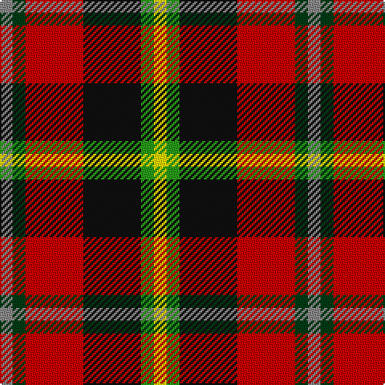

In pattern [RGRKGY](/patterns/rgrkgy/).

This was sourced from register-of-tartans.  It is a [6 stripes tartan](/stripes/stripes6/).

Original link https://www.tartanregister.gov.uk/tartanDetails.aspx?ref=11592

## Thread count
N/8 DG8 R36 K36 G8 Y/8

## Palette
Each colour and its ΔE from the base-6 reference it is a variant of.

| Colour | Shade | Base | ΔE (OKLab) |
|---|---|---|---|
| DG | <code style="background-color:#003C14;">#003C14</code> `#003C14` | G <code style="background-color:#006100;">#006100</code> | 0.13 |
| G | <code style="background-color:#289C18;">#289C18</code> `#289C18` | G <code style="background-color:#006100;">#006100</code> | 0.19 |
| K | <code style="background-color:#101010;">#101010</code> `#101010` | K <code style="background-color:#000000;">#000000</code> | 0.17 |
| N | <code style="background-color:#888888;">#888888</code> `#888888` | R <code style="background-color:#CC0000;">#CC0000</code> | 0.24 |
| R | <code style="background-color:#C80000;">#C80000</code> `#C80000` | R <code style="background-color:#CC0000;">#CC0000</code> | 0.01 |
| Y | <code style="background-color:#FFE600;">#FFE600</code> `#FFE600` | Y <code style="background-color:#F2BF00;">#F2BF00</code> | 0.10 |

# Sample pattern

## Nearest tartans

The nearest existing variants by ΔTartan distance.

1. [Tyrolean (Fashion?)](/setts/s6/w3r22k18g10ga6y3~g006818-ga604000-k101010-rc80000-we0e0e0-ye8c000~x2/) — ΔT 0.84
1. [Aboyne II (Fashion)](/setts/s6/r2y1r5k4g5w1~g006818-k101010-rc80000-wfcfcfc-yfccc00~x4/) — ΔT 1.27
1. [Douglas of Roxburgh](/setts/s5/k6b3g20r20y3~b2c2c80-g003800-k000000-rc80000-ye8c000~x2/) — ΔT 1.32
1. [Nicolson of Lewis (Clan?)](/setts/s6/b3ba5bb2g5r11w3~b344054-ba003c64-bb5c5c5c-g003820-rc80000-we0e0e0~x4/) — ΔT 1.41
1. [Craigmoor](/setts/s9/k2r8b2k2r2k6g2ga6y1~b2c4084-g503c14-ga005020-k101010-rdc0000-ye8c000~x2/) — ΔT 1.47
1. [Craigmoor](/setts/s9/k2r8b2k2r2k6ra2g6y1~b304080-g008000-k000000-rc00000-ra806050-yf0c000~x2/) — ΔT 1.47
1. [Raytheon](/setts/s8/k14w2k3r14wa6ra14k2ra3~k101010-r888888-rac80000-wfcfcfc-wac0c0c0~x2/) — ΔT 1.48
1. [Thirkill](/setts/s9/w4k2r15k2r5g7ga7k2y4~g5c6428-ga003820-k101010-rc80000-we0e0e0-ye8c000~x2/) — ΔT 1.49
1. [Eusa](/setts/s7/k16y16r16g3b7w7k7~b2c2c80-g288028-k101010-rc80000-we0e0e0-ye8c000~x2/) — ΔT 1.49
1. [Eusa (District)](/setts/s7/k16y16r16g3b7w7k7~b2c2c80-g00881c-k101010-rc80000-we0e0e0-ye8c000~x2/) — ΔT 1.49

## Neighbour map

Every grey dot is one of 15726 variants placed by the first two principal components of the ΔTartan feature space (44% of its variance). Red is this tartan; blue dots are its nearest — click one to open its page.

<svg viewBox="0 0 640 380" role="img" style="max-width:100%;height:auto;border:1px solid #e0e0e0;border-radius:4px;display:block" xmlns="http://www.w3.org/2000/svg"><image href="/nn/cloud.v1.png" width="640" height="380"/><a href="/setts/s6/w3r22k18g10ga6y3~g006818-ga604000-k101010-rc80000-we0e0e0-ye8c000~x2/"><circle cx="108.1" cy="183.9" r="4" fill="#3465a4"><title>Tyrolean (Fashion?)</title></circle></a><a href="/setts/s6/r2y1r5k4g5w1~g006818-k101010-rc80000-wfcfcfc-yfccc00~x4/"><circle cx="112.0" cy="224.2" r="4" fill="#3465a4"><title>Aboyne II (Fashion)</title></circle></a><a href="/setts/s5/k6b3g20r20y3~b2c2c80-g003800-k000000-rc80000-ye8c000~x2/"><circle cx="162.8" cy="211.7" r="4" fill="#3465a4"><title>Douglas of Roxburgh</title></circle></a><a href="/setts/s6/b3ba5bb2g5r11w3~b344054-ba003c64-bb5c5c5c-g003820-rc80000-we0e0e0~x4/"><circle cx="97.9" cy="206.2" r="4" fill="#3465a4"><title>Nicolson of Lewis (Clan?)</title></circle></a><a href="/setts/s9/k2r8b2k2r2k6g2ga6y1~b2c4084-g503c14-ga005020-k101010-rdc0000-ye8c000~x2/"><circle cx="101.8" cy="172.5" r="4" fill="#3465a4"><title>Craigmoor</title></circle></a><a href="/setts/s9/k2r8b2k2r2k6ra2g6y1~b304080-g008000-k000000-rc00000-ra806050-yf0c000~x2/"><circle cx="77.0" cy="166.1" r="4" fill="#3465a4"><title>Craigmoor</title></circle></a><a href="/setts/s8/k14w2k3r14wa6ra14k2ra3~k101010-r888888-rac80000-wfcfcfc-wac0c0c0~x2/"><circle cx="105.8" cy="180.7" r="4" fill="#3465a4"><title>Raytheon</title></circle></a><a href="/setts/s9/w4k2r15k2r5g7ga7k2y4~g5c6428-ga003820-k101010-rc80000-we0e0e0-ye8c000~x2/"><circle cx="119.9" cy="158.3" r="4" fill="#3465a4"><title>Thirkill</title></circle></a><a href="/setts/s7/k16y16r16g3b7w7k7~b2c2c80-g288028-k101010-rc80000-we0e0e0-ye8c000~x2/"><circle cx="23.4" cy="200.1" r="4" fill="#3465a4"><title>Eusa</title></circle></a><a href="/setts/s7/k16y16r16g3b7w7k7~b2c2c80-g00881c-k101010-rc80000-we0e0e0-ye8c000~x2/"><circle cx="23.1" cy="200.1" r="4" fill="#3465a4"><title>Eusa (District)</title></circle></a><circle cx="87.5" cy="193.6" r="5" fill="#c00000"/></svg>

ID: /setts/s6/r2g2ra9k9ga2y2~g003c14-ga289c18-k101010-r888888-rac80000-yffe600~x4/
