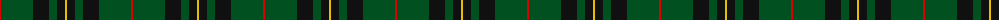

In pattern [RGKGKY](/patterns/rgkgky/).

This was sourced from register-of-tartans.  It is a [6 stripes tartan](/stripes/stripes6/).

Original link https://www.tartanregister.gov.uk/tartanDetails.aspx?ref=1219

## Thread count
R/2 G32 K16 G8 K8 Y/2

## Palette
Each colour and its ΔE from the base-6 reference it is a variant of.

| Colour | Shade | Base | ΔE (OKLab) |
|---|---|---|---|
| G | <code style="background-color:#005020;">#005020</code> `#005020` | G <code style="background-color:#006400;">#006400</code> | 0.08 |
| K | <code style="background-color:#101010;">#101010</code> `#101010` | K <code style="background-color:#000000;">#000000</code> | 0.17 |
| R | <code style="background-color:#DC0000;">#DC0000</code> `#DC0000` | R <code style="background-color:#C80000;">#C80000</code> | 0.04 |
| Y | <code style="background-color:#E8C000;">#E8C000</code> `#E8C000` | Y <code style="background-color:#E8C000;">#E8C000</code> | 0.00 |

# Sample pattern

## Nearest tartans

The nearest existing variants by ΔTartan distance.

1. [Page](/setts/s7/g92k36g12k26r8k8w8-g004810-k101010-rc80000-we0e0e0/) — ΔT 0.97
1. [Wcwm 1255](/setts/s5/g12r4k56g56y4-g006818-k101010-r880000-yd09800/) — ΔT 0.99
1. [MacKinross](/setts/s7/k12b2k12g8k20g40r4-b2c2c80-g006818-k101010-rc80000/) — ΔT 1.08
1. [St Andrews Links](/setts/s7/b32g8b6g6y4g48r4-b14283c-g006818-r880000-yd09800/) — ΔT 1.13
1. [MacHardy (Clan)](/setts/s8/b12r6g52b52w4b54r10g10-b14283c-g006428-rc80000-we0e0e0/) — ΔT 1.14
1. [MacArthur (Variant)](/setts/s6/r6g60k24g12k32y4-g006818-k101010-rc80000-ye8c000/) — ΔT 1.17
1. [Duchess of Fife #2](/setts/s6/g140k52g24k28b6k32-b2c2c80-g006818-k101010/) — ΔT 1.18
1. [MacKintosh Hunting](/setts/s7/y4g24b12r6g24r8b2-b000052-g11450d-raa0000-yaaaa00/) — ΔT 1.18
1. [Glenbarr](/setts/s8/g12k24r8k24g12k8g64k4-g006818-k101010-rc80000/) — ΔT 1.22
1. [Lockhart Family Tartan Tartan Number: 2258. Earliest known date: 1996 The clan tartan approved by the chief and the Lockhart Family Association 1996. The tartan was registered in the Lyon Court Book. LCB 100 on 11th June 1996. See products available Copyright © Blair Urquhart, Comrie, 2015](/setts/s9/g26k6g68k12b32r4b32k6g26-b202060-g006818-k101010-rc80000/) — ΔT 1.23

## Neighbour map

Every grey dot is one of 15726 variants placed by the first two principal components of the ΔTartan feature space (44% of its variance). Red is this tartan; blue dots are its nearest — click one to open its page.

<svg viewBox="0 0 640 380" role="img" style="max-width:100%;height:auto;border:1px solid #e0e0e0;border-radius:4px;display:block" xmlns="http://www.w3.org/2000/svg"><image href="/nn/cloud.v1.png" width="640" height="380"/><a href="/setts/s7/g92k36g12k26r8k8w8-g004810-k101010-rc80000-we0e0e0/"><circle cx="341.2" cy="205.6" r="4" fill="#3465a4"><title>Page</title></circle></a><a href="/setts/s5/g12r4k56g56y4-g006818-k101010-r880000-yd09800/"><circle cx="335.2" cy="219.8" r="4" fill="#3465a4"><title>Wcwm 1255</title></circle></a><a href="/setts/s7/k12b2k12g8k20g40r4-b2c2c80-g006818-k101010-rc80000/"><circle cx="330.0" cy="199.7" r="4" fill="#3465a4"><title>MacKinross</title></circle></a><a href="/setts/s7/b32g8b6g6y4g48r4-b14283c-g006818-r880000-yd09800/"><circle cx="380.9" cy="214.9" r="4" fill="#3465a4"><title>St Andrews Links</title></circle></a><a href="/setts/s8/b12r6g52b52w4b54r10g10-b14283c-g006428-rc80000-we0e0e0/"><circle cx="362.8" cy="211.2" r="4" fill="#3465a4"><title>MacHardy (Clan)</title></circle></a><a href="/setts/s6/r6g60k24g12k32y4-g006818-k101010-rc80000-ye8c000/"><circle cx="317.1" cy="211.1" r="4" fill="#3465a4"><title>MacArthur (Variant)</title></circle></a><a href="/setts/s6/g140k52g24k28b6k32-b2c2c80-g006818-k101010/"><circle cx="417.7" cy="217.0" r="4" fill="#3465a4"><title>Duchess of Fife #2</title></circle></a><a href="/setts/s7/y4g24b12r6g24r8b2-b000052-g11450d-raa0000-yaaaa00/"><circle cx="332.8" cy="223.1" r="4" fill="#3465a4"><title>MacKintosh Hunting</title></circle></a><a href="/setts/s8/g12k24r8k24g12k8g64k4-g006818-k101010-rc80000/"><circle cx="374.5" cy="211.4" r="4" fill="#3465a4"><title>Glenbarr</title></circle></a><a href="/setts/s9/g26k6g68k12b32r4b32k6g26-b202060-g006818-k101010-rc80000/"><circle cx="343.6" cy="204.2" r="4" fill="#3465a4"><title>Lockhart Family Tartan Tartan Number: 2258. Earliest known date: 1996 The clan tartan approved by the chief and the Lockhart Family Association 1996. The tartan was registered in the Lyon Court Book. LCB 100 on 11th June 1996. See products available Copyright © Blair Urquhart, Comrie, 2015</title></circle></a><circle cx="386.2" cy="216.9" r="5" fill="#c00000"/></svg>

ID: /setts/s6/r2g32k16g8k8y2-g005020-k101010-rdc0000-ye8c000/
