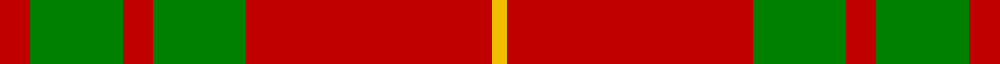
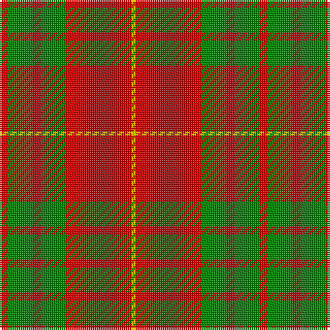

In pattern [RGRGRY](/stripes/rgrgry/).

This was sourced from weddslist.  It is a [6 stripe tartan](/stripes/stripes6/).

Original link http://www.weddslist.com/cgi-bin/tartans/pg.pl?source=sts

## Attestations

This cloth appears in 2 source records; the oldest owns this page.

- undated — Cameron (weddslist, [record](http://www.weddslist.com/cgi-bin/tartans/pg.pl?source=sts))
- undated — Cameron Clan Tartan Tartan Number: 1538. Earliest known date: 1842 First illustrated in the 'Vestiarium Scoticum' this sett is known as the Cameron Clan tartan. It may be derived from the tartan worn by the MacFees who also had a close association with Lochaber. The sett was recorded by Lord Lyon in the Public Register of All Arms and Bearings in 1947. See products available Copyright © Blair Urquhart, Comrie, 2015 (house-of-tartan, [record](http://www.house-of-tartan.scotland.net/house/TartanViewjs.asp?colr=Def&tnam=1538))

## Thread count
R/4 G12 R4 G12 R32 Y/2

## Palette
Each colour and the base-6 reference it is a variant of.

| Colour | Shade | Base |
|---|---|---|
| G | <code style="background-color:#008000;">#008000</code> `oklch(52.0% 0.177 142.5)` <small>#008000</small> | G <code style="background-color:#006100;">#006100</code> |
| R | <code style="background-color:#C00000;">#C00000</code> `oklch(50.7% 0.208 29.2)` <small>#C00000</small> | R <code style="background-color:#CC0000;">#CC0000</code> |
| Y | <code style="background-color:#F0C000;">#F0C000</code> `oklch(82.7% 0.169 90.5)` <small>#F0C000</small> | Y <code style="background-color:#F2BF00;">#F2BF00</code> |

# Sample pattern

## Nearest tartans

The nearest existing variants by ΔTartan distance, with this tartan at the top so the swatches line up against it.

ΔTartan

Tartan

Sett

—

<a href="/ttd/edit/#slug=r2g6r2g6r16ly1~x2">Cameron</a> <a class="nn-out" href="/setts/s6/r2g6r2g6r16ly1~x2/" title="open its dictionary page">↗</a>

0.35

<a href="/ttd/edit/#slug=r2g6r2g6r16ly1~x4">Cameron (Clan)</a> <a class="nn-out" href="/setts/s6/r2g6r2g6r16ly1~x4/" title="open its dictionary page">↗</a>

0.65

<a href="/ttd/edit/#slug=r2dg6r2dg6r16ly1~x2">Cameron</a> <a class="nn-out" href="/setts/s6/r2dg6r2dg6r16ly1~x2/" title="open its dictionary page">↗</a>

0.74

<a href="/ttd/edit/#slug=r1dg6r1dg6r15ly1~x2">Cameron Clan D</a> <a class="nn-out" href="/setts/s6/r1dg6r1dg6r15ly1~x2/" title="open its dictionary page">↗</a>

0.80

<a href="/ttd/edit/#slug=r6lb2r30dg12r3dg12r3">Crawford</a> <a class="nn-out" href="/setts/s7/r6lb2r30dg12r3dg12r3/" title="open its dictionary page">↗</a>

1.00

<a href="/ttd/edit/#slug=r1g10r1db4r18g1~x4">Robertson 6</a> <a class="nn-out" href="/setts/s6/r1g10r1db4r18g1~x4/" title="open its dictionary page">↗</a>

1.02

<a href="/ttd/edit/#slug=r16g1r1g1r4g12~x4">MacQuarrie #5</a> <a class="nn-out" href="/setts/s6/r16g1r1g1r4g12~x4/" title="open its dictionary page">↗</a>

1.04

<a href="/ttd/edit/#slug=r22db5r2g11r3db1~x2">MacKintosh 1</a> <a class="nn-out" href="/setts/s6/r22db5r2g11r3db1~x2/" title="open its dictionary page">↗</a>

1.07

<a href="/ttd/edit/#slug=r4g14r5k6r24g2r4~x2">Auld Lang Syne (red) Tartan Tartan Number: 2402. Earliest known date: Threadcount and colours aren't 100% original. Generated manually. See products available Copyright © Blair Urquhart, Comrie, 2015</a> <a class="nn-out" href="/setts/s7/r4g14r5k6r24g2r4~x2/" title="open its dictionary page">↗</a>

1.08

<a href="/ttd/edit/#slug=r48db2r3g28r4db2~x2">MacKintosh 2</a> <a class="nn-out" href="/setts/s6/r48db2r3g28r4db2~x2/" title="open its dictionary page">↗</a>

1.10

<a href="/ttd/edit/#slug=k1r18g12r2g12r18w1~x2">MacKinnon 8</a> <a class="nn-out" href="/setts/s7/k1r18g12r2g12r18w1~x2/" title="open its dictionary page">↗</a>

## Neighbour map

Every grey dot is one of 14299 variants placed by the first two principal components of the ΔTartan feature space (44% of its variance). Red is this tartan; blue dots are its nearest — click one to open its page.

<svg viewBox="0 0 640 380" role="img" style="max-width:100%;height:auto;border:1px solid #e0e0e0;border-radius:4px;display:block" xmlns="http://www.w3.org/2000/svg"><image href="/nn/cloud.v1.png" width="640" height="380"/><a href="/setts/s6/r2g6r2g6r16ly1~x4/"><circle cx="421.8" cy="202.2" r="4" fill="#3465a4"><title>Cameron (Clan)</title></circle></a><a href="/setts/s6/r2dg6r2dg6r16ly1~x2/"><circle cx="414.6" cy="198.6" r="4" fill="#3465a4"><title>Cameron</title></circle></a><a href="/setts/s6/r1dg6r1dg6r15ly1~x2/"><circle cx="394.4" cy="195.3" r="4" fill="#3465a4"><title>Cameron Clan D</title></circle></a><a href="/setts/s7/r6lb2r30dg12r3dg12r3/"><circle cx="417.2" cy="193.4" r="4" fill="#3465a4"><title>Crawford</title></circle></a><a href="/setts/s6/r1g10r1db4r18g1~x4/"><circle cx="397.7" cy="186.3" r="4" fill="#3465a4"><title>Robertson 6</title></circle></a><a href="/setts/s6/r16g1r1g1r4g12~x4/"><circle cx="456.7" cy="215.1" r="4" fill="#3465a4"><title>MacQuarrie #5</title></circle></a><a href="/setts/s6/r22db5r2g11r3db1~x2/"><circle cx="425.0" cy="185.2" r="4" fill="#3465a4"><title>MacKintosh 1</title></circle></a><a href="/setts/s7/r4g14r5k6r24g2r4~x2/"><circle cx="394.7" cy="205.8" r="4" fill="#3465a4"><title>Auld Lang Syne (red) Tartan Tartan Number: 2402. Earliest known date: Threadcount and colours aren't 100% original. Generated manually. See products available Copyright © Blair Urquhart, Comrie, 2015</title></circle></a><a href="/setts/s6/r48db2r3g28r4db2~x2/"><circle cx="466.9" cy="170.2" r="4" fill="#3465a4"><title>MacKintosh 2</title></circle></a><a href="/setts/s7/k1r18g12r2g12r18w1~x2/"><circle cx="374.0" cy="183.8" r="4" fill="#3465a4"><title>MacKinnon 8</title></circle></a><circle cx="416.7" cy="200.8" r="5" fill="#c00000"/></svg>

ID: /setts/s6/r2g6r2g6r16ly1~x2/
