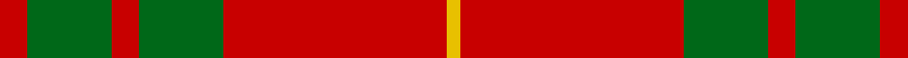
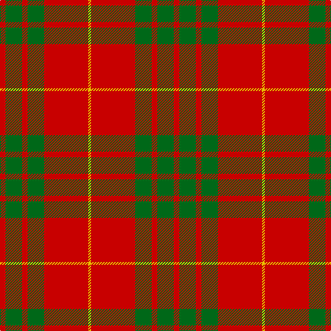

**Bands:** [RGRGRY](/stripes/rgrgry/) · **Stripes:** [R G R G R LY](/stripes/stripes6/) R G R G R LY

This was sourced from tartans-authority.  It is a [6 band tartan](/bands/bands6/).

Original link http://www.tartansauthority.com/tartan-ferret/display/1538/

## Variants

Other setts woven to the same stripe pattern.

- [Cameron](/setts/s6/r1g3r1g3r8ly1~x8/)
- [Cameron](/setts/s6/r2g6r2g6r16ly1~x2/)
- [Maguire, Black](/setts/s6/r29g2r2g2r6ly21~x4/)

## Thread count
R/8 G24 R8 G24 R64 Y/4

## Palette
Each colour and its ΔE from the base-6 reference it is a variant of.

| Colour | Shade | Base | ΔE (OKLab) |
|---|---|---|---|
| G | <code style="background-color:#006818;">#006818</code> `#006818` | G <code style="background-color:#006100;">#006100</code> | 0.02 |
| R | <code style="background-color:#C80000;">#C80000</code> `#C80000` | R <code style="background-color:#CC0000;">#CC0000</code> | 0.01 |
| Y | <code style="background-color:#E8C000;">#E8C000</code> `#E8C000` | Y <code style="background-color:#F2BF00;">#F2BF00</code> | 0.02 |

# Sample pattern

## Nearest tartans

The nearest existing variants by ΔTartan distance.

1. [Cameron](/setts/s6/r2g6r2g6r16ly1~x2/) — ΔT 0.35
1. [Cameron](/setts/s6/r2dg6r2dg6r16ly1~x2/) — ΔT 0.45
1. [Crawford](/setts/s7/r6lb2r30dg12r3dg12r3/) — ΔT 0.59
1. [Cameron Clan D](/setts/s6/r1dg6r1dg6r15ly1~x2/) — ΔT 0.67
1. [MacKintosh 1](/setts/s6/r22db5r2g11r3db1~x2/) — ΔT 0.84
1. [Auld Lang Syne (red) Tartan Tartan Number: 2402. Earliest known date: Threadcount and colours aren't 100% original. Generated manually. See products available Copyright © Blair Urquhart, Comrie, 2015](/setts/s7/r4g14r5k6r24g2r4~x2/) — ΔT 0.87
1. [MacKintosh 3](/setts/s6/r68db18r9g34r9db3~x2/) — ΔT 0.90
1. [Robertson 6](/setts/s6/r1g10r1db4r18g1~x4/) — ΔT 0.93
1. [MacQuarrie #5](/setts/s6/r16g1r1g1r4g12~x4/) — ΔT 0.95
1. [MacQuarrie](/setts/s6/r16dg1r1dg1r4dg12/) — ΔT 1.01

## Neighbour map

Every grey dot is one of 14299 variants placed by the first two principal components of the ΔTartan feature space (44% of its variance). Red is this tartan; blue dots are its nearest — click one to open its page.

<svg viewBox="0 0 640 380" role="img" style="max-width:100%;height:auto;border:1px solid #e0e0e0;border-radius:4px;display:block" xmlns="http://www.w3.org/2000/svg"><image href="/nn/cloud.v1.png" width="640" height="380"/><a href="/setts/s6/r2g6r2g6r16ly1~x2/"><circle cx="416.7" cy="200.8" r="4" fill="#3465a4"><title>Cameron</title></circle></a><a href="/setts/s6/r2dg6r2dg6r16ly1~x2/"><circle cx="414.6" cy="198.6" r="4" fill="#3465a4"><title>Cameron</title></circle></a><a href="/setts/s7/r6lb2r30dg12r3dg12r3/"><circle cx="417.2" cy="193.4" r="4" fill="#3465a4"><title>Crawford</title></circle></a><a href="/setts/s6/r1dg6r1dg6r15ly1~x2/"><circle cx="394.4" cy="195.3" r="4" fill="#3465a4"><title>Cameron Clan D</title></circle></a><a href="/setts/s6/r22db5r2g11r3db1~x2/"><circle cx="425.0" cy="185.2" r="4" fill="#3465a4"><title>MacKintosh 1</title></circle></a><a href="/setts/s7/r4g14r5k6r24g2r4~x2/"><circle cx="394.7" cy="205.8" r="4" fill="#3465a4"><title>Auld Lang Syne (red) Tartan Tartan Number: 2402. Earliest known date: Threadcount and colours aren't 100% original. Generated manually. See products available Copyright © Blair Urquhart, Comrie, 2015</title></circle></a><a href="/setts/s6/r68db18r9g34r9db3~x2/"><circle cx="419.1" cy="187.8" r="4" fill="#3465a4"><title>MacKintosh 3</title></circle></a><a href="/setts/s6/r1g10r1db4r18g1~x4/"><circle cx="397.7" cy="186.3" r="4" fill="#3465a4"><title>Robertson 6</title></circle></a><a href="/setts/s6/r16g1r1g1r4g12~x4/"><circle cx="456.7" cy="215.1" r="4" fill="#3465a4"><title>MacQuarrie #5</title></circle></a><a href="/setts/s6/r16dg1r1dg1r4dg12/"><circle cx="451.9" cy="212.8" r="4" fill="#3465a4"><title>MacQuarrie</title></circle></a><circle cx="421.8" cy="202.2" r="5" fill="#c00000"/></svg>

ID: /setts/s6/r2g6r2g6r16ly1~x4/
