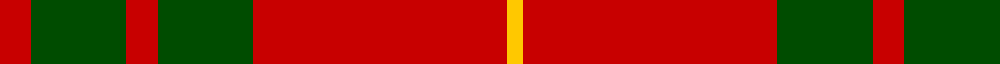

In pattern [RGRGRY](/patterns/rgrgry/).

This was sourced from weddslist.  It is a [6 stripes tartan](/stripes/stripes6/).

Original link http://www.weddslist.com/cgi-bin/tartans/pg.pl?source=rb

## Thread count
R/4 G12 R4 G12 R32 Y/2

## Palette
Each colour and its ΔE from the base-6 reference it is a variant of.

| Colour | Shade | Base | ΔE (OKLab) |
|---|---|---|---|
| G | <code style="background-color:#004C00;">#004C00</code> `#004C00` | G <code style="background-color:#006100;">#006100</code> | 0.07 |
| R | <code style="background-color:#C80000;">#C80000</code> `#C80000` | R <code style="background-color:#CC0000;">#CC0000</code> | 0.01 |
| Y | <code style="background-color:#FFC800;">#FFC800</code> `#FFC800` | Y <code style="background-color:#F2BF00;">#F2BF00</code> | 0.03 |

# Sample pattern

## Nearest tartans

The nearest existing variants by ΔTartan distance.

1. [Crawford](/setts/s7/r6w2r30g12r3g12r3~g004c00-rc80000-wd0d0d0/) — ΔT 0.37
1. [Cameron (Clan)](/setts/s6/r2g6r2g6r16y1x4~g006818-rc80000-ye8c000/) — ΔT 0.45
1. [Cameron Clan Tartan Tartan Number: 1538. Earliest known date: 1842 First illustrated in the 'Vestiarium Scoticum' this sett is known as the Cameron Clan tartan. It may be derived from the tartan worn by the MacFees who also had a close association with Lochaber. The sett was recorded by Lord Lyon in the Public Register of All Arms and Bearings in 1947. See products available Copyright © Blair Urquhart, Comrie, 2015](/setts/s6/r2g6r2g6r16y1x2~g006818-rc80000-ye8c000/) — ΔT 0.45
1. [Cameron Clan D](/setts/s6/r1g6r1g6r15y1x2~g004c00-rc80000-yffc800/) — ΔT 0.50
1. [Cameron](/setts/s6/r2g6r2g6r16y1x2~g008000-rc00000-yf0c000/) — ΔT 0.65
1. [Auld Lang Syne (red) Tartan Tartan Number: 2402. Earliest known date: Threadcount and colours aren't 100% original. Generated manually. See products available Copyright © Blair Urquhart, Comrie, 2015](/setts/s7/r4g14r5k6r24g2r4x2~g006818-k101010-rc80000/) — ΔT 0.68
1. [MacKintosh 1](/setts/s6/r22b5r2g11r3b1x2~b304080-g008000-rc00000/) — ΔT 0.89
1. [MacKintosh 3](/setts/s6/r68b18r9g34r9b3x2~b304080-g008000-rc00000/) — ΔT 0.94
1. [MacQuarrie](/setts/s6/r16g1r1g1r4g12x2~g004c00-rc80000/) — ΔT 0.97
1. [MacKintosh Clan Tartan Tartan Number: 521. Earliest known date: 1815 D.C. Stewart wrote, "This is one of the few ancient tartans too well authenticated to admit of doubt or question." The earliest publication is attributed to Logan but he may well have known of the sample, sealed with signature of the chief, which existed in the collection of the Highland Society of London, dating around 1815. The chief of the MacKintoshes is also chief of Clan Chattan. Logan wrote, "The chief also wears a particular tartan of a very showy pattern", which has now been registered with Lord Lyon (1947) as 'Clan Chattan (Chief)'. The clan tartan has likewise been registered as 'Clan Chattan'. See products available Copyright © Blair Urquhart, Comrie, 2015](/setts/s6/r22b5r2g11r3b1x2~b2c2c80-g006818-rc80000/) — ΔT 0.97

## Neighbour map

Every grey dot is one of 15726 variants placed by the first two principal components of the ΔTartan feature space (44% of its variance). Red is this tartan; blue dots are its nearest — click one to open its page.

<svg viewBox="0 0 640 380" role="img" style="max-width:100%;height:auto;border:1px solid #e0e0e0;border-radius:4px;display:block" xmlns="http://www.w3.org/2000/svg"><image href="/nn/cloud.v1.png" width="640" height="380"/><a href="/setts/s7/r6w2r30g12r3g12r3~g004c00-rc80000-wd0d0d0/"><circle cx="417.8" cy="197.9" r="4" fill="#3465a4"><title>Crawford</title></circle></a><a href="/setts/s6/r2g6r2g6r16y1x4~g006818-rc80000-ye8c000/"><circle cx="422.4" cy="205.7" r="4" fill="#3465a4"><title>Cameron (Clan)</title></circle></a><a href="/setts/s6/r2g6r2g6r16y1x2~g006818-rc80000-ye8c000/"><circle cx="422.4" cy="205.7" r="4" fill="#3465a4"><title>Cameron Clan Tartan Tartan Number: 1538. Earliest known date: 1842 First illustrated in the 'Vestiarium Scoticum' this sett is known as the Cameron Clan tartan. It may be derived from the tartan worn by the MacFees who also had a close association with Lochaber. The sett was recorded by Lord Lyon in the Public Register of All Arms and Bearings in 1947. See products available Copyright © Blair Urquhart, Comrie, 2015</title></circle></a><a href="/setts/s6/r1g6r1g6r15y1x2~g004c00-rc80000-yffc800/"><circle cx="394.6" cy="199.5" r="4" fill="#3465a4"><title>Cameron Clan D</title></circle></a><a href="/setts/s6/r2g6r2g6r16y1x2~g008000-rc00000-yf0c000/"><circle cx="417.3" cy="204.6" r="4" fill="#3465a4"><title>Cameron</title></circle></a><a href="/setts/s7/r4g14r5k6r24g2r4x2~g006818-k101010-rc80000/"><circle cx="395.2" cy="210.1" r="4" fill="#3465a4"><title>Auld Lang Syne (red) Tartan Tartan Number: 2402. Earliest known date: Threadcount and colours aren't 100% original. Generated manually. See products available Copyright © Blair Urquhart, Comrie, 2015</title></circle></a><a href="/setts/s6/r22b5r2g11r3b1x2~b304080-g008000-rc00000/"><circle cx="425.5" cy="188.1" r="4" fill="#3465a4"><title>MacKintosh 1</title></circle></a><a href="/setts/s6/r68b18r9g34r9b3x2~b304080-g008000-rc00000/"><circle cx="419.5" cy="190.6" r="4" fill="#3465a4"><title>MacKintosh 3</title></circle></a><a href="/setts/s6/r16g1r1g1r4g12x2~g004c00-rc80000/"><circle cx="452.4" cy="217.2" r="4" fill="#3465a4"><title>MacQuarrie</title></circle></a><a href="/setts/s6/r22b5r2g11r3b1x2~b2c2c80-g006818-rc80000/"><circle cx="424.6" cy="186.8" r="4" fill="#3465a4"><title>MacKintosh Clan Tartan Tartan Number: 521. Earliest known date: 1815 D.C. Stewart wrote, &quot;This is one of the few ancient tartans too well authenticated to admit of doubt or question.&quot; The earliest publication is attributed to Logan but he may well have known of the sample, sealed with signature of the chief, which existed in the collection of the Highland Society of London, dating around 1815. The chief of the MacKintoshes is also chief of Clan Chattan. Logan wrote, &quot;The chief also wears a particular tartan of a very showy pattern&quot;, which has now been registered with Lord Lyon (1947) as 'Clan Chattan (Chief)'. The clan tartan has likewise been registered as 'Clan Chattan'. See products available Copyright © Blair Urquhart, Comrie, 2015</title></circle></a><circle cx="415.1" cy="203.2" r="5" fill="#c00000"/></svg>

ID: /setts/s6/r2g6r2g6r16y1x2~g004c00-rc80000-yffc800/
