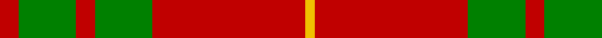

In pattern [RGRGRY](/patterns/rgrgry/).

This was sourced from weddslist.  It is a [6 stripes tartan](/stripes/stripes6/).

Original link http://www.weddslist.com/cgi-bin/tartans/pg.pl?source=sts

## Thread count
R/4 G12 R4 G12 R32 Y/2

## Palette
Each colour and its ΔE from the base-6 reference it is a variant of.

| Colour | Shade | Base | ΔE (OKLab) |
|---|---|---|---|
| G | <code style="background-color:#008000;">#008000</code> `#008000` | G <code style="background-color:#006100;">#006100</code> | 0.10 |
| R | <code style="background-color:#C00000;">#C00000</code> `#C00000` | R <code style="background-color:#CC0000;">#CC0000</code> | 0.03 |
| Y | <code style="background-color:#F0C000;">#F0C000</code> `#F0C000` | Y <code style="background-color:#F2BF00;">#F2BF00</code> | 0.00 |

# Sample pattern

## Nearest tartans

The nearest existing variants by ΔTartan distance.

1. [Cameron (Clan)](/setts/s6/r2g6r2g6r16y1x4~g006818-rc80000-ye8c000/) — ΔT 0.35
1. [Cameron Clan Tartan Tartan Number: 1538. Earliest known date: 1842 First illustrated in the 'Vestiarium Scoticum' this sett is known as the Cameron Clan tartan. It may be derived from the tartan worn by the MacFees who also had a close association with Lochaber. The sett was recorded by Lord Lyon in the Public Register of All Arms and Bearings in 1947. See products available Copyright © Blair Urquhart, Comrie, 2015](/setts/s6/r2g6r2g6r16y1x2~g006818-rc80000-ye8c000/) — ΔT 0.35
1. [Cameron](/setts/s6/r2g6r2g6r16y1x2~g004c00-rc80000-yffc800/) — ΔT 0.65
1. [Cameron Clan D](/setts/s6/r1g6r1g6r15y1x2~g004c00-rc80000-yffc800/) — ΔT 0.74
1. [Crawford](/setts/s7/r6w2r30g12r3g12r3~g004c00-rc80000-wd0d0d0/) — ΔT 0.80
1. [Robertson 6](/setts/s6/g1r18b4r1g10r1x4~b304080-g008000-rc00000/) — ΔT 1.00
1. [MacQuarrie #5](/setts/s6/r16g1r1g1r4g12x4~g006818-rc80000/) — ΔT 1.02
1. [MacKintosh 1](/setts/s6/r22b5r2g11r3b1x2~b304080-g008000-rc00000/) — ΔT 1.04
1. [Auld Lang Syne (red) Tartan Tartan Number: 2402. Earliest known date: Threadcount and colours aren't 100% original. Generated manually. See products available Copyright © Blair Urquhart, Comrie, 2015](/setts/s7/r4g14r5k6r24g2r4x2~g006818-k101010-rc80000/) — ΔT 1.07
1. [MacKintosh 2](/setts/s6/r48b2r3g28r4b2x2~b304080-g008000-rc00000/) — ΔT 1.08

## Neighbour map

Every grey dot is one of 15726 variants placed by the first two principal components of the ΔTartan feature space (44% of its variance). Red is this tartan; blue dots are its nearest — click one to open its page.

<svg viewBox="0 0 640 380" role="img" style="max-width:100%;height:auto;border:1px solid #e0e0e0;border-radius:4px;display:block" xmlns="http://www.w3.org/2000/svg"><image href="/nn/cloud.v1.png" width="640" height="380"/><a href="/setts/s6/r2g6r2g6r16y1x4~g006818-rc80000-ye8c000/"><circle cx="422.4" cy="205.7" r="4" fill="#3465a4"><title>Cameron (Clan)</title></circle></a><a href="/setts/s6/r2g6r2g6r16y1x2~g006818-rc80000-ye8c000/"><circle cx="422.4" cy="205.7" r="4" fill="#3465a4"><title>Cameron Clan Tartan Tartan Number: 1538. Earliest known date: 1842 First illustrated in the 'Vestiarium Scoticum' this sett is known as the Cameron Clan tartan. It may be derived from the tartan worn by the MacFees who also had a close association with Lochaber. The sett was recorded by Lord Lyon in the Public Register of All Arms and Bearings in 1947. See products available Copyright © Blair Urquhart, Comrie, 2015</title></circle></a><a href="/setts/s6/r2g6r2g6r16y1x2~g004c00-rc80000-yffc800/"><circle cx="415.1" cy="203.2" r="4" fill="#3465a4"><title>Cameron</title></circle></a><a href="/setts/s6/r1g6r1g6r15y1x2~g004c00-rc80000-yffc800/"><circle cx="394.6" cy="199.5" r="4" fill="#3465a4"><title>Cameron Clan D</title></circle></a><a href="/setts/s7/r6w2r30g12r3g12r3~g004c00-rc80000-wd0d0d0/"><circle cx="417.8" cy="197.9" r="4" fill="#3465a4"><title>Crawford</title></circle></a><a href="/setts/s6/g1r18b4r1g10r1x4~b304080-g008000-rc00000/"><circle cx="397.7" cy="188.7" r="4" fill="#3465a4"><title>Robertson 6</title></circle></a><a href="/setts/s6/r16g1r1g1r4g12x4~g006818-rc80000/"><circle cx="457.2" cy="218.6" r="4" fill="#3465a4"><title>MacQuarrie #5</title></circle></a><a href="/setts/s6/r22b5r2g11r3b1x2~b304080-g008000-rc00000/"><circle cx="425.5" cy="188.1" r="4" fill="#3465a4"><title>MacKintosh 1</title></circle></a><a href="/setts/s7/r4g14r5k6r24g2r4x2~g006818-k101010-rc80000/"><circle cx="395.2" cy="210.1" r="4" fill="#3465a4"><title>Auld Lang Syne (red) Tartan Tartan Number: 2402. Earliest known date: Threadcount and colours aren't 100% original. Generated manually. See products available Copyright © Blair Urquhart, Comrie, 2015</title></circle></a><a href="/setts/s6/r48b2r3g28r4b2x2~b304080-g008000-rc00000/"><circle cx="467.5" cy="173.7" r="4" fill="#3465a4"><title>MacKintosh 2</title></circle></a><circle cx="417.3" cy="204.6" r="5" fill="#c00000"/></svg>

ID: /setts/s6/r2g6r2g6r16y1x2~g008000-rc00000-yf0c000/
