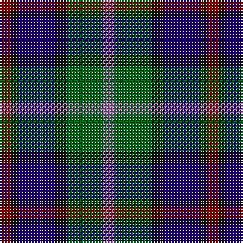

In pattern [RGKBKR](/stripes/rgkbkr/).

This was sourced from tartans-authority.  It is a [6 stripe tartan](/stripes/stripes6/).

Original link http://www.tartansauthority.com/tartan-ferret/display/3359/

## Also known as

This cloth is also recorded under:

- MacCaughan or MacEachain

## Attestations

This cloth appears in 3 source records; the oldest owns this page.

- pre 2002 — MacEachain (Clan) (tartans-authority, [record](http://www.tartansauthority.com/tartan-ferret/display/3359/))
- undated — MacEachain (register-of-tartans, [record](https://www.tartanregister.gov.uk/tartanDetails.aspx?ref=5186))
- undated — MacCaughan or MacEachain Clan Tartan Tartan Number: 169. Earliest known date: 1972 Nothing See products available Copyright © Blair Urquhart, Comrie, 2015 (house-of-tartan, [record](http://www.house-of-tartan.scotland.net/house/TartanViewjs.asp?colr=Def&tnam=169))

## Register references

External register numbers recorded for this tartan.

- Scottish Register of Tartans: [5186](https://www.tartanregister.gov.uk/tartanDetails.aspx?ref=5186)
- Scottish Tartans Authority (ITI): 3359

## Thread count
DR/8 K4 DB24 K8 G24 LP/8

## Palette
Each colour and the base-6 reference it is a variant of.

| Colour | Shade | Base |
|---|---|---|
| DB | <code style="background-color:#1C0070;">#1C0070</code> `oklch(26.3% 0.162 277.1)` <small>#1C0070</small> | B <code style="background-color:#2A418A;">#2A418A</code> |
| DR | <code style="background-color:#880000;">#880000</code> `oklch(39.4% 0.162 29.2)` <small>#880000</small> | R <code style="background-color:#CC0000;">#CC0000</code> |
| G | <code style="background-color:#006818;">#006818</code> `oklch(45.0% 0.142 145.0)` <small>#006818</small> | G <code style="background-color:#006100;">#006100</code> |
| K | <code style="background-color:#101010;">#101010</code> `oklch(17.3% 0.000 89.9)` <small>#101010</small> | K <code style="background-color:#000000;">#000000</code> |
| LP | <code style="background-color:#9C68A4;">#9C68A4</code> `oklch(59.4% 0.107 322.0)` <small>#9C68A4</small> | R <code style="background-color:#CC0000;">#CC0000</code> |

# Sample pattern

## Nearest tartans

The nearest existing variants by ΔTartan distance, with this tartan at the top so the swatches line up against it.

ΔTartan

Tartan

Sett

—

<a href="/ttd/edit/#slug=r2k1db6k2g6m2~x4">MacEachain (Clan)</a> <a class="nn-out" href="/setts/s6/r2k1db6k2g6m2~x4/" title="open its dictionary page">↗</a>

0.42

<a href="/ttd/edit/#slug=k6t2db12g8r5k2g3~x4">Cooke (Personal)</a> <a class="nn-out" href="/setts/s7/k6t2db12g8r5k2g3~x4/" title="open its dictionary page">↗</a>

0.53

<a href="/ttd/edit/#slug=db1r1db6k6dg6w1~x2">Wellington</a> <a class="nn-out" href="/setts/s6/db1r1db6k6dg6w1~x2/" title="open its dictionary page">↗</a>

0.74

<a href="/ttd/edit/#slug=b2dg6ly1k6db6k1db1~x2">Hogarth of Firhill #2</a> <a class="nn-out" href="/setts/s7/b2dg6ly1k6db6k1db1~x2/" title="open its dictionary page">↗</a>

0.74

<a href="/ttd/edit/#slug=t2g6ly1k6db6k1db1~x2">Hogarth of Firhill</a> <a class="nn-out" href="/setts/s7/t2g6ly1k6db6k1db1~x2/" title="open its dictionary page">↗</a>

0.75

<a href="/ttd/edit/#slug=r1db7k7g7w1~x6">Davidson of Tulloch (Clan)</a> <a class="nn-out" href="/setts/s5/r1db7k7g7w1~x6/" title="open its dictionary page">↗</a>

0.77

<a href="/ttd/edit/#slug=r1db6k3dg6w1~x4">Davidson of Tulloch #2</a> <a class="nn-out" href="/setts/s5/r1db6k3dg6w1~x4/" title="open its dictionary page">↗</a>

0.78

<a href="/ttd/edit/#slug=t4g14ly2k14db14k2db3~x2">Hogarth of Firhill (Clan)</a> <a class="nn-out" href="/setts/s7/t4g14ly2k14db14k2db3~x2/" title="open its dictionary page">↗</a>

0.79

<a href="/ttd/edit/#slug=dp27db4k27g27lo4~x2">Selkirk (Personal)</a> <a class="nn-out" href="/setts/s5/dp27db4k27g27lo4~x2/" title="open its dictionary page">↗</a>

0.81

<a href="/ttd/edit/#slug=r2db12k7g8t2~x4">Forbo Nairn</a> <a class="nn-out" href="/setts/s5/r2db12k7g8t2~x4/" title="open its dictionary page">↗</a>

0.81

<a href="/ttd/edit/#slug=r2k1db8k8g8k1t2~x2">Argyll</a> <a class="nn-out" href="/setts/s7/r2k1db8k8g8k1t2~x2/" title="open its dictionary page">↗</a>

## Neighbour map

Every grey dot is one of 14299 variants placed by the first two principal components of the ΔTartan feature space (44% of its variance). Red is this tartan; blue dots are its nearest — click one to open its page.

<svg viewBox="0 0 640 380" role="img" style="max-width:100%;height:auto;border:1px solid #e0e0e0;border-radius:4px;display:block" xmlns="http://www.w3.org/2000/svg"><image href="/nn/cloud.v1.png" width="640" height="380"/><a href="/setts/s7/k6t2db12g8r5k2g3~x4/"><circle cx="114.2" cy="235.2" r="4" fill="#3465a4"><title>Cooke (Personal)</title></circle></a><a href="/setts/s6/db1r1db6k6dg6w1~x2/"><circle cx="142.2" cy="236.4" r="4" fill="#3465a4"><title>Wellington</title></circle></a><a href="/setts/s7/b2dg6ly1k6db6k1db1~x2/"><circle cx="120.0" cy="229.0" r="4" fill="#3465a4"><title>Hogarth of Firhill #2</title></circle></a><a href="/setts/s7/t2g6ly1k6db6k1db1~x2/"><circle cx="116.1" cy="225.7" r="4" fill="#3465a4"><title>Hogarth of Firhill</title></circle></a><a href="/setts/s5/r1db7k7g7w1~x6/"><circle cx="126.6" cy="241.4" r="4" fill="#3465a4"><title>Davidson of Tulloch (Clan)</title></circle></a><a href="/setts/s5/r1db6k3dg6w1~x4/"><circle cx="146.7" cy="247.1" r="4" fill="#3465a4"><title>Davidson of Tulloch #2</title></circle></a><a href="/setts/s7/t4g14ly2k14db14k2db3~x2/"><circle cx="134.8" cy="220.9" r="4" fill="#3465a4"><title>Hogarth of Firhill (Clan)</title></circle></a><a href="/setts/s5/dp27db4k27g27lo4~x2/"><circle cx="136.1" cy="243.2" r="4" fill="#3465a4"><title>Selkirk (Personal)</title></circle></a><a href="/setts/s5/r2db12k7g8t2~x4/"><circle cx="159.8" cy="256.9" r="4" fill="#3465a4"><title>Forbo Nairn</title></circle></a><a href="/setts/s7/r2k1db8k8g8k1t2~x2/"><circle cx="150.9" cy="216.8" r="4" fill="#3465a4"><title>Argyll</title></circle></a><circle cx="118.5" cy="240.6" r="5" fill="#c00000"/></svg>

ID: /setts/s6/r2k1db6k2g6m2~x4/
