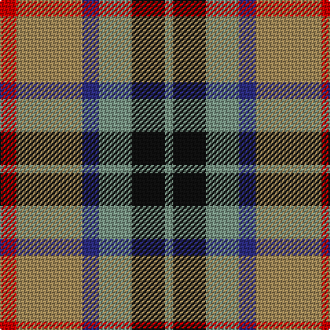

This page is one **sett** — a single exact thread-count. It belongs to the [tartan](/tartans/r2lo8db2y4k4y1/)
(the same proportion at any scale), whose colour order is pattern [GKGBYR](/stripes/gkgbyr/).

Sourced from register-of-tartans.  It is a [6 stripe tartan](/stripes/stripes6/).

Original link https://www.tartanregister.gov.uk/tartanDetails.aspx?ref=4109

2 attestations — the source records this cloth was collapsed from (oldest owns this page)

<ul>
<li>01/01/2002 — Thompson (J.C.'s Fancy) (Personal) (register-of-tartans, <a href="https://www.tartanregister.gov.uk/tartanDetails.aspx?ref=4109">record</a>)</li>
<li>pre 2002 — Thompson (J.C.'s Fancy) (Personal) (tartans-authority, <a href="http://www.tartansauthority.com/tartan-ferret/display/286/">record</a>)</li>
</ul>

## Register references

External register numbers recorded for this tartan.

- Scottish Register of Tartans: [4109](https://www.tartanregister.gov.uk/tartanDetails.aspx?ref=4109)
- Scottish Tartans Authority (ITI): 286
- Scottish Tartans World Register: 286

## Thread count
R/12 LT48 DB12 LG24 K24 LG/6

## Palette

Palette: <strong>Tartan Register</strong>
<table><thead><tr><th>Colour</th><th>Threads</th><th>Shade</th><th>Base</th><th>OKLCh</th></tr></thead><tbody><tr><td>R/</td><td style="text-align:right;font-variant-numeric:tabular-nums">12</td><td><code style="background-color:#C80000;">#C80000</code> <small style="color:#888">#C80000</small></td><td>R <code style="background-color:#CC0000;">#CC0000</code></td><td><small style="color:#888">oklch(52.3% 0.215 29.2)</small></td></tr><tr><td>LT</td><td style="text-align:right;font-variant-numeric:tabular-nums">48</td><td><code style="background-color:#A08858;">#A08858</code> <small style="color:#888">#A08858</small></td><td>Y <code style="background-color:#F2BF00;">#F2BF00</code></td><td><small style="color:#888">oklch(63.7% 0.071 84.0)</small></td></tr><tr><td>DB</td><td style="text-align:right;font-variant-numeric:tabular-nums">12</td><td><code style="background-color:#2C2C80;">#2C2C80</code> <small style="color:#888">#2C2C80</small></td><td>B <code style="background-color:#2A418A;">#2A418A</code></td><td><small style="color:#888">oklch(35.0% 0.138 276.6)</small></td></tr><tr><td>LG</td><td style="text-align:right;font-variant-numeric:tabular-nums">24</td><td><code style="background-color:#789484;">#789484</code> <small style="color:#888">#789484</small></td><td>G <code style="background-color:#006100;">#006100</code></td><td><small style="color:#888">oklch(64.0% 0.040 160.0)</small></td></tr><tr><td>K</td><td style="text-align:right;font-variant-numeric:tabular-nums">24</td><td><code style="background-color:#101010;">#101010</code> <small style="color:#888">#101010</small></td><td>K <code style="background-color:#000000;">#000000</code></td><td><small style="color:#888">oklch(17.3% 0.000 89.9)</small></td></tr><tr><td>LG/</td><td style="text-align:right;font-variant-numeric:tabular-nums">6</td><td><code style="background-color:#789484;">#789484</code> <small style="color:#888">#789484</small></td><td>G <code style="background-color:#006100;">#006100</code></td><td><small style="color:#888">oklch(64.0% 0.040 160.0)</small></td></tr></tbody></table>

# Sample pattern

## Nearest tartans

The nearest existing variants by ΔTartan distance, with this tartan at the top so the swatches line up against it.

ΔTartan

Tartan

Sett

—

<a href="/ttd/edit/#slug=r2lo8db2y4k4y1~x6">Thompson (J.C.'s Fancy) (Personal)</a> <a class="nn-out" href="/setts/s6/r2lo8db2y4k4y1~x6/" title="open its dictionary page">↗</a>

0.93

<a href="/ttd/edit/#slug=w6ri8g24ri8db6r8db8w3~x2">Utah Centennial</a> <a class="nn-out" href="/setts/s8/w6ri8g24ri8db6r8db8w3~x2/" title="open its dictionary page">↗</a>

1.00

<a href="/ttd/edit/#slug=r2dy8db2t4k4t1~x6">Thompson's Fancy Personal Tartan Tartan Number: 286. Earliest known date: pre 2003 Designed for his own use. See products available Copyright © Blair Urquhart, Comrie, 2015</a> <a class="nn-out" href="/setts/s6/r2dy8db2t4k4t1~x6/" title="open its dictionary page">↗</a>

1.04

<a href="/ttd/edit/#slug=r10db6g24dbi24r6ly3">Canine All Dogs (Fashion)</a> <a class="nn-out" href="/setts/s6/r10db6g24dbi24r6ly3/" title="open its dictionary page">↗</a>

1.05

<a href="/ttd/edit/#slug=o30r3dg14w10r3b30~x2">Cercle de Fermières Varennes</a> <a class="nn-out" href="/setts/s6/o30r3dg14w10r3b30~x2/" title="open its dictionary page">↗</a>

1.05

<a href="/ttd/edit/#slug=dy9o9y9r1t1~x4">Jardine #2</a> <a class="nn-out" href="/setts/s5/dy9o9y9r1t1~x4/" title="open its dictionary page">↗</a>

1.05

<a href="/ttd/edit/#slug=dy12k4w2o6r3~x2">Strathblane (Fashion)</a> <a class="nn-out" href="/setts/s5/dy12k4w2o6r3~x2/" title="open its dictionary page">↗</a>

1.07

<a href="/ttd/edit/#slug=o56k12o7k12o7g50db50ly10">Sikh</a> <a class="nn-out" href="/setts/s8/o56k12o7k12o7g50db50ly10/" title="open its dictionary page">↗</a>

1.09

<a href="/ttd/edit/#slug=o12k4w2y6r3~x2">Strathblane</a> <a class="nn-out" href="/setts/s5/o12k4w2y6r3~x2/" title="open its dictionary page">↗</a>

1.10

<a href="/ttd/edit/#slug=o6w2k4dy12k4w2o6r3~x2">Strathblane</a> <a class="nn-out" href="/setts/s8/o6w2k4dy12k4w2o6r3~x2/" title="open its dictionary page">↗</a>

1.14

<a href="/ttd/edit/#slug=r2o8db2t4k4t1~x6">Thom(p)son's, Fancy</a> <a class="nn-out" href="/setts/s6/r2o8db2t4k4t1~x6/" title="open its dictionary page">↗</a>

## Neighbour map

Every grey dot is one of 14359 variants placed by the first two principal components of the ΔTartan feature space (44% of its variance). Red is this tartan; blue dots are its nearest — click one to open its page.

<svg viewBox="0 0 640 380" role="img" style="max-width:100%;height:auto;border:1px solid #e0e0e0;border-radius:4px;display:block" xmlns="http://www.w3.org/2000/svg"><image href="/nn/cloud.v1.png" width="640" height="380"/><a href="/setts/s8/w6ri8g24ri8db6r8db8w3~x2/"><circle cx="107.2" cy="190.6" r="4" fill="#3465a4"><title>Utah Centennial</title></circle></a><a href="/setts/s6/r2dy8db2t4k4t1~x6/"><circle cx="163.1" cy="226.5" r="4" fill="#3465a4"><title>Thompson's Fancy Personal Tartan Tartan Number: 286. Earliest known date: pre 2003 Designed for his own use. See products available Copyright © Blair Urquhart, Comrie, 2015</title></circle></a><a href="/setts/s6/r10db6g24dbi24r6ly3/"><circle cx="141.9" cy="215.3" r="4" fill="#3465a4"><title>Canine All Dogs (Fashion)</title></circle></a><a href="/setts/s6/o30r3dg14w10r3b30~x2/"><circle cx="146.6" cy="195.3" r="4" fill="#3465a4"><title>Cercle de Fermières Varennes</title></circle></a><a href="/setts/s5/dy9o9y9r1t1~x4/"><circle cx="162.3" cy="222.4" r="4" fill="#3465a4"><title>Jardine #2</title></circle></a><a href="/setts/s5/dy12k4w2o6r3~x2/"><circle cx="173.0" cy="230.9" r="4" fill="#3465a4"><title>Strathblane (Fashion)</title></circle></a><a href="/setts/s8/o56k12o7k12o7g50db50ly10/"><circle cx="142.3" cy="189.6" r="4" fill="#3465a4"><title>Sikh</title></circle></a><a href="/setts/s5/o12k4w2y6r3~x2/"><circle cx="157.5" cy="222.7" r="4" fill="#3465a4"><title>Strathblane</title></circle></a><a href="/setts/s8/o6w2k4dy12k4w2o6r3~x2/"><circle cx="87.3" cy="207.3" r="4" fill="#3465a4"><title>Strathblane</title></circle></a><a href="/setts/s6/r2o8db2t4k4t1~x6/"><circle cx="135.0" cy="212.1" r="4" fill="#3465a4"><title>Thom(p)son's, Fancy</title></circle></a><circle cx="143.6" cy="213.0" r="5" fill="#c00000"/></svg>

ID: /setts/s6/r2lo8db2y4k4y1~x6/
