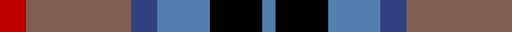
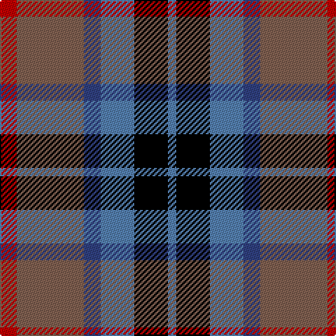

This page is one **sett** — a single exact thread-count. It belongs to the [tartan](/tartans/r2lt8b2ba4k4ba1/)
(the same proportion at any scale), whose colour order is pattern [BKBBRR](/stripes/bkbbrr/).

Sourced from weddslist.  It is a [6 stripe tartan](/stripes/stripes6/).

Original link http://www.weddslist.com/cgi-bin/tartans/pg.pl?source=sts

## Thread count
R/12 LT48 B12 Ba24 K24 Ba/6

## Palette
Each colour and the base-6 reference it is a variant of.

| Colour | Shade | Base |
|---|---|---|
| B | <code style="background-color:#304080;">#304080</code> `oklch(39.4% 0.109 270.2)` <small>#304080</small> | B <code style="background-color:#2A418A;">#2A418A</code> |
| Ba | <code style="background-color:#5480B0;">#5480B0</code> `oklch(58.8% 0.089 251.5)` <small>#5480B0</small> | B <code style="background-color:#2A418A;">#2A418A</code> |
| K | <code style="background-color:#000000;">#000000</code> `oklch(0.0% 0.000 0.0)` <small>#000000</small> | K <code style="background-color:#000000;">#000000</code> |
| LT | <code style="background-color:#806050;">#806050</code> `oklch(51.7% 0.049 47.8)` <small>#806050</small> | R <code style="background-color:#CC0000;">#CC0000</code> |
| R | <code style="background-color:#C00000;">#C00000</code> `oklch(50.7% 0.208 29.2)` <small>#C00000</small> | R <code style="background-color:#CC0000;">#CC0000</code> |

# Sample pattern

## Nearest tartans

The nearest existing variants by ΔTartan distance, with this tartan at the top so the swatches line up against it.

ΔTartan

Tartan

Sett

—

<a href="/ttd/edit/#slug=r2o8db2t4k4t1~x6">Thom(p)son's, Fancy</a> <a class="nn-out" href="/setts/s6/r2o8db2t4k4t1~x6/" title="open its dictionary page">↗</a>

0.80

<a href="/ttd/edit/#slug=m3k17n11m2o20w2~x2">Commonwealth Games Council (Corp.)</a> <a class="nn-out" href="/setts/s6/m3k17n11m2o20w2~x2/" title="open its dictionary page">↗</a>

0.86

<a href="/ttd/edit/#slug=db6g27db3k19dp27w3~x2">Gold Brothers</a> <a class="nn-out" href="/setts/s6/db6g27db3k19dp27w3~x2/" title="open its dictionary page">↗</a>

0.87

<a href="/ttd/edit/#slug=r10db6g24db24r6ly3">Canine All Dogs (Fashion)</a> <a class="nn-out" href="/setts/s6/r10db6g24db24r6ly3/" title="open its dictionary page">↗</a>

0.88

<a href="/ttd/edit/#slug=r1dy6db2lb4k4lb1~x6">Thompson's Fancy (Fashion)</a> <a class="nn-out" href="/setts/s6/r1dy6db2lb4k4lb1~x6/" title="open its dictionary page">↗</a>

0.90

<a href="/ttd/edit/#slug=k4t3g12p13ly2~x2">Wilson's, No 176</a> <a class="nn-out" href="/setts/s5/k4t3g12p13ly2~x2/" title="open its dictionary page">↗</a>

0.95

<a href="/ttd/edit/#slug=k4b21dy10y4k20r6b3~x2">Swankie (Personal)</a> <a class="nn-out" href="/setts/s7/k4b21dy10y4k20r6b3~x2/" title="open its dictionary page">↗</a>

0.97

<a href="/ttd/edit/#slug=dp9k7dg5r4dg7k1ly1~x2">MacLaren #2</a> <a class="nn-out" href="/setts/s7/dp9k7dg5r4dg7k1ly1~x2/" title="open its dictionary page">↗</a>

0.97

<a href="/ttd/edit/#slug=dg3db12w1dg12r12dg2~x2">Patterson, John (Personal)</a> <a class="nn-out" href="/setts/s6/dg3db12w1dg12r12dg2~x2/" title="open its dictionary page">↗</a>

0.99

<a href="/ttd/edit/#slug=ly5db24k8db18ly6dy3">Cala Homes (Corporate)</a> <a class="nn-out" href="/setts/s6/ly5db24k8db18ly6dy3/" title="open its dictionary page">↗</a>

0.99

<a href="/ttd/edit/#slug=r1o5k5db1k1db6ly1~x8">Lopez-Gasparotto</a> <a class="nn-out" href="/setts/s7/r1o5k5db1k1db6ly1~x8/" title="open its dictionary page">↗</a>

## Neighbour map

Every grey dot is one of 14299 variants placed by the first two principal components of the ΔTartan feature space (44% of its variance). Red is this tartan; blue dots are its nearest — click one to open its page.

<svg viewBox="0 0 640 380" role="img" style="max-width:100%;height:auto;border:1px solid #e0e0e0;border-radius:4px;display:block" xmlns="http://www.w3.org/2000/svg"><image href="/nn/cloud.v1.png" width="640" height="380"/><a href="/setts/s6/m3k17n11m2o20w2~x2/"><circle cx="160.2" cy="191.2" r="4" fill="#3465a4"><title>Commonwealth Games Council (Corp.)</title></circle></a><a href="/setts/s6/db6g27db3k19dp27w3~x2/"><circle cx="141.0" cy="206.8" r="4" fill="#3465a4"><title>Gold Brothers</title></circle></a><a href="/setts/s6/r10db6g24db24r6ly3/"><circle cx="142.2" cy="214.1" r="4" fill="#3465a4"><title>Canine All Dogs (Fashion)</title></circle></a><a href="/setts/s6/r1dy6db2lb4k4lb1~x6/"><circle cx="87.7" cy="218.9" r="4" fill="#3465a4"><title>Thompson's Fancy (Fashion)</title></circle></a><a href="/setts/s5/k4t3g12p13ly2~x2/"><circle cx="135.6" cy="215.8" r="4" fill="#3465a4"><title>Wilson's, No 176</title></circle></a><a href="/setts/s7/k4b21dy10y4k20r6b3~x2/"><circle cx="147.4" cy="213.4" r="4" fill="#3465a4"><title>Swankie (Personal)</title></circle></a><a href="/setts/s7/dp9k7dg5r4dg7k1ly1~x2/"><circle cx="143.7" cy="220.9" r="4" fill="#3465a4"><title>MacLaren #2</title></circle></a><a href="/setts/s6/dg3db12w1dg12r12dg2~x2/"><circle cx="163.3" cy="195.6" r="4" fill="#3465a4"><title>Patterson, John (Personal)</title></circle></a><a href="/setts/s6/ly5db24k8db18ly6dy3/"><circle cx="142.8" cy="211.7" r="4" fill="#3465a4"><title>Cala Homes (Corporate)</title></circle></a><a href="/setts/s7/r1o5k5db1k1db6ly1~x8/"><circle cx="132.1" cy="209.5" r="4" fill="#3465a4"><title>Lopez-Gasparotto</title></circle></a><circle cx="135.4" cy="210.8" r="5" fill="#c00000"/></svg>

ID: /setts/s6/r2o8db2t4k4t1~x6/
