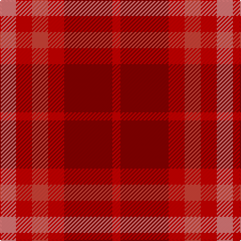

**Bands:** [RRRRRR](/stripes/rrrrrr/) · **Stripes:** [R R R R R R](/stripes/stripes6/) R R R R R R

This was sourced from tartans-authority.  It is a [6 band tartan](/bands/bands6/).

Original link http://www.tartansauthority.com/tartan-ferret/display/4238/

## Variants

Other setts woven to the same stripe pattern.

- [Samye Sangha #2](/setts/s6/r32r3r3r2r3r23~x2/)

## Thread count
LR/16 Ra16 R16 Ra16 DR48 Ra/8

## Palette
Each colour and its ΔE from the base-6 reference it is a variant of.

| Colour | Shade | Base | ΔE (OKLab) |
|---|---|---|---|
| DR | <code style="background-color:#880000;">#880000</code> `#880000` | R <code style="background-color:#CC0000;">#CC0000</code> | 0.15 |
| LR | <code style="background-color:#E87878;">#E87878</code> `#E87878` | R <code style="background-color:#CC0000;">#CC0000</code> | 0.19 |
| R | <code style="background-color:#CC4438;">#CC4438</code> `#CC4438` | R <code style="background-color:#CC0000;">#CC0000</code> | 0.06 |
| Ra | <code style="background-color:#C80000;">#C80000</code> `#C80000` | R <code style="background-color:#CC0000;">#CC0000</code> | 0.01 |

# Sample pattern

## Nearest tartans

The nearest existing variants by ΔTartan distance.

1. [Tune Hotels](/setts/s9/r3r18r6r15r4r3r4r7w2~x2/) — ΔT 1.75
1. [Tune Hotels Corporate Tartan Tartan Number: 10742. Earliest known date: 04/09/2012 The Tune Hotels tartan was commissioned in 2012 to celebrate the launch of the first Tune Hotel in Scotland. Founded by prominent Malaysian entrepreneur, Tony Fernandes, Tune Hotels is a value hotel brand providing high quality, affordably priced accommodation. With hotels located across Southeast Asia and the United Kingdom and new hotels opening in areas such as Australia, China and India, this initial Scottish addition marks an important new stage in the company’s growth. As the first Scottish Tune Hotel will be based in Edinburgh, the City of Edinburgh Tartan presented itself as a great starting point and base sett for the new design. A simple but bold colour palette of tonal reds and white not only creates a striking appearance but also reflects the clean and contemporary feel of the brand’s identity. See products available Copyright © Blair Urquhart, Comrie, 2015](/setts/s9/r3r18r6r15r4r3r4r7k2~x2/) — ΔT 1.89
1. [Grelloch (Fashion)](/setts/s6/r2k1r12r12t1m2~x4/) — ΔT 2.21
1. [Grelloch](/setts/s10/r2k1r12r12t1m2~x4/) — ΔT 2.34
1. [Hamilton, Red](/setts/s8/r32lo4r32o23r4o23r4o23~x2/) — ΔT 2.39
1. [Blairgowrie Berries and Cherries](/setts/s5/dr1r3r1g1dp1~x8/) — ΔT 2.42
1. [Kinloch Anderson Rowanberry](/setts/s14/ly7r30r4r8dr4r12r6r12m28dr4m8dr8m8dr4/) — ΔT 2.44
1. [Unidentified, Sett](/setts/s9/lr2o1r10o12o10lr6r10o1lr2~x2/) — ΔT 2.49
1. [Kreutz, Arthur (Personal)](/setts/s12/r8r8r8lo3t1dg1r8r8r9lo3t1dg1~x2/) — ΔT 2.61
1. [Earle's Flame (Fashion)](/setts/s8/do10y24r3y3r24dg3y6do6~x2/) — ΔT 2.61

## Neighbour map

Every grey dot is one of 14299 variants placed by the first two principal components of the ΔTartan feature space (44% of its variance). Red is this tartan; blue dots are its nearest — click one to open its page.

<svg viewBox="0 0 640 380" role="img" style="max-width:100%;height:auto;border:1px solid #e0e0e0;border-radius:4px;display:block" xmlns="http://www.w3.org/2000/svg"><image href="/nn/cloud.v1.png" width="640" height="380"/><a href="/setts/s9/r3r18r6r15r4r3r4r7w2~x2/"><circle cx="348.7" cy="222.2" r="4" fill="#3465a4"><title>Tune Hotels</title></circle></a><a href="/setts/s9/r3r18r6r15r4r3r4r7k2~x2/"><circle cx="340.7" cy="219.5" r="4" fill="#3465a4"><title>Tune Hotels Corporate Tartan Tartan Number: 10742. Earliest known date: 04/09/2012 The Tune Hotels tartan was commissioned in 2012 to celebrate the launch of the first Tune Hotel in Scotland. Founded by prominent Malaysian entrepreneur, Tony Fernandes, Tune Hotels is a value hotel brand providing high quality, affordably priced accommodation. With hotels located across Southeast Asia and the United Kingdom and new hotels opening in areas such as Australia, China and India, this initial Scottish addition marks an important new stage in the company’s growth. As the first Scottish Tune Hotel will be based in Edinburgh, the City of Edinburgh Tartan presented itself as a great starting point and base sett for the new design. A simple but bold colour palette of tonal reds and white not only creates a striking appearance but also reflects the clean and contemporary feel of the brand’s identity. See products available Copyright © Blair Urquhart, Comrie, 2015</title></circle></a><a href="/setts/s6/r2k1r12r12t1m2~x4/"><circle cx="409.7" cy="226.8" r="4" fill="#3465a4"><title>Grelloch (Fashion)</title></circle></a><a href="/setts/s10/r2k1r12r12t1m2~x4/"><circle cx="394.5" cy="206.5" r="4" fill="#3465a4"><title>Grelloch</title></circle></a><a href="/setts/s8/r32lo4r32o23r4o23r4o23~x2/"><circle cx="439.9" cy="297.2" r="4" fill="#3465a4"><title>Hamilton, Red</title></circle></a><a href="/setts/s5/dr1r3r1g1dp1~x8/"><circle cx="227.9" cy="309.1" r="4" fill="#3465a4"><title>Blairgowrie Berries and Cherries</title></circle></a><a href="/setts/s14/ly7r30r4r8dr4r12r6r12m28dr4m8dr8m8dr4/"><circle cx="227.2" cy="196.7" r="4" fill="#3465a4"><title>Kinloch Anderson Rowanberry</title></circle></a><a href="/setts/s9/lr2o1r10o12o10lr6r10o1lr2~x2/"><circle cx="260.7" cy="220.0" r="4" fill="#3465a4"><title>Unidentified, Sett</title></circle></a><a href="/setts/s12/r8r8r8lo3t1dg1r8r8r9lo3t1dg1~x2/"><circle cx="194.6" cy="195.1" r="4" fill="#3465a4"><title>Kreutz, Arthur (Personal)</title></circle></a><a href="/setts/s8/do10y24r3y3r24dg3y6do6~x2/"><circle cx="341.6" cy="261.5" r="4" fill="#3465a4"><title>Earle's Flame (Fashion)</title></circle></a><circle cx="302.8" cy="280.4" r="5" fill="#c00000"/></svg>

ID: /setts/s6/r2r2r2r2r6r1~x8/
