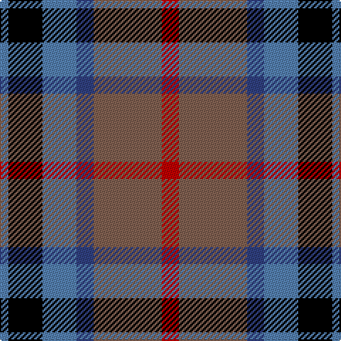

In pattern [BKBBRR](/patterns/bkbbrr/).

This was sourced from weddslist.  It is a [6 stripes tartan](/stripes/stripes6/).

Original link http://www.weddslist.com/cgi-bin/tartans/pg.pl?source=sts

## Thread count
Ba/6 K24 Ba24 B12 LT48 R/12

## Palette
Each colour and its ΔE from the base-6 reference it is a variant of.

| Colour | Shade | Base | ΔE (OKLab) |
|---|---|---|---|
| B | <code style="background-color:#304080;">#304080</code> `#304080` | B <code style="background-color:#2A418A;">#2A418A</code> | 0.02 |
| Ba | <code style="background-color:#5480B0;">#5480B0</code> `#5480B0` | B <code style="background-color:#2A418A;">#2A418A</code> | 0.19 |
| K | <code style="background-color:#000000;">#000000</code> `#000000` | K <code style="background-color:#000000;">#000000</code> | 0.00 |
| LT | <code style="background-color:#806050;">#806050</code> `#806050` | R <code style="background-color:#CC0000;">#CC0000</code> | 0.17 |
| R | <code style="background-color:#C00000;">#C00000</code> `#C00000` | R <code style="background-color:#CC0000;">#CC0000</code> | 0.03 |

# Sample pattern

## Nearest tartans

The nearest existing variants by ΔTartan distance.

1. [Commonwealth Games Council (Corp.)](/setts/s6/r3k17b11r2ra20w2~b484848-k101010-rb468ac-ra888888-we0e0e0~x2/) — ΔT 0.80
1. [Dunbog, Primary School](/setts/s6/r12b3g5ba16y2g2~b304080-ba000050-g008000-rc00000-yf0c000~x2/) — ΔT 0.86
1. [Gold Brothers](/setts/s6/b6g27b3k19ba27w3~b2c2c80-ba780078-g006818-k101010-wf8f8f8~x2/) — ΔT 0.86
1. [Canine All Dogs (Fashion)](/setts/s6/r10b6g24ba24r6y3~b2c2c80-ba1c1c50-g006818-rc80000-ye8c000/) — ΔT 0.87
1. [Dunbog Primary School Corporate Tartan Tartan Number: 954. Earliest known date: 1985 C. Armstrong is a pupil at the school. See products available Copyright © Blair Urquhart, Comrie, 2015](/setts/s6/r12b3g5ba16y2g2~b2c2c80-ba202060-g006818-rc80000-ye8c000~x2/) — ΔT 0.88
1. [Thompson's Fancy (Fashion)](/setts/s6/r1g6b2w4k4w1~b1c0070-g604000-k101010-r880000-w98c8e8~x6/) — ΔT 0.88
1. [Wilson's, No 176](/setts/s5/k4b3g12ba13y2~b5480b0-ba800080-g008000-k000000-yf0c000~x2/) — ΔT 0.90
1. [Swankie (Personal)](/setts/s7/k4b21g10ga4k20r6b3~b1474b4-g604000-ga8c7038-k101010-rc80000~x2/) — ΔT 0.95
1. [MacLaren #2](/setts/s7/b9k7g5r4g7k1y1~b5a008c-g005020-k101010-rc80028-ye8c000~x2/) — ΔT 0.97
1. [Patterson, John (Personal)](/setts/s6/g3b12w1ga12r12ga2~b2c4084-g005020-ga002814-rdc0000-we0e0e0~x2/) — ΔT 0.97

## Neighbour map

Every grey dot is one of 15726 variants placed by the first two principal components of the ΔTartan feature space (44% of its variance). Red is this tartan; blue dots are its nearest — click one to open its page.

<svg viewBox="0 0 640 380" role="img" style="max-width:100%;height:auto;border:1px solid #e0e0e0;border-radius:4px;display:block" xmlns="http://www.w3.org/2000/svg"><image href="/nn/cloud.v1.png" width="640" height="380"/><a href="/setts/s6/r3k17b11r2ra20w2~b484848-k101010-rb468ac-ra888888-we0e0e0~x2/"><circle cx="157.4" cy="190.0" r="4" fill="#3465a4"><title>Commonwealth Games Council (Corp.)</title></circle></a><a href="/setts/s6/r12b3g5ba16y2g2~b304080-ba000050-g008000-rc00000-yf0c000~x2/"><circle cx="157.2" cy="194.1" r="4" fill="#3465a4"><title>Dunbog, Primary School</title></circle></a><a href="/setts/s6/b6g27b3k19ba27w3~b2c2c80-ba780078-g006818-k101010-wf8f8f8~x2/"><circle cx="137.9" cy="204.2" r="4" fill="#3465a4"><title>Gold Brothers</title></circle></a><a href="/setts/s6/r10b6g24ba24r6y3~b2c2c80-ba1c1c50-g006818-rc80000-ye8c000/"><circle cx="139.5" cy="211.7" r="4" fill="#3465a4"><title>Canine All Dogs (Fashion)</title></circle></a><a href="/setts/s6/r12b3g5ba16y2g2~b2c2c80-ba202060-g006818-rc80000-ye8c000~x2/"><circle cx="178.3" cy="198.5" r="4" fill="#3465a4"><title>Dunbog Primary School Corporate Tartan Tartan Number: 954. Earliest known date: 1985 C. Armstrong is a pupil at the school. See products available Copyright © Blair Urquhart, Comrie, 2015</title></circle></a><a href="/setts/s6/r1g6b2w4k4w1~b1c0070-g604000-k101010-r880000-w98c8e8~x6/"><circle cx="84.6" cy="219.2" r="4" fill="#3465a4"><title>Thompson's Fancy (Fashion)</title></circle></a><a href="/setts/s5/k4b3g12ba13y2~b5480b0-ba800080-g008000-k000000-yf0c000~x2/"><circle cx="132.8" cy="217.2" r="4" fill="#3465a4"><title>Wilson's, No 176</title></circle></a><a href="/setts/s7/k4b21g10ga4k20r6b3~b1474b4-g604000-ga8c7038-k101010-rc80000~x2/"><circle cx="144.3" cy="210.4" r="4" fill="#3465a4"><title>Swankie (Personal)</title></circle></a><a href="/setts/s7/b9k7g5r4g7k1y1~b5a008c-g005020-k101010-rc80028-ye8c000~x2/"><circle cx="141.0" cy="217.6" r="4" fill="#3465a4"><title>MacLaren #2</title></circle></a><a href="/setts/s6/g3b12w1ga12r12ga2~b2c4084-g005020-ga002814-rdc0000-we0e0e0~x2/"><circle cx="161.0" cy="194.0" r="4" fill="#3465a4"><title>Patterson, John (Personal)</title></circle></a><circle cx="132.8" cy="210.0" r="5" fill="#c00000"/></svg>

ID: /setts/s6/r2ra8b2ba4k4ba1~b304080-ba5480b0-k000000-rc00000-ra806050~x6/
