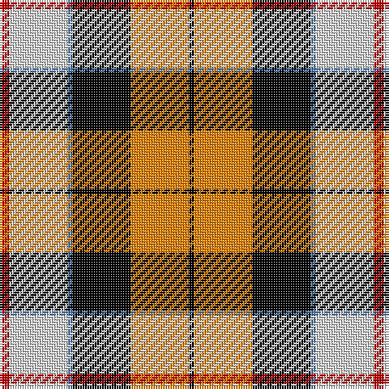

This page is one **sett** — a single exact thread-count. It belongs to the [tartan](/tartans/r2ln12b1k12o12k1/)
(the same proportion at any scale), whose colour order is pattern [KYKBWR](/stripes/kykbwr/).

Sourced from weddslist.  It is a [6 stripe tartan](/stripes/stripes6/).

Original link http://www.weddslist.com/cgi-bin/tartans/pg.pl?source=sts

## Also known as

This cloth is also recorded under:

- Dutch, dress

2 attestations — the source records this cloth was collapsed from (oldest owns this page)

<ul>
<li>undated — Dutch, dress (weddslist, <a href="http://www.weddslist.com/cgi-bin/tartans/pg.pl?source=sts">record</a>)</li>
<li>undated — Dutch Dress District Tartan Tartan Number: 1133. Earliest known date: 1965 The late Sir Iain Moncrieffe of that Ilk, Albany Herald said, "It should be based on Mackay tartan because of the association with the Chiefs of the Clan Mackay. Baron Aeneas Mackay was Prime Minister of the Netherlands in 1889 and his great grandson Lord Reay, the present Chief, is also a Dutch Baron." The sett chosen was John Cargill's proposal of a simple colour change in respect of the two tartans, Dutch and Dutch Dress. See products available Copyright © Blair Urquhart, Comrie, 2015 (house-of-tartan, <a href="http://www.house-of-tartan.scotland.net/house/TartanViewjs.asp?colr=Def&tnam=1133">record</a>)</li>
</ul>

## Thread count
R/4 LN24 B2 K24 O24 K/2

## Palette
Each colour and the base-6 reference it is a variant of.

| Colour | Shade | Base |
|---|---|---|
| B | <code style="background-color:#5480B0;">#5480B0</code> `oklch(58.8% 0.089 251.5)` <small>#5480B0</small> | B <code style="background-color:#2A418A;">#2A418A</code> |
| K | <code style="background-color:#000000;">#000000</code> `oklch(0.0% 0.000 0.0)` <small>#000000</small> | K <code style="background-color:#000000;">#000000</code> |
| LN | <code style="background-color:#E0E0E0;">#E0E0E0</code> `oklch(90.7% 0.000 89.9)` <small>#E0E0E0</small> | W <code style="background-color:#F7F7F7;">#F7F7F7</code> |
| O | <code style="background-color:#FF8500;">#FF8500</code> `oklch(74.0% 0.183 55.1)` <small>#FF8500</small> | Y <code style="background-color:#F2BF00;">#F2BF00</code> |
| R | <code style="background-color:#C00000;">#C00000</code> `oklch(50.7% 0.208 29.2)` <small>#C00000</small> | R <code style="background-color:#CC0000;">#CC0000</code> |

# Sample pattern

## Nearest tartans

The nearest existing variants by ΔTartan distance, with this tartan at the top so the swatches line up against it.

ΔTartan

Tartan

Sett

—

<a href="/ttd/edit/#slug=r2w12t1k12lo12k1~x2">Dutch, dress</a> <a class="nn-out" href="/setts/s6/r2w12t1k12lo12k1~x2/" title="open its dictionary page">↗</a>

0.56

<a href="/ttd/edit/#slug=r2w12y1k12o12k1~x2">Dutch Dress</a> <a class="nn-out" href="/setts/s6/r2w12y1k12o12k1~x2/" title="open its dictionary page">↗</a>

0.73

<a href="/ttd/edit/#slug=dg20r3y3r15w19dg3t2~x2">Glasgow</a> <a class="nn-out" href="/setts/s7/dg20r3y3r15w19dg3t2~x2/" title="open its dictionary page">↗</a>

1.00

<a href="/ttd/edit/#slug=r36w3lo4g24w24k3lo6~x2">MacLachlan Dress</a> <a class="nn-out" href="/setts/s7/r36w3lo4g24w24k3lo6~x2/" title="open its dictionary page">↗</a>

1.19

<a href="/ttd/edit/#slug=dg2do8dg8r3do1w12dg2y1~x2">National Trust Corporate Tartan Tartan Number: 2117. Earliest known date: pre 1991 Sent in by Tweedmill for information. See products available Copyright © Blair Urquhart, Comrie, 2015</a> <a class="nn-out" href="/setts/s8/dg2do8dg8r3do1w12dg2y1~x2/" title="open its dictionary page">↗</a>

1.21

<a href="/ttd/edit/#slug=k3r3lo2r20k16lb24w2~x2">Oor Wullie Corporate Tartan Tartan Number: 10356. Earliest known date: August 2010 Oor Wullie's tartan is based on the Black Watch which was his Uncle Wattie's regiment and in this new design the red is from the hackle on their famous bonnets. The silver grey is for Wullie's iconic bucket and for his faithful pet, Jeemie the moose. The black is for his mentor PC Murdoch and for Wullie's dungarees, the yellow is for his tousled gold locks that never see a comb. The three lines on the yellow are for his best pals Fat Bob, Soapy Soutar and Wee Eck. The black and white are for the newsprint of The Sunday Post in which Wullie and his pals have lived for 75 years. See products available Copyright © Blair Urquhart, Comrie, 2015</a> <a class="nn-out" href="/setts/s7/k3r3lo2r20k16lb24w2~x2/" title="open its dictionary page">↗</a>

1.23

<a href="/ttd/edit/#slug=r24w2ly3dg16k16w2ly3~x2">MacLachlan #4</a> <a class="nn-out" href="/setts/s7/r24w2ly3dg16k16w2ly3~x2/" title="open its dictionary page">↗</a>

1.26

<a href="/ttd/edit/#slug=w2k11ly11db3k1r1~x2">Cornish National #2</a> <a class="nn-out" href="/setts/s6/w2k11ly11db3k1r1~x2/" title="open its dictionary page">↗</a>

1.27

<a href="/ttd/edit/#slug=ly3r3ly2r20k16lb24w2~x2">Oor Wullie (Corporate)</a> <a class="nn-out" href="/setts/s7/ly3r3ly2r20k16lb24w2~x2/" title="open its dictionary page">↗</a>

1.28

<a href="/ttd/edit/#slug=r32db6k6g6w18k3">Rose, White dress</a> <a class="nn-out" href="/setts/s6/r32db6k6g6w18k3/" title="open its dictionary page">↗</a>

1.28

<a href="/ttd/edit/#slug=r24w2ly3g16k16w2ly3~x2">MacLachlan Old Clan Tartan Tartan Number: 1710. Earliest known date: 1790 It is the oldest MacLachlan tartan actually bearing the name. The sett has been refered to as Old MacLachlan, MacLachlan and Hunting MacLachlan. Although the sett did not appear in books until D.W. Stewart's Old &amp; Rare Scottish Tartans of 1893, there are samples of it in the collections of Campbell of Craignish in 1790 and in the Highland Society of London (circa 1816). See products available Copyright © Blair Urquhart, Comrie, 2015</a> <a class="nn-out" href="/setts/s7/r24w2ly3g16k16w2ly3~x2/" title="open its dictionary page">↗</a>

## Neighbour map

Every grey dot is one of 14299 variants placed by the first two principal components of the ΔTartan feature space (44% of its variance). Red is this tartan; blue dots are its nearest — click one to open its page.

<svg viewBox="0 0 640 380" role="img" style="max-width:100%;height:auto;border:1px solid #e0e0e0;border-radius:4px;display:block" xmlns="http://www.w3.org/2000/svg"><image href="/nn/cloud.v1.png" width="640" height="380"/><a href="/setts/s6/r2w12y1k12o12k1~x2/"><circle cx="132.4" cy="162.1" r="4" fill="#3465a4"><title>Dutch Dress</title></circle></a><a href="/setts/s7/dg20r3y3r15w19dg3t2~x2/"><circle cx="134.8" cy="157.9" r="4" fill="#3465a4"><title>Glasgow</title></circle></a><a href="/setts/s7/r36w3lo4g24w24k3lo6~x2/"><circle cx="140.3" cy="146.4" r="4" fill="#3465a4"><title>MacLachlan Dress</title></circle></a><a href="/setts/s8/dg2do8dg8r3do1w12dg2y1~x2/"><circle cx="123.0" cy="151.9" r="4" fill="#3465a4"><title>National Trust Corporate Tartan Tartan Number: 2117. Earliest known date: pre 1991 Sent in by Tweedmill for information. See products available Copyright © Blair Urquhart, Comrie, 2015</title></circle></a><a href="/setts/s7/k3r3lo2r20k16lb24w2~x2/"><circle cx="128.2" cy="128.7" r="4" fill="#3465a4"><title>Oor Wullie Corporate Tartan Tartan Number: 10356. Earliest known date: August 2010 Oor Wullie's tartan is based on the Black Watch which was his Uncle Wattie's regiment and in this new design the red is from the hackle on their famous bonnets. The silver grey is for Wullie's iconic bucket and for his faithful pet, Jeemie the moose. The black is for his mentor PC Murdoch and for Wullie's dungarees, the yellow is for his tousled gold locks that never see a comb. The three lines on the yellow are for his best pals Fat Bob, Soapy Soutar and Wee Eck. The black and white are for the newsprint of The Sunday Post in which Wullie and his pals have lived for 75 years. See products available Copyright © Blair Urquhart, Comrie, 2015</title></circle></a><a href="/setts/s7/r24w2ly3dg16k16w2ly3~x2/"><circle cx="154.2" cy="152.5" r="4" fill="#3465a4"><title>MacLachlan #4</title></circle></a><a href="/setts/s6/w2k11ly11db3k1r1~x2/"><circle cx="174.5" cy="158.9" r="4" fill="#3465a4"><title>Cornish National #2</title></circle></a><a href="/setts/s7/ly3r3ly2r20k16lb24w2~x2/"><circle cx="129.5" cy="127.7" r="4" fill="#3465a4"><title>Oor Wullie (Corporate)</title></circle></a><a href="/setts/s6/r32db6k6g6w18k3/"><circle cx="180.3" cy="154.9" r="4" fill="#3465a4"><title>Rose, White dress</title></circle></a><a href="/setts/s7/r24w2ly3g16k16w2ly3~x2/"><circle cx="155.1" cy="154.7" r="4" fill="#3465a4"><title>MacLachlan Old Clan Tartan Tartan Number: 1710. Earliest known date: 1790 It is the oldest MacLachlan tartan actually bearing the name. The sett has been refered to as Old MacLachlan, MacLachlan and Hunting MacLachlan. Although the sett did not appear in books until D.W. Stewart's Old &amp; Rare Scottish Tartans of 1893, there are samples of it in the collections of Campbell of Craignish in 1790 and in the Highland Society of London (circa 1816). See products available Copyright © Blair Urquhart, Comrie, 2015</title></circle></a><circle cx="121.0" cy="154.0" r="5" fill="#c00000"/></svg>

ID: /setts/s6/r2w12t1k12lo12k1~x2/
