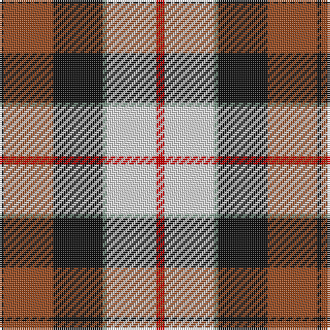

**Bands:** [KRKGWR](/stripes/krkgwr/) · **Stripes:** [K O K Y W R](/stripes/stripes6/) K O K Y W R

This was sourced from register-of-tartans.  It is a [6 band tartan](/bands/bands6/).

Original link https://www.tartanregister.gov.uk/tartanDetails.aspx?ref=1055

## Attestations

This cloth appears in 2 source records; the oldest owns this page.

- 01/01/1965 — Dutch Dress (register-of-tartans, [record](https://www.tartanregister.gov.uk/tartanDetails.aspx?ref=1055))
- 1965 — Dutch Dress (District) (tartans-authority, [record](http://www.tartansauthority.com/tartan-ferret/display/1133/))

## Register references

External register numbers recorded for this tartan.

- Scottish Register of Tartans: [1055](https://www.tartanregister.gov.uk/tartanDetails.aspx?ref=1055)
- Scottish Tartans Authority (ITI): 1133
- Scottish Tartans World Register: 1133

## Thread count
R/4 LN24 LG2 K24 T24 K/2

## Palette
Each colour and its ΔE from the base-6 reference it is a variant of.

| Colour | Shade | Base | ΔE (OKLab) |
|---|---|---|---|
| K | <code style="background-color:#101010;">#101010</code> `#101010` | K <code style="background-color:#000000;">#000000</code> | 0.17 |
| LG | <code style="background-color:#789484;">#789484</code> `#789484` | G <code style="background-color:#006100;">#006100</code> | 0.24 |
| LN | <code style="background-color:#E0E0E0;">#E0E0E0</code> `#E0E0E0` | W <code style="background-color:#F7F7F7;">#F7F7F7</code> | 0.07 |
| R | <code style="background-color:#C80000;">#C80000</code> `#C80000` | R <code style="background-color:#CC0000;">#CC0000</code> | 0.01 |
| T | <code style="background-color:#98481C;">#98481C</code> `#98481C` | R <code style="background-color:#CC0000;">#CC0000</code> | 0.11 |

# Sample pattern

## Nearest tartans

The nearest existing variants by ΔTartan distance.

1. [Dutch, dress](/setts/s6/r2w12t1k12lo12k1~x2/) — ΔT 0.56
1. [Glasgow](/setts/s7/dg20r3y3r15w19dg3t2~x2/) — ΔT 0.57
1. [National Trust Corporate Tartan Tartan Number: 2117. Earliest known date: pre 1991 Sent in by Tweedmill for information. See products available Copyright © Blair Urquhart, Comrie, 2015](/setts/s8/dg2do8dg8r3do1w12dg2y1~x2/) — ΔT 0.91
1. [MacLachlan Dress](/setts/s7/r36w3lo4g24w24k3lo6~x2/) — ΔT 1.04
1. [Pengelly, The Cornish (Name)](/setts/s7/lb5k26ly4lb24dp8k3r4~x2/) — ΔT 1.07
1. [Tombow 140th Anniversary, The](/setts/s7/g4ly7o9ly9db20w2db2~x2/) — ΔT 1.08
1. [Unidentified #27](/setts/s9/r5db1r5g13db8t5r5w1db3~x2/) — ΔT 1.14
1. [Thomson Dress (Grey) (Fashion)](/setts/s6/r4o25k6w12k11ly3~x2/) — ΔT 1.14
1. [MacLachlan #4](/setts/s7/r24w2ly3dg16k16w2ly3~x2/) — ΔT 1.18
1. [Oor Wullie Corporate Tartan Tartan Number: 10356. Earliest known date: August 2010 Oor Wullie's tartan is based on the Black Watch which was his Uncle Wattie's regiment and in this new design the red is from the hackle on their famous bonnets. The silver grey is for Wullie's iconic bucket and for his faithful pet, Jeemie the moose. The black is for his mentor PC Murdoch and for Wullie's dungarees, the yellow is for his tousled gold locks that never see a comb. The three lines on the yellow are for his best pals Fat Bob, Soapy Soutar and Wee Eck. The black and white are for the newsprint of The Sunday Post in which Wullie and his pals have lived for 75 years. See products available Copyright © Blair Urquhart, Comrie, 2015](/setts/s7/k3r3lo2r20k16lb24w2~x2/) — ΔT 1.18

## Neighbour map

Every grey dot is one of 14299 variants placed by the first two principal components of the ΔTartan feature space (44% of its variance). Red is this tartan; blue dots are its nearest — click one to open its page.

<svg viewBox="0 0 640 380" role="img" style="max-width:100%;height:auto;border:1px solid #e0e0e0;border-radius:4px;display:block" xmlns="http://www.w3.org/2000/svg"><image href="/nn/cloud.v1.png" width="640" height="380"/><a href="/setts/s6/r2w12t1k12lo12k1~x2/"><circle cx="121.0" cy="154.0" r="4" fill="#3465a4"><title>Dutch, dress</title></circle></a><a href="/setts/s7/dg20r3y3r15w19dg3t2~x2/"><circle cx="134.8" cy="157.9" r="4" fill="#3465a4"><title>Glasgow</title></circle></a><a href="/setts/s8/dg2do8dg8r3do1w12dg2y1~x2/"><circle cx="123.0" cy="151.9" r="4" fill="#3465a4"><title>National Trust Corporate Tartan Tartan Number: 2117. Earliest known date: pre 1991 Sent in by Tweedmill for information. See products available Copyright © Blair Urquhart, Comrie, 2015</title></circle></a><a href="/setts/s7/r36w3lo4g24w24k3lo6~x2/"><circle cx="140.3" cy="146.4" r="4" fill="#3465a4"><title>MacLachlan Dress</title></circle></a><a href="/setts/s7/lb5k26ly4lb24dp8k3r4~x2/"><circle cx="152.6" cy="162.2" r="4" fill="#3465a4"><title>Pengelly, The Cornish (Name)</title></circle></a><a href="/setts/s7/g4ly7o9ly9db20w2db2~x2/"><circle cx="156.1" cy="170.7" r="4" fill="#3465a4"><title>Tombow 140th Anniversary, The</title></circle></a><a href="/setts/s9/r5db1r5g13db8t5r5w1db3~x2/"><circle cx="119.9" cy="162.7" r="4" fill="#3465a4"><title>Unidentified #27</title></circle></a><a href="/setts/s6/r4o25k6w12k11ly3~x2/"><circle cx="141.3" cy="185.0" r="4" fill="#3465a4"><title>Thomson Dress (Grey) (Fashion)</title></circle></a><a href="/setts/s7/r24w2ly3dg16k16w2ly3~x2/"><circle cx="154.2" cy="152.5" r="4" fill="#3465a4"><title>MacLachlan #4</title></circle></a><a href="/setts/s7/k3r3lo2r20k16lb24w2~x2/"><circle cx="128.2" cy="128.7" r="4" fill="#3465a4"><title>Oor Wullie Corporate Tartan Tartan Number: 10356. Earliest known date: August 2010 Oor Wullie's tartan is based on the Black Watch which was his Uncle Wattie's regiment and in this new design the red is from the hackle on their famous bonnets. The silver grey is for Wullie's iconic bucket and for his faithful pet, Jeemie the moose. The black is for his mentor PC Murdoch and for Wullie's dungarees, the yellow is for his tousled gold locks that never see a comb. The three lines on the yellow are for his best pals Fat Bob, Soapy Soutar and Wee Eck. The black and white are for the newsprint of The Sunday Post in which Wullie and his pals have lived for 75 years. See products available Copyright © Blair Urquhart, Comrie, 2015</title></circle></a><circle cx="132.4" cy="162.1" r="5" fill="#c00000"/></svg>

ID: /setts/s6/r2w12y1k12o12k1~x2/
