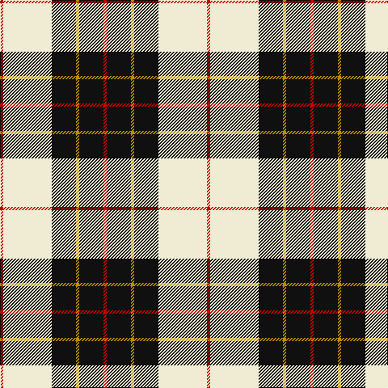

This page is one **sett** — a single exact thread-count. It belongs to the [tartan](/tartans/r2w30k15lo2k15r2/)
(the same proportion at any scale), whose colour order is pattern [RKYKWR](/stripes/rkykwr/).

Sourced from register-of-tartans.  It is a [6 stripe tartan](/stripes/stripes6/).

Original link https://www.tartanregister.gov.uk/tartanDetails.aspx?ref=5292

## Register references

External register numbers recorded for this tartan.

- Scottish Register of Tartans: [5292](https://www.tartanregister.gov.uk/tartanDetails.aspx?ref=5292)
- Scottish Tartans Authority (ITI): 3732

## Thread count
R/4 LY60 K30 DY4 K30 R/4

## Palette

Palette: <strong>Tartan Register</strong> <small style="color:#888">(3 of 4 colours)</small>
<table><thead><tr><th>Colour</th><th>Threads</th><th>Shade</th><th>Base</th><th>OKLCh</th></tr></thead><tbody><tr><td>R/</td><td style="text-align:right;font-variant-numeric:tabular-nums">4</td><td><code style="background-color:#C80000;">#C80000</code> <small style="color:#888">#C80000</small></td><td>R <code style="background-color:#CC0000;">#CC0000</code></td><td><small style="color:#888">oklch(52.3% 0.215 29.2)</small></td></tr><tr><td>LY</td><td style="text-align:right;font-variant-numeric:tabular-nums">60</td><td><code style="background-color:#F0ECD4;">#F0ECD4</code> <small style="color:#888">#F0ECD4</small></td><td>W <code style="background-color:#F7F7F7;">#F7F7F7</code></td><td><small style="color:#888">oklch(94.0% 0.032 99.2)</small></td></tr><tr><td>K</td><td style="text-align:right;font-variant-numeric:tabular-nums">30</td><td><code style="background-color:#101010;">#101010</code> <small style="color:#888">#101010</small></td><td>K <code style="background-color:#000000;">#000000</code></td><td><small style="color:#888">oklch(17.3% 0.000 89.9)</small></td></tr><tr><td>DY</td><td style="text-align:right;font-variant-numeric:tabular-nums">4</td><td><code style="background-color:#BC8C00;">#BC8C00</code> <small style="color:#888">#BC8C00</small></td><td>Y <code style="background-color:#F2BF00;">#F2BF00</code></td><td><small style="color:#888">oklch(66.8% 0.137 84.1)</small></td></tr><tr><td>K</td><td style="text-align:right;font-variant-numeric:tabular-nums">30</td><td><code style="background-color:#101010;">#101010</code> <small style="color:#888">#101010</small></td><td>K <code style="background-color:#000000;">#000000</code></td><td><small style="color:#888">oklch(17.3% 0.000 89.9)</small></td></tr><tr><td>R/</td><td style="text-align:right;font-variant-numeric:tabular-nums">4</td><td><code style="background-color:#C80000;">#C80000</code> <small style="color:#888">#C80000</small></td><td>R <code style="background-color:#CC0000;">#CC0000</code></td><td><small style="color:#888">oklch(52.3% 0.215 29.2)</small></td></tr></tbody></table>

# Sample pattern

## Nearest tartans

The nearest existing variants by ΔTartan distance, with this tartan at the top so the swatches line up against it.

ΔTartan

Tartan

Sett

—

<a href="/ttd/edit/#slug=r2w30k15lo2k15r2~x2">Brodie (WCWM)</a> <a class="nn-out" href="/setts/s6/r2w30k15lo2k15r2~x2/" title="open its dictionary page">↗</a>

0.91

<a href="/ttd/edit/#slug=w1m2w17k11w2k4ly1~x4">MacPherson - 1842 (VS) Dress</a> <a class="nn-out" href="/setts/s7/w1m2w17k11w2k4ly1~x4/" title="open its dictionary page">↗</a>

0.93

<a href="/ttd/edit/#slug=r4w19dg2w8dg2w8k38w4~x2">St. Piran Dress</a> <a class="nn-out" href="/setts/s8/r4w19dg2w8dg2w8k38w4~x2/" title="open its dictionary page">↗</a>

0.97

<a href="/ttd/edit/#slug=w3p3w30k20w3k9ly3~x2">MacPherson Dress (1951)</a> <a class="nn-out" href="/setts/s7/w3p3w30k20w3k9ly3~x2/" title="open its dictionary page">↗</a>

1.04

<a href="/ttd/edit/#slug=r1lb12k1w2k5r1~x4">Rui (Personal)</a> <a class="nn-out" href="/setts/s6/r1lb12k1w2k5r1~x4/" title="open its dictionary page">↗</a>

1.09

<a href="/ttd/edit/#slug=dp2k1dp16g17w2~x4">Kansai Highland Games</a> <a class="nn-out" href="/setts/s5/dp2k1dp16g17w2~x4/" title="open its dictionary page">↗</a>

1.12

<a href="/ttd/edit/#slug=w5r3w26k21w3k8ly3~x2">MacPherson Dress, Blue (Dance)</a> <a class="nn-out" href="/setts/s7/w5r3w26k21w3k8ly3~x2/" title="open its dictionary page">↗</a>

1.14

<a href="/ttd/edit/#slug=ly9k32g6w20ly3w9k5~x2">Black and White Golf</a> <a class="nn-out" href="/setts/s7/ly9k32g6w20ly3w9k5~x2/" title="open its dictionary page">↗</a>

1.16

<a href="/ttd/edit/#slug=ly35db3r4db3r8db30w3db4~x2">Clemens and August (Personal)</a> <a class="nn-out" href="/setts/s8/ly35db3r4db3r8db30w3db4~x2/" title="open its dictionary page">↗</a>

1.17

<a href="/ttd/edit/#slug=k30w2lr4lo10w9k3lr5~x2">Virginia Commonwealth University</a> <a class="nn-out" href="/setts/s7/k30w2lr4lo10w9k3lr5~x2/" title="open its dictionary page">↗</a>

1.19

<a href="/ttd/edit/#slug=k23ly3k23w36r4~x2">Macleod, Winnifred Mary, Dress</a> <a class="nn-out" href="/setts/s5/k23ly3k23w36r4~x2/" title="open its dictionary page">↗</a>

## Neighbour map

Every grey dot is one of 14359 variants placed by the first two principal components of the ΔTartan feature space (44% of its variance). Red is this tartan; blue dots are its nearest — click one to open its page.

<svg viewBox="0 0 640 380" role="img" style="max-width:100%;height:auto;border:1px solid #e0e0e0;border-radius:4px;display:block" xmlns="http://www.w3.org/2000/svg"><image href="/nn/cloud.v1.png" width="640" height="380"/><a href="/setts/s7/w1m2w17k11w2k4ly1~x4/"><circle cx="280.8" cy="140.7" r="4" fill="#3465a4"><title>MacPherson - 1842 (VS) Dress</title></circle></a><a href="/setts/s8/r4w19dg2w8dg2w8k38w4~x2/"><circle cx="256.8" cy="132.4" r="4" fill="#3465a4"><title>St. Piran Dress</title></circle></a><a href="/setts/s7/w3p3w30k20w3k9ly3~x2/"><circle cx="246.6" cy="164.5" r="4" fill="#3465a4"><title>MacPherson Dress (1951)</title></circle></a><a href="/setts/s6/r1lb12k1w2k5r1~x4/"><circle cx="259.7" cy="153.0" r="4" fill="#3465a4"><title>Rui (Personal)</title></circle></a><a href="/setts/s5/dp2k1dp16g17w2~x4/"><circle cx="287.5" cy="176.9" r="4" fill="#3465a4"><title>Kansai Highland Games</title></circle></a><a href="/setts/s7/w5r3w26k21w3k8ly3~x2/"><circle cx="227.7" cy="178.7" r="4" fill="#3465a4"><title>MacPherson Dress, Blue (Dance)</title></circle></a><a href="/setts/s7/ly9k32g6w20ly3w9k5~x2/"><circle cx="177.1" cy="174.5" r="4" fill="#3465a4"><title>Black and White Golf</title></circle></a><a href="/setts/s8/ly35db3r4db3r8db30w3db4~x2/"><circle cx="226.5" cy="146.2" r="4" fill="#3465a4"><title>Clemens and August (Personal)</title></circle></a><a href="/setts/s7/k30w2lr4lo10w9k3lr5~x2/"><circle cx="247.3" cy="153.3" r="4" fill="#3465a4"><title>Virginia Commonwealth University</title></circle></a><a href="/setts/s5/k23ly3k23w36r4~x2/"><circle cx="247.0" cy="200.1" r="4" fill="#3465a4"><title>Macleod, Winnifred Mary, Dress</title></circle></a><circle cx="241.9" cy="160.1" r="5" fill="#c00000"/></svg>

ID: /setts/s6/r2w30k15lo2k15r2~x2/
