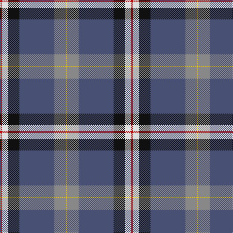

**Bands:** [RWKBRY](/stripes/rwkbry/) · **Stripes:** [R W K N O LY](/stripes/stripes6/) R W K N O LY

This was sourced from tartans-authority.  It is a [6 band tartan](/bands/bands6/).

Original link http://www.tartansauthority.com/tartan-ferret/display/10133/

## Attestations

This cloth appears in 2 source records; the oldest owns this page.

- 12th Jan. 2010 — Stone, Alan (Personal) (tartans-authority, [record](http://www.tartansauthority.com/tartan-ferret/display/10133/))
- undated — Stone Family Name Tartan Tartan Number: 10133. Earliest known date: 12th Jan. 2010 The Stone family tartan has been created for the family of Alan Stone to commemorate the diverse and wonderful Stone family history from their origins within the British Isles to their accomplishments in American history. The royal blue background represents both the family from Great Bromley who carried the title of Knight, and those family members who fought on the Union side of the American Civil War. The black background with a white cross symbolizes Cornwall, the earliest known origin of the Stone family. A red cross on a white background represents family throughout England. The grey stripe represents those of the Stone family who fought for the Confederacy during the American Civil War. The gold/yellow stripe running throughout represents the line of the Stone family from Ireland. See products available Copyright © Blair Urquhart, Comrie, 2015 (house-of-tartan, [record](http://www.house-of-tartan.scotland.net/house/TartanViewjs.asp?colr=Def&tnam=10133))

## Thread count
R/4 LN12 K24 N72 Na24 Y/2

## Palette
Each colour and its ΔE from the base-6 reference it is a variant of.

| Colour | Shade | Base | ΔE (OKLab) |
|---|---|---|---|
| K | <code style="background-color:#101010;">#101010</code> `#101010` | K <code style="background-color:#000000;">#000000</code> | 0.17 |
| LN | <code style="background-color:#E0E0E0;">#E0E0E0</code> `#E0E0E0` | W <code style="background-color:#F7F7F7;">#F7F7F7</code> | 0.07 |
| N | <code style="background-color:#485074;">#485074</code> `#485074` | B <code style="background-color:#2A418A;">#2A418A</code> | 0.08 |
| Na | <code style="background-color:#888888;">#888888</code> `#888888` | R <code style="background-color:#CC0000;">#CC0000</code> | 0.24 |
| R | <code style="background-color:#C80000;">#C80000</code> `#C80000` | R <code style="background-color:#CC0000;">#CC0000</code> | 0.01 |
| Y | <code style="background-color:#E8C000;">#E8C000</code> `#E8C000` | Y <code style="background-color:#F2BF00;">#F2BF00</code> | 0.02 |

# Sample pattern

## Nearest tartans

The nearest existing variants by ΔTartan distance.

1. [(4) Traill](/setts/s7/r8ly2o7ly2n24k2g1~x2/) — ΔT 0.91
1. [Alan Stone Family (Personal)](/setts/s6/r2w6k12db36o12ly1~x2/) — ΔT 0.94
1. [Ascension Island Heritage Society](/setts/s7/r8t45w1y4k11g6r4~x2/) — ΔT 1.06
1. [Ascension Island Heritage Trust](/setts/s7/r8t45w1o4k11g6r4~x2/) — ΔT 1.11
1. [Gamblin Thompson (Personal)](/setts/s6/t2g13r2k6db23w1~x4/) — ΔT 1.25
1. [Kirkcaldy Name Tartan Tartan Number: 9072. Earliest known date: 2008 Blue and white for the Scottish flag, the red and yellow is from William Kirkcaldy's shield (it is also my son's army colours). It is for general use. See products available Copyright © Blair Urquhart, Comrie, 2015](/setts/s6/t23w3k10r2dt45ly1~x2/) — ΔT 1.27
1. [Timmins (2013)](/setts/s10/g4db2t14db12t32ly1db12dp14db2r4~x2/) — ΔT 1.28
1. [Longhaugh Primary School](/setts/s8/g20db2w2db12dp29r1dp1k3~x2/) — ΔT 1.28
1. [Sandelin (Personal)](/setts/s8/w10db2w1db35g10lo3g10r4~x2/) — ΔT 1.29
1. [College of New Caledonia](/setts/s6/db52lo23g6dg5w1r1~x2/) — ΔT 1.31

## Neighbour map

Every grey dot is one of 14313 variants placed by the first two principal components of the ΔTartan feature space (44% of its variance). Red is this tartan; blue dots are its nearest — click one to open its page.

<svg viewBox="0 0 640 380" role="img" style="max-width:100%;height:auto;border:1px solid #e0e0e0;border-radius:4px;display:block" xmlns="http://www.w3.org/2000/svg"><image href="/nn/cloud.v1.png" width="640" height="380"/><a href="/setts/s7/r8ly2o7ly2n24k2g1~x2/"><circle cx="276.6" cy="118.6" r="4" fill="#3465a4"><title>(4) Traill</title></circle></a><a href="/setts/s6/r2w6k12db36o12ly1~x2/"><circle cx="269.7" cy="114.2" r="4" fill="#3465a4"><title>Alan Stone Family (Personal)</title></circle></a><a href="/setts/s7/r8t45w1y4k11g6r4~x2/"><circle cx="343.0" cy="93.2" r="4" fill="#3465a4"><title>Ascension Island Heritage Society</title></circle></a><a href="/setts/s7/r8t45w1o4k11g6r4~x2/"><circle cx="336.0" cy="92.0" r="4" fill="#3465a4"><title>Ascension Island Heritage Trust</title></circle></a><a href="/setts/s6/t2g13r2k6db23w1~x4/"><circle cx="268.5" cy="149.0" r="4" fill="#3465a4"><title>Gamblin Thompson (Personal)</title></circle></a><a href="/setts/s6/t23w3k10r2dt45ly1~x2/"><circle cx="332.3" cy="120.8" r="4" fill="#3465a4"><title>Kirkcaldy Name Tartan Tartan Number: 9072. Earliest known date: 2008 Blue and white for the Scottish flag, the red and yellow is from William Kirkcaldy's shield (it is also my son's army colours). It is for general use. See products available Copyright © Blair Urquhart, Comrie, 2015</title></circle></a><a href="/setts/s10/g4db2t14db12t32ly1db12dp14db2r4~x2/"><circle cx="249.8" cy="113.4" r="4" fill="#3465a4"><title>Timmins (2013)</title></circle></a><a href="/setts/s8/g20db2w2db12dp29r1dp1k3~x2/"><circle cx="229.7" cy="98.8" r="4" fill="#3465a4"><title>Longhaugh Primary School</title></circle></a><a href="/setts/s8/w10db2w1db35g10lo3g10r4~x2/"><circle cx="273.9" cy="112.6" r="4" fill="#3465a4"><title>Sandelin (Personal)</title></circle></a><a href="/setts/s6/db52lo23g6dg5w1r1~x2/"><circle cx="358.5" cy="90.1" r="4" fill="#3465a4"><title>College of New Caledonia</title></circle></a><circle cx="286.4" cy="119.1" r="5" fill="#c00000"/></svg>

ID: /setts/s6/r2w6k12n36o12ly1~x2/
