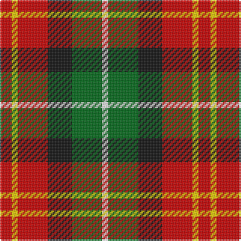

In pattern [RYRKGW](/patterns/ryrkgw/).

This was sourced from tartans-authority.  It is a [6 stripes tartan](/stripes/stripes6/).

Original link http://www.tartansauthority.com/tartan-ferret/display/8811/

## Thread count
R/8 Y4 R20 K16 G20 W/4

## Palette
Each colour and its ΔE from the base-6 reference it is a variant of.

| Colour | Shade | Base | ΔE (OKLab) |
|---|---|---|---|
| G | <code style="background-color:#006818;">#006818</code> `#006818` | G <code style="background-color:#006100;">#006100</code> | 0.02 |
| K | <code style="background-color:#101010;">#101010</code> `#101010` | K <code style="background-color:#000000;">#000000</code> | 0.17 |
| R | <code style="background-color:#C80000;">#C80000</code> `#C80000` | R <code style="background-color:#CC0000;">#CC0000</code> | 0.01 |
| W | <code style="background-color:#FCFCFC;">#FCFCFC</code> `#FCFCFC` | W <code style="background-color:#F7F7F7;">#F7F7F7</code> | 0.01 |
| Y | <code style="background-color:#FCCC00;">#FCCC00</code> `#FCCC00` | Y <code style="background-color:#F2BF00;">#F2BF00</code> | 0.04 |

# Sample pattern

## Nearest tartans

The nearest existing variants by ΔTartan distance.

1. [Abbink, Ingmar (Personal)](/setts/s5/r39b22k11y22g5~b5c8ca8-g288028-k101010-ra00000-yfccc00~x2/) — ΔT 1.05
1. [Jardine of Castlemilk](/setts/s9/r8g33y33k33r8b8y33b8r8~b2c4084-g482800-k101010-rdc0000-ye8c000/) — ΔT 1.16
1. [Blackie](/setts/s8/g9y2g9w5r9b2r9b2~b5c8ca8-g006818-rc80000-wffffff-ye8c000~x2/) — ΔT 1.17
1. [Jardine, of Castlemilk](/setts/s9/r8ra33y33k33r8b8y33b8r8~b304080-k000000-rc00000-ra703000-yf0c000/) — ΔT 1.19
1. [Scottish American Athletic Assoc](/setts/s5/y32k21r16ya6b4~b344054-k101010-r901c1c-ye8c000-yab8b8b8~x2/) — ΔT 1.20
1. [Jardine, of Castlemilk](/setts/s9/r8ra33y33k33r8b8y33b8r8~b304080-k000000-rc00000-ra806050-yf0c000/) — ΔT 1.23
1. [Inspiration](/setts/s5/r5b12y11ba21ya5~b202060-ba5c5c5c-rc80000-yfccc00-yae8c000~x2/) — ΔT 1.25
1. [Blackie (Artefact)](/setts/s8/g9y2g9w5r9b2r9b2~b5c8ca8-g006818-rc80000-we0e0e0-ye8c000~x2/) — ΔT 1.25
1. [Douglas of Roxburgh](/setts/s5/k6b3g20r20y3~b2c2c80-g003800-k000000-rc80000-ye8c000~x2/) — ΔT 1.25
1. [Torana](/setts/s6/r13b13ra5y2b13y13~b1c1c1c-rc80000-rad87000-yd09800~x2/) — ΔT 1.26

## Neighbour map

Every grey dot is one of 15726 variants placed by the first two principal components of the ΔTartan feature space (44% of its variance). Red is this tartan; blue dots are its nearest — click one to open its page.

<svg viewBox="0 0 640 380" role="img" style="max-width:100%;height:auto;border:1px solid #e0e0e0;border-radius:4px;display:block" xmlns="http://www.w3.org/2000/svg"><image href="/nn/cloud.v1.png" width="640" height="380"/><a href="/setts/s5/r39b22k11y22g5~b5c8ca8-g288028-k101010-ra00000-yfccc00~x2/"><circle cx="129.8" cy="210.9" r="4" fill="#3465a4"><title>Abbink, Ingmar (Personal)</title></circle></a><a href="/setts/s9/r8g33y33k33r8b8y33b8r8~b2c4084-g482800-k101010-rdc0000-ye8c000/"><circle cx="76.6" cy="198.3" r="4" fill="#3465a4"><title>Jardine of Castlemilk</title></circle></a><a href="/setts/s8/g9y2g9w5r9b2r9b2~b5c8ca8-g006818-rc80000-wffffff-ye8c000~x2/"><circle cx="113.4" cy="219.7" r="4" fill="#3465a4"><title>Blackie</title></circle></a><a href="/setts/s9/r8ra33y33k33r8b8y33b8r8~b304080-k000000-rc00000-ra703000-yf0c000/"><circle cx="71.2" cy="195.6" r="4" fill="#3465a4"><title>Jardine, of Castlemilk</title></circle></a><a href="/setts/s5/y32k21r16ya6b4~b344054-k101010-r901c1c-ye8c000-yab8b8b8~x2/"><circle cx="129.1" cy="200.9" r="4" fill="#3465a4"><title>Scottish American Athletic Assoc</title></circle></a><a href="/setts/s9/r8ra33y33k33r8b8y33b8r8~b304080-k000000-rc00000-ra806050-yf0c000/"><circle cx="69.7" cy="195.4" r="4" fill="#3465a4"><title>Jardine, of Castlemilk</title></circle></a><a href="/setts/s5/r5b12y11ba21ya5~b202060-ba5c5c5c-rc80000-yfccc00-yae8c000~x2/"><circle cx="93.2" cy="241.4" r="4" fill="#3465a4"><title>Inspiration</title></circle></a><a href="/setts/s8/g9y2g9w5r9b2r9b2~b5c8ca8-g006818-rc80000-we0e0e0-ye8c000~x2/"><circle cx="122.9" cy="223.8" r="4" fill="#3465a4"><title>Blackie (Artefact)</title></circle></a><a href="/setts/s5/k6b3g20r20y3~b2c2c80-g003800-k000000-rc80000-ye8c000~x2/"><circle cx="162.8" cy="211.7" r="4" fill="#3465a4"><title>Douglas of Roxburgh</title></circle></a><a href="/setts/s6/r13b13ra5y2b13y13~b1c1c1c-rc80000-rad87000-yd09800~x2/"><circle cx="162.5" cy="248.7" r="4" fill="#3465a4"><title>Torana</title></circle></a><circle cx="112.0" cy="224.2" r="5" fill="#c00000"/></svg>

ID: /setts/s6/r2y1r5k4g5w1~g006818-k101010-rc80000-wfcfcfc-yfccc00~x4/
