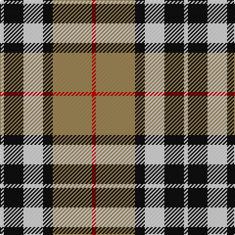

In pattern [RYKWKW](/patterns/rykwkw/).

This was sourced from house-of-tartan.  It is a [6 stripes tartan](/stripes/stripes6/).

Original link http://www.house-of-tartan.scotland.net/house/TartanViewjs.asp?colr=Def&tnam=2421

## Thread count
LN/4 K20 LN20 K10 LT40 R/4

## Palette
Each colour and its ΔE from the base-6 reference it is a variant of.

| Colour | Shade | Base | ΔE (OKLab) |
|---|---|---|---|
| K | <code style="background-color:#101010;">#101010</code> `#101010` | K <code style="background-color:#000000;">#000000</code> | 0.17 |
| LN | <code style="background-color:#E0E0E0;">#E0E0E0</code> `#E0E0E0` | W <code style="background-color:#F7F7F7;">#F7F7F7</code> | 0.07 |
| LT | <code style="background-color:#A08858;">#A08858</code> `#A08858` | Y <code style="background-color:#F2BF00;">#F2BF00</code> | 0.21 |
| R | <code style="background-color:#C80000;">#C80000</code> `#C80000` | R <code style="background-color:#CC0000;">#CC0000</code> | 0.01 |

# Sample pattern

## Nearest tartans

The nearest existing variants by ΔTartan distance.

1. [Thomson Camel](/setts/s6/r4y30k6w13k13w3~k101010-rc80000-we0e0e0-ya08858~x2/) — ΔT 0.29
1. [Thomson, Camel (Fashion)](/setts/s6/r4y30k6w13k13w3~k101010-rc80000-we0e0e0-yb8a47c~x2/) — ΔT 0.47
1. [Thompson Grey Family Tartan Tartan Number: 1611. Earliest known date: pre 2003 Designed for Lord Thomson of Fleet in 1958 based on a sample in the Moy Hall collection dating from the mid 19th century. The tartan is also suitable for MacTavishs and Thompsons, who claim descent from the Clan MacIntosh. See products available Copyright © Blair Urquhart, Comrie, 2015](/setts/s6/r2ra20k5w10k10r2~k101010-rc80000-ra888888-we0e0e0~x2/) — ΔT 0.57
1. [Black & White Golf (Corporate)](/setts/s7/y9k32g6w20y3w9k5~g006818-k101010-we8ccb8-ybc8c00~x2/) — ΔT 0.73
1. [MacKintosh Dress (Scott Adie)](/setts/s6/r3w8b4g14r4b2~b2c2c80-g285800-rc80000-we0e0e0~x4/) — ΔT 0.82
1. [Un-named (D C Dalgliesh) #3](/setts/s6/g3y24k15r3g25k3~g408060-k101010-ra888b4-ye09894~x2/) — ΔT 0.84
1. [Black and White Golf](/setts/s7/y9k32g6w20y3w9k5~g008b00-k101010-wffffff-yd9b666~x2/) — ΔT 0.84
1. [Cape Breton (yellow stripes)](/setts/s7/y6k6g30k8w18k6y3~g789484-k000000-wc0c0c0-ye8c000~x2/) — ΔT 0.85
1. [MacIntosh Dress Clan Tartan Tartan Number: 538. Earliest known date: pre 2003 From an old pattern book in possesion of Messrs Scott Adie of London. See products available Copyright © Blair Urquhart, Comrie, 2015](/setts/s6/r3w8b4g14r4b2~b2c2c80-g006818-rc80000-we0e0e0~x2/) — ΔT 0.89
1. [Bannockbane Light Tan](/setts/s8/k4y2k13y1w8ya13y2ya4~k101010-we0e0e0-ye8c000-yaa08858~x2/) — ΔT 0.89

## Neighbour map

Every grey dot is one of 15726 variants placed by the first two principal components of the ΔTartan feature space (44% of its variance). Red is this tartan; blue dots are its nearest — click one to open its page.

<svg viewBox="0 0 640 380" role="img" style="max-width:100%;height:auto;border:1px solid #e0e0e0;border-radius:4px;display:block" xmlns="http://www.w3.org/2000/svg"><image href="/nn/cloud.v1.png" width="640" height="380"/><a href="/setts/s6/r4y30k6w13k13w3~k101010-rc80000-we0e0e0-ya08858~x2/"><circle cx="188.6" cy="191.0" r="4" fill="#3465a4"><title>Thomson Camel</title></circle></a><a href="/setts/s6/r4y30k6w13k13w3~k101010-rc80000-we0e0e0-yb8a47c~x2/"><circle cx="183.9" cy="187.9" r="4" fill="#3465a4"><title>Thomson, Camel (Fashion)</title></circle></a><a href="/setts/s6/r2ra20k5w10k10r2~k101010-rc80000-ra888888-we0e0e0~x2/"><circle cx="172.2" cy="195.7" r="4" fill="#3465a4"><title>Thompson Grey Family Tartan Tartan Number: 1611. Earliest known date: pre 2003 Designed for Lord Thomson of Fleet in 1958 based on a sample in the Moy Hall collection dating from the mid 19th century. The tartan is also suitable for MacTavishs and Thompsons, who claim descent from the Clan MacIntosh. See products available Copyright © Blair Urquhart, Comrie, 2015</title></circle></a><a href="/setts/s7/y9k32g6w20y3w9k5~g006818-k101010-we8ccb8-ybc8c00~x2/"><circle cx="187.8" cy="184.1" r="4" fill="#3465a4"><title>Black &amp; White Golf (Corporate)</title></circle></a><a href="/setts/s6/r3w8b4g14r4b2~b2c2c80-g285800-rc80000-we0e0e0~x4/"><circle cx="148.3" cy="216.1" r="4" fill="#3465a4"><title>MacKintosh Dress (Scott Adie)</title></circle></a><a href="/setts/s6/g3y24k15r3g25k3~g408060-k101010-ra888b4-ye09894~x2/"><circle cx="177.6" cy="207.2" r="4" fill="#3465a4"><title>Un-named (D C Dalgliesh) #3</title></circle></a><a href="/setts/s7/y9k32g6w20y3w9k5~g008b00-k101010-wffffff-yd9b666~x2/"><circle cx="175.3" cy="178.6" r="4" fill="#3465a4"><title>Black and White Golf</title></circle></a><a href="/setts/s7/y6k6g30k8w18k6y3~g789484-k000000-wc0c0c0-ye8c000~x2/"><circle cx="145.2" cy="182.8" r="4" fill="#3465a4"><title>Cape Breton (yellow stripes)</title></circle></a><a href="/setts/s6/r3w8b4g14r4b2~b2c2c80-g006818-rc80000-we0e0e0~x2/"><circle cx="146.8" cy="216.7" r="4" fill="#3465a4"><title>MacIntosh Dress Clan Tartan Tartan Number: 538. Earliest known date: pre 2003 From an old pattern book in possesion of Messrs Scott Adie of London. See products available Copyright © Blair Urquhart, Comrie, 2015</title></circle></a><a href="/setts/s8/k4y2k13y1w8ya13y2ya4~k101010-we0e0e0-ye8c000-yaa08858~x2/"><circle cx="154.8" cy="171.2" r="4" fill="#3465a4"><title>Bannockbane Light Tan</title></circle></a><circle cx="174.2" cy="194.0" r="5" fill="#c00000"/></svg>

ID: /setts/s6/r2y20k5w10k10w2~k101010-rc80000-we0e0e0-ya08858~x2/
