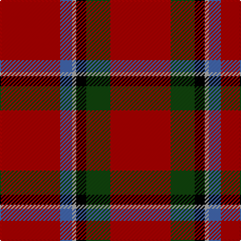

In pattern [RBYKGR](/stripes/rbykgr/).

This was sourced from weddslist.  It is a [6 stripe tartan](/stripes/stripes6/).

Original link http://www.weddslist.com/cgi-bin/tartans/pg.pl?source=tinsel

## Thread count
DR/60 DG24 K10 N4 B12 DR/60

## Palette
Each colour and the base-6 reference it is a variant of.

| Colour | Shade | Base |
|---|---|---|
| B | <code style="background-color:#4367AE;">#4367AE</code> `oklch(52.2% 0.120 262.7)` <small>#4367AE</small> | B <code style="background-color:#2A418A;">#2A418A</code> |
| DG | <code style="background-color:#11450D;">#11450D</code> `oklch(34.4% 0.101 142.1)` <small>#11450D</small> | G <code style="background-color:#006100;">#006100</code> |
| DR | <code style="background-color:#AA0000;">#AA0000</code> `oklch(46.3% 0.190 29.2)` <small>#AA0000</small> | R <code style="background-color:#CC0000;">#CC0000</code> |
| K | <code style="background-color:#000000;">#000000</code> `oklch(0.0% 0.000 0.0)` <small>#000000</small> | K <code style="background-color:#000000;">#000000</code> |
| N | <code style="background-color:#AAAAAA;">#AAAAAA</code> `oklch(73.8% 0.000 89.9)` <small>#AAAAAA</small> | Y <code style="background-color:#F2BF00;">#F2BF00</code> |

# Sample pattern

## Nearest tartans

The nearest existing variants by ΔTartan distance.

1. [Sinclair](/setts/s6/r30dg12k5lr2b6r30/) — ΔT 0.00
1. [Sinclair](/setts/s6/r30g12k5w2t6r30/) — ΔT 0.85
1. [Sinclair Dress](/setts/s6/r28dg16k4lr1b6r28~x2/) — ΔT 1.04
1. [Sinclair Dress](/setts/s6/r28dg16k4lr1b6r28/) — ΔT 1.04
1. [Sinclair (Logan)](/setts/s6/r28g16k4w1db6r28~x2/) — ΔT 1.12
1. [Sinclair](/setts/s6/r28g16k4w1t6r28~x2/) — ΔT 1.30
1. [AON](/setts/s6/r5db10r5dg5r25ly1~x4/) — ΔT 1.31
1. [Hackston or Halkerston Family Tartan Tartan Number: 907. Earliest known date: 1987 Taken from a portrait (c. 1746) Red pivot reduced by half for display. Should read R112. See products available Copyright © Blair Urquhart, Comrie, 2015](/setts/s8/r28w2k12ly3r12ly3r12g3~x2/) — ΔT 1.35
1. [Kinnaird (Name)](/setts/s6/g15k10r30dp2r20w1~x2/) — ΔT 1.35
1. [Highlands at Wyomissing, The](/setts/s5/r35w3r8ly2g11~x2/) — ΔT 1.43

## Neighbour map

Every grey dot is one of 14299 variants placed by the first two principal components of the ΔTartan feature space (44% of its variance). Red is this tartan; blue dots are its nearest — click one to open its page.

<svg viewBox="0 0 640 380" role="img" style="max-width:100%;height:auto;border:1px solid #e0e0e0;border-radius:4px;display:block" xmlns="http://www.w3.org/2000/svg"><image href="/nn/cloud.v1.png" width="640" height="380"/><a href="/setts/s6/r30dg12k5lr2b6r30/"><circle cx="419.7" cy="182.6" r="4" fill="#3465a4"><title>Sinclair</title></circle></a><a href="/setts/s6/r30g12k5w2t6r30/"><circle cx="400.8" cy="169.2" r="4" fill="#3465a4"><title>Sinclair</title></circle></a><a href="/setts/s6/r28dg16k4lr1b6r28~x2/"><circle cx="424.1" cy="165.5" r="4" fill="#3465a4"><title>Sinclair Dress</title></circle></a><a href="/setts/s6/r28dg16k4lr1b6r28/"><circle cx="424.1" cy="165.5" r="4" fill="#3465a4"><title>Sinclair Dress</title></circle></a><a href="/setts/s6/r28g16k4w1db6r28~x2/"><circle cx="416.0" cy="156.4" r="4" fill="#3465a4"><title>Sinclair (Logan)</title></circle></a><a href="/setts/s6/r28g16k4w1t6r28~x2/"><circle cx="404.0" cy="151.7" r="4" fill="#3465a4"><title>Sinclair</title></circle></a><a href="/setts/s6/r5db10r5dg5r25ly1~x4/"><circle cx="453.9" cy="165.9" r="4" fill="#3465a4"><title>AON</title></circle></a><a href="/setts/s8/r28w2k12ly3r12ly3r12g3~x2/"><circle cx="384.4" cy="147.8" r="4" fill="#3465a4"><title>Hackston or Halkerston Family Tartan Tartan Number: 907. Earliest known date: 1987 Taken from a portrait (c. 1746) Red pivot reduced by half for display. Should read R112. See products available Copyright © Blair Urquhart, Comrie, 2015</title></circle></a><a href="/setts/s6/g15k10r30dp2r20w1~x2/"><circle cx="397.5" cy="161.6" r="4" fill="#3465a4"><title>Kinnaird (Name)</title></circle></a><a href="/setts/s5/r35w3r8ly2g11~x2/"><circle cx="468.7" cy="180.6" r="4" fill="#3465a4"><title>Highlands at Wyomissing, The</title></circle></a><circle cx="419.7" cy="182.6" r="5" fill="#c00000"/></svg>

ID: /setts/s6/r30dg12k5lr2b6r30~x2/
