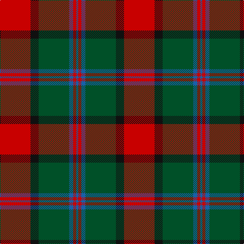

In pattern [BRBGKR](/stripes/brbgkr/).

This was sourced from house-of-tartan.  It is a [6 stripe tartan](/stripes/stripes6/).

Original link http://www.house-of-tartan.scotland.net/house/TartanViewjs.asp?colr=Def&tnam=2778

## Thread count
R/60 K16 G60 B8 R6 B/4

## Palette
Each colour and its ΔE from the base-6 reference it is a variant of.

| Colour | Shade | Base | ΔE (OKLab) |
|---|---|---|---|
| B | <code style="background-color:#1860A8;">#1860A8</code> `#1860A8` | B <code style="background-color:#2A418A;">#2A418A</code> | 0.09 |
| DB | <code style="background-color:#1C0070;">#1C0070</code> `#1C0070` | B <code style="background-color:#2A418A;">#2A418A</code> | 0.14 |
| DG | <code style="background-color:#003000;">#003000</code> `#003000` | G <code style="background-color:#006100;">#006100</code> | 0.17 |
| G | <code style="background-color:#005028;">#005028</code> `#005028` | G <code style="background-color:#006100;">#006100</code> | 0.07 |
| K | <code style="background-color:#101010;">#101010</code> `#101010` | K <code style="background-color:#000000;">#000000</code> | 0.17 |
| N | <code style="background-color:#3C3C60;">#3C3C60</code> `#3C3C60` | B <code style="background-color:#2A418A;">#2A418A</code> | 0.07 |
| R | <code style="background-color:#C80000;">#C80000</code> `#C80000` | R <code style="background-color:#CC0000;">#CC0000</code> | 0.01 |

# Sample pattern

## Nearest tartans

The nearest existing variants by ΔTartan distance.

1. [Logan - 1819 (with yellow)](/setts/s7/dp8r3ly1r3dg14r3ly1~x4/) — ΔT 0.59
1. [Unidentified #15](/setts/s6/k6r2dg17r16k1t2~x2/) — ΔT 0.62
1. [Christmas](/setts/s5/ly2dg17g4r15dg1~x2/) — ΔT 0.63
1. [Cook (Name)](/setts/s7/dg12g6dg6r15k1r1k2~x2/) — ΔT 0.66
1. [Logan with Yellow](/setts/s7/dp8r3ly1r3g14r3ly1~x4/) — ΔT 0.71
1. [MacKintosh Geddes](/setts/s7/db1r5dg18r4db9r10w1~x4/) — ΔT 0.82
1. [Geddes](/setts/s7/dp1r5g15r3dp9r10w1~x4/) — ΔT 0.89
1. [Fraser Green](/setts/s6/lb2dr12g6dr1n6dr1~x4/) — ΔT 0.93
1. [Scott Hunting Clan Tartan Tartan Number: 1546. Earliest known date: 1906 Also known as Green Scott, this tartan is generally available today. The Chief of the Scotts is His Grace the 9th Duke of Buccleuch and 10th of Queensberry who lives in Selkirk in the borders region of Scotland. See products available Copyright © Blair Urquhart, Comrie, 2015](/setts/s8/r3dr14g8r2g2w2g2r1~x2/) — ΔT 0.96
1. [McCook/Cook (Name)](/setts/s7/g12t6g6r15k1r1k2~x4/) — ΔT 0.97

## Neighbour map

Every grey dot is one of 14299 variants placed by the first two principal components of the ΔTartan feature space (44% of its variance). Red is this tartan; blue dots are its nearest — click one to open its page.

<svg viewBox="0 0 640 380" role="img" style="max-width:100%;height:auto;border:1px solid #e0e0e0;border-radius:4px;display:block" xmlns="http://www.w3.org/2000/svg"><image href="/nn/cloud.v1.png" width="640" height="380"/><a href="/setts/s7/dp8r3ly1r3dg14r3ly1~x4/"><circle cx="248.6" cy="180.2" r="4" fill="#3465a4"><title>Logan - 1819 (with yellow)</title></circle></a><a href="/setts/s6/k6r2dg17r16k1t2~x2/"><circle cx="258.7" cy="178.4" r="4" fill="#3465a4"><title>Unidentified #15</title></circle></a><a href="/setts/s5/ly2dg17g4r15dg1~x2/"><circle cx="302.1" cy="200.2" r="4" fill="#3465a4"><title>Christmas</title></circle></a><a href="/setts/s7/dg12g6dg6r15k1r1k2~x2/"><circle cx="253.2" cy="191.0" r="4" fill="#3465a4"><title>Cook (Name)</title></circle></a><a href="/setts/s7/dp8r3ly1r3g14r3ly1~x4/"><circle cx="247.4" cy="177.9" r="4" fill="#3465a4"><title>Logan with Yellow</title></circle></a><a href="/setts/s7/db1r5dg18r4db9r10w1~x4/"><circle cx="249.9" cy="180.0" r="4" fill="#3465a4"><title>MacKintosh Geddes</title></circle></a><a href="/setts/s7/dp1r5g15r3dp9r10w1~x4/"><circle cx="243.5" cy="187.3" r="4" fill="#3465a4"><title>Geddes</title></circle></a><a href="/setts/s6/lb2dr12g6dr1n6dr1~x4/"><circle cx="288.5" cy="212.1" r="4" fill="#3465a4"><title>Fraser Green</title></circle></a><a href="/setts/s8/r3dr14g8r2g2w2g2r1~x2/"><circle cx="246.1" cy="171.1" r="4" fill="#3465a4"><title>Scott Hunting Clan Tartan Tartan Number: 1546. Earliest known date: 1906 Also known as Green Scott, this tartan is generally available today. The Chief of the Scotts is His Grace the 9th Duke of Buccleuch and 10th of Queensberry who lives in Selkirk in the borders region of Scotland. See products available Copyright © Blair Urquhart, Comrie, 2015</title></circle></a><a href="/setts/s7/g12t6g6r15k1r1k2~x4/"><circle cx="249.3" cy="188.7" r="4" fill="#3465a4"><title>McCook/Cook (Name)</title></circle></a><circle cx="280.6" cy="187.6" r="5" fill="#c00000"/></svg>

ID: /setts/s6/r30k8dg30b4r3b2~x2/
