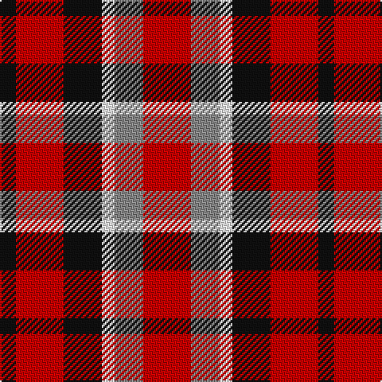

In pattern [KRKWRR](/patterns/krkwrr/).

This was sourced from register-of-tartans.  It is a [6 stripes tartan](/stripes/stripes6/).

Original link https://www.tartanregister.gov.uk/tartanDetails.aspx?ref=11069

## Thread count
K/10 R30 K24 W8 N18 R/30

## Palette
Each colour and its ΔE from the base-6 reference it is a variant of.

| Colour | Shade | Base | ΔE (OKLab) |
|---|---|---|---|
| K | <code style="background-color:#101010;">#101010</code> `#101010` | K <code style="background-color:#000000;">#000000</code> | 0.17 |
| N | <code style="background-color:#888888;">#888888</code> `#888888` | R <code style="background-color:#CC0000;">#CC0000</code> | 0.24 |
| R | <code style="background-color:#C80000;">#C80000</code> `#C80000` | R <code style="background-color:#CC0000;">#CC0000</code> | 0.01 |
| W | <code style="background-color:#FFFFFF;">#FFFFFF</code> `#FFFFFF` | W <code style="background-color:#F7F7F7;">#F7F7F7</code> | 0.02 |

# Sample pattern

## Nearest tartans

The nearest existing variants by ΔTartan distance.

1. [Eastern Kentucky University](/setts/s6/r30ra18w8k24r30k10-k101010-rc80000-ra888888-wfcfcfc/) — ΔT 0.02
1. [MacDuff #3](/setts/s7/r20b12k16g20r12g6r12-b2c4084-g005020-k101010-rdc0000/) — ΔT 1.35
1. [Hamby Sport (Personal)](/setts/s4/r50k26w16b10-b2c2c80-k101010-rc8002c-we0e0e0/) — ΔT 1.37
1. [MacDuff #5](/setts/s7/r16b6k8g12r8k2r8-b3c82af-g005020-k101010-rdc0000/) — ΔT 1.38
1. [Torana](/setts/s6/r26b26ra10y4b26y26-b1c1c1c-rc80000-rad87000-yd09800/) — ΔT 1.42
1. [Gow](/setts/s5/r8b8r2g8r8-b00004c-g004c00-rc80000/) — ΔT 1.43
1. [MacDuff](/setts/s7/r16b6k8g12r8k2r8-b5480b0-g008000-k000000-rc00000/) — ΔT 1.43
1. [Fiddes (Corrected)](/setts/s7/g24r22b24ra6b16g16b16-b780078-g289c18-rc80000-racc4438/) — ΔT 1.46
1. [MacDuff](/setts/s7/r20b12k16g20r12g6r12-b304080-g008000-k000000-rc00000/) — ΔT 1.50
1. [MacNaughton (Logan)](/setts/s7/b10r34g32k20b20r34b10-b080848-g002814-k101010-rdc0000/) — ΔT 1.51

## Neighbour map

Every grey dot is one of 15726 variants placed by the first two principal components of the ΔTartan feature space (44% of its variance). Red is this tartan; blue dots are its nearest — click one to open its page.

<svg viewBox="0 0 640 380" role="img" style="max-width:100%;height:auto;border:1px solid #e0e0e0;border-radius:4px;display:block" xmlns="http://www.w3.org/2000/svg"><image href="/nn/cloud.v1.png" width="640" height="380"/><a href="/setts/s6/r30ra18w8k24r30k10-k101010-rc80000-ra888888-wfcfcfc/"><circle cx="176.2" cy="264.6" r="4" fill="#3465a4"><title>Eastern Kentucky University</title></circle></a><a href="/setts/s7/r20b12k16g20r12g6r12-b2c4084-g005020-k101010-rdc0000/"><circle cx="137.6" cy="290.3" r="4" fill="#3465a4"><title>MacDuff #3</title></circle></a><a href="/setts/s4/r50k26w16b10-b2c2c80-k101010-rc8002c-we0e0e0/"><circle cx="197.1" cy="248.5" r="4" fill="#3465a4"><title>Hamby Sport (Personal)</title></circle></a><a href="/setts/s7/r16b6k8g12r8k2r8-b3c82af-g005020-k101010-rdc0000/"><circle cx="233.2" cy="234.5" r="4" fill="#3465a4"><title>MacDuff #5</title></circle></a><a href="/setts/s6/r26b26ra10y4b26y26-b1c1c1c-rc80000-rad87000-yd09800/"><circle cx="164.3" cy="247.3" r="4" fill="#3465a4"><title>Torana</title></circle></a><a href="/setts/s5/r8b8r2g8r8-b00004c-g004c00-rc80000/"><circle cx="223.5" cy="311.4" r="4" fill="#3465a4"><title>Gow</title></circle></a><a href="/setts/s7/r16b6k8g12r8k2r8-b5480b0-g008000-k000000-rc00000/"><circle cx="215.7" cy="231.1" r="4" fill="#3465a4"><title>MacDuff</title></circle></a><a href="/setts/s7/g24r22b24ra6b16g16b16-b780078-g289c18-rc80000-racc4438/"><circle cx="151.3" cy="282.0" r="4" fill="#3465a4"><title>Fiddes (Corrected)</title></circle></a><a href="/setts/s7/r20b12k16g20r12g6r12-b304080-g008000-k000000-rc00000/"><circle cx="116.9" cy="285.1" r="4" fill="#3465a4"><title>MacDuff</title></circle></a><a href="/setts/s7/b10r34g32k20b20r34b10-b080848-g002814-k101010-rdc0000/"><circle cx="131.6" cy="274.1" r="4" fill="#3465a4"><title>MacNaughton (Logan)</title></circle></a><circle cx="175.8" cy="264.4" r="5" fill="#c00000"/></svg>

ID: /setts/s6/r30ra18w8k24r30k10-k101010-rc80000-ra888888-wffffff/
