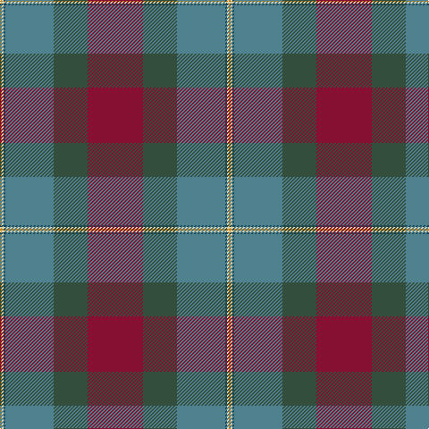

**Bands:** [RGBBWY](/stripes/rgbbwy/) · **Stripes:** [R DG T DT W LO](/stripes/stripes6/) R DG T DT W LO

This was sourced from register-of-tartans.  It is a [6 band tartan](/bands/bands6/).

Original link https://www.tartanregister.gov.uk/tartanDetails.aspx?ref=10438

## Register references

External register numbers recorded for this tartan.

- Scottish Register of Tartans: [10438](https://www.tartanregister.gov.uk/tartanDetails.aspx?ref=10438)

## Thread count
DO/2 LR2 DB2 B54 N38 DR/62

## Palette
Each colour and its ΔE from the base-6 reference it is a variant of.

| Colour | Shade | Base | ΔE (OKLab) |
|---|---|---|---|
| B | <code style="background-color:#50818E;">#50818E</code> `#50818E` | B <code style="background-color:#2A418A;">#2A418A</code> | 0.20 |
| DB | <code style="background-color:#14465C;">#14465C</code> `#14465C` | B <code style="background-color:#2A418A;">#2A418A</code> | 0.09 |
| DO | <code style="background-color:#C5831B;">#C5831B</code> `#C5831B` | Y <code style="background-color:#F2BF00;">#F2BF00</code> | 0.17 |
| DR | <code style="background-color:#861031;">#861031</code> `#861031` | R <code style="background-color:#CC0000;">#CC0000</code> | 0.15 |
| LR | <code style="background-color:#DDD5AF;">#DDD5AF</code> `#DDD5AF` | W <code style="background-color:#F7F7F7;">#F7F7F7</code> | 0.12 |
| N | <code style="background-color:#334E3D;">#334E3D</code> `#334E3D` | G <code style="background-color:#006100;">#006100</code> | 0.11 |

# Sample pattern

## Nearest tartans

The nearest existing variants by ΔTartan distance.

1. [Knockando Woolmill](/setts/s9/o16k1o7k1o7k1o7dy24o4~x2/) — ΔT 1.45
1. [The Climb (Fashion)](/setts/s8/y2dg9r16r2b30y3dg6lb1~x2/) — ΔT 1.46
1. [Harding (Name)](/setts/s8/dg30dt2n7r14n7r7w1dt14~x2/) — ΔT 1.47
1. [Eachaidh](/setts/s6/k6y1r18b6dg18k2~x2/) — ΔT 1.56
1. [Aberuchill District Tartan Tartan Number: 6814. Earliest known date: 2005 Aberuchill lends it name to the area south of Comrie where the river Ruchil meets the river Earn. The two rivers form the boundaries of the Aberuchill Estate for which this tartan was created. See products available Copyright © Blair Urquhart, Comrie, 2015](/setts/s8/m8k2y10dp30y30g55k4o6/) — ΔT 1.63
1. [Aberuchill](/setts/s8/m8k2dy10dp30dy30g55k4lo6/) — ΔT 1.63
1. [Knockando Woolmill (Corporate)](/setts/s9/t16k1r7k1r7k1t7y24lo4~x2/) — ΔT 1.63
1. [Spens/Spence (Clan)](/setts/s9/r26t1t10t1g32r11t8w3t1~x2/) — ΔT 1.65
1. [Wright, Anne (Personal)](/setts/s6/db12t6g30db9r8lo1~x2/) — ΔT 1.66
1. [Lachance (Commemorative)](/setts/s7/n50o50ly1db27dg18do9ly4~x2/) — ΔT 1.66

## Neighbour map

Every grey dot is one of 14313 variants placed by the first two principal components of the ΔTartan feature space (44% of its variance). Red is this tartan; blue dots are its nearest — click one to open its page.

<svg viewBox="0 0 640 380" role="img" style="max-width:100%;height:auto;border:1px solid #e0e0e0;border-radius:4px;display:block" xmlns="http://www.w3.org/2000/svg"><image href="/nn/cloud.v1.png" width="640" height="380"/><a href="/setts/s9/o16k1o7k1o7k1o7dy24o4~x2/"><circle cx="272.3" cy="164.1" r="4" fill="#3465a4"><title>Knockando Woolmill</title></circle></a><a href="/setts/s8/y2dg9r16r2b30y3dg6lb1~x2/"><circle cx="267.0" cy="127.6" r="4" fill="#3465a4"><title>The Climb (Fashion)</title></circle></a><a href="/setts/s8/dg30dt2n7r14n7r7w1dt14~x2/"><circle cx="244.9" cy="161.9" r="4" fill="#3465a4"><title>Harding (Name)</title></circle></a><a href="/setts/s6/k6y1r18b6dg18k2~x2/"><circle cx="251.3" cy="203.9" r="4" fill="#3465a4"><title>Eachaidh</title></circle></a><a href="/setts/s8/m8k2y10dp30y30g55k4o6/"><circle cx="243.5" cy="150.8" r="4" fill="#3465a4"><title>Aberuchill District Tartan Tartan Number: 6814. Earliest known date: 2005 Aberuchill lends it name to the area south of Comrie where the river Ruchil meets the river Earn. The two rivers form the boundaries of the Aberuchill Estate for which this tartan was created. See products available Copyright © Blair Urquhart, Comrie, 2015</title></circle></a><a href="/setts/s8/m8k2dy10dp30dy30g55k4lo6/"><circle cx="232.5" cy="141.3" r="4" fill="#3465a4"><title>Aberuchill</title></circle></a><a href="/setts/s9/t16k1r7k1r7k1t7y24lo4~x2/"><circle cx="248.4" cy="153.3" r="4" fill="#3465a4"><title>Knockando Woolmill (Corporate)</title></circle></a><a href="/setts/s9/r26t1t10t1g32r11t8w3t1~x2/"><circle cx="275.3" cy="131.6" r="4" fill="#3465a4"><title>Spens/Spence (Clan)</title></circle></a><a href="/setts/s6/db12t6g30db9r8lo1~x2/"><circle cx="320.3" cy="192.9" r="4" fill="#3465a4"><title>Wright, Anne (Personal)</title></circle></a><a href="/setts/s7/n50o50ly1db27dg18do9ly4~x2/"><circle cx="216.9" cy="133.8" r="4" fill="#3465a4"><title>Lachance (Commemorative)</title></circle></a><circle cx="290.1" cy="155.9" r="5" fill="#c00000"/></svg>

ID: /setts/s6/r31dg19t27dt1w1lo1~x2/
