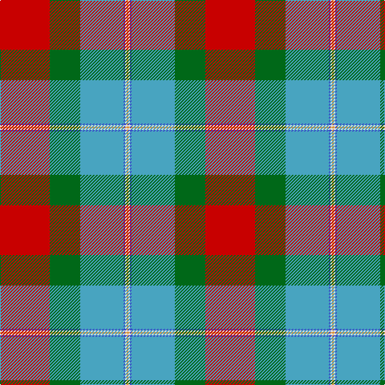

In pattern [RGYBWY](/stripes/rgybwy/).

This was sourced from tartans-authority.  It is a [6 stripe tartan](/stripes/stripes6/).

Original link http://www.tartansauthority.com/tartan-ferret/display/10438/

## Thread count
R/62 G38 Ba54 B2 LN2 O/2

## Palette
Each colour and its ΔE from the base-6 reference it is a variant of.

| Colour | Shade | Base | ΔE (OKLab) |
|---|---|---|---|
| B | <code style="background-color:#3850C8;">#3850C8</code> `#3850C8` | B <code style="background-color:#2A418A;">#2A418A</code> | 0.11 |
| Ba | <code style="background-color:#48A4C0;">#48A4C0</code> `#48A4C0` | Y <code style="background-color:#F2BF00;">#F2BF00</code> | 0.29 |
| G | <code style="background-color:#006818;">#006818</code> `#006818` | G <code style="background-color:#006100;">#006100</code> | 0.02 |
| LN | <code style="background-color:#E0E0E0;">#E0E0E0</code> `#E0E0E0` | W <code style="background-color:#F7F7F7;">#F7F7F7</code> | 0.07 |
| O | <code style="background-color:#DC943C;">#DC943C</code> `#DC943C` | Y <code style="background-color:#F2BF00;">#F2BF00</code> | 0.12 |
| R | <code style="background-color:#C80000;">#C80000</code> `#C80000` | R <code style="background-color:#CC0000;">#CC0000</code> | 0.01 |

# Sample pattern

## Nearest tartans

The nearest existing variants by ΔTartan distance.

1. [Norwegian Migration Period](/setts/s8/o30ly4dt9lb2dt1o6dt8r8~x4/) — ΔT 0.95
1. [Gordon of Abergeldie (Red..) Portrait Tartan Tartan Number: 955. Earliest known date: 1723 This sett was reconstructed from a scarf in a painting of Rachael Gordon, hanging in Abergeldie Castle, painted by Alexander in 1723. The count and colour desciption was taken by the Lord Lyon in 1953. See products available Copyright © Blair Urquhart, Comrie, 2015](/setts/s6/r20w1k1m6ly1g18~x2/) — ΔT 1.28
1. [Etienne, Paschal Tache Sir...](/setts/s8/w3o1r29o16g23db3g3ly2~x2/) — ΔT 1.33
1. [Westwood (Fashion?)](/setts/s10/r15lo30k1w6k1lo2dg16t4r6w1~x2/) — ΔT 1.35
1. [Golden Wedding (Fashion)](/setts/s8/r8lo44k32w2o52k7o7w3/) — ΔT 1.35
1. [Berger-MacLaren (Personal)](/setts/s7/lg37k12lo17r3lo17k1ly3~x2/) — ΔT 1.35
1. [Gordon of Abergeldie, (Red..)](/setts/s6/r20w1k1dp6ly1g18~x2/) — ΔT 1.38
1. [COG USA, THE](/setts/s6/lo9dg18t9r1w1db1~x4/) — ΔT 1.39
1. [Etienne Paschal Tache Sir... Canadian Tartan Tartan Number: 1877. Earliest known date: 1983 Nothing See products available Copyright © Blair Urquhart, Comrie, 2015](/setts/s8/w3dy1r29dy16g23db3g3ly2~x2/) — ΔT 1.43
1. [State Seal of New Mexico (Fashion)](/setts/s8/lb5o49lb3dg24r5lo4dy30lb4~x2/) — ΔT 1.44

## Neighbour map

Every grey dot is one of 14299 variants placed by the first two principal components of the ΔTartan feature space (44% of its variance). Red is this tartan; blue dots are its nearest — click one to open its page.

<svg viewBox="0 0 640 380" role="img" style="max-width:100%;height:auto;border:1px solid #e0e0e0;border-radius:4px;display:block" xmlns="http://www.w3.org/2000/svg"><image href="/nn/cloud.v1.png" width="640" height="380"/><a href="/setts/s8/o30ly4dt9lb2dt1o6dt8r8~x4/"><circle cx="228.7" cy="105.8" r="4" fill="#3465a4"><title>Norwegian Migration Period</title></circle></a><a href="/setts/s6/r20w1k1m6ly1g18~x2/"><circle cx="254.3" cy="132.9" r="4" fill="#3465a4"><title>Gordon of Abergeldie (Red..) Portrait Tartan Tartan Number: 955. Earliest known date: 1723 This sett was reconstructed from a scarf in a painting of Rachael Gordon, hanging in Abergeldie Castle, painted by Alexander in 1723. The count and colour desciption was taken by the Lord Lyon in 1953. See products available Copyright © Blair Urquhart, Comrie, 2015</title></circle></a><a href="/setts/s8/w3o1r29o16g23db3g3ly2~x2/"><circle cx="229.8" cy="115.4" r="4" fill="#3465a4"><title>Etienne, Paschal Tache Sir...</title></circle></a><a href="/setts/s10/r15lo30k1w6k1lo2dg16t4r6w1~x2/"><circle cx="208.8" cy="86.7" r="4" fill="#3465a4"><title>Westwood (Fashion?)</title></circle></a><a href="/setts/s8/r8lo44k32w2o52k7o7w3/"><circle cx="208.4" cy="123.7" r="4" fill="#3465a4"><title>Golden Wedding (Fashion)</title></circle></a><a href="/setts/s7/lg37k12lo17r3lo17k1ly3~x2/"><circle cx="251.4" cy="129.2" r="4" fill="#3465a4"><title>Berger-MacLaren (Personal)</title></circle></a><a href="/setts/s6/r20w1k1dp6ly1g18~x2/"><circle cx="244.2" cy="128.8" r="4" fill="#3465a4"><title>Gordon of Abergeldie, (Red..)</title></circle></a><a href="/setts/s6/lo9dg18t9r1w1db1~x4/"><circle cx="231.6" cy="147.6" r="4" fill="#3465a4"><title>COG USA, THE</title></circle></a><a href="/setts/s8/w3dy1r29dy16g23db3g3ly2~x2/"><circle cx="227.8" cy="114.8" r="4" fill="#3465a4"><title>Etienne Paschal Tache Sir... Canadian Tartan Tartan Number: 1877. Earliest known date: 1983 Nothing See products available Copyright © Blair Urquhart, Comrie, 2015</title></circle></a><a href="/setts/s8/lb5o49lb3dg24r5lo4dy30lb4~x2/"><circle cx="197.1" cy="135.7" r="4" fill="#3465a4"><title>State Seal of New Mexico (Fashion)</title></circle></a><circle cx="235.9" cy="122.9" r="5" fill="#c00000"/></svg>

ID: /setts/s6/r31g19lg27b1w1lo1~x2/
