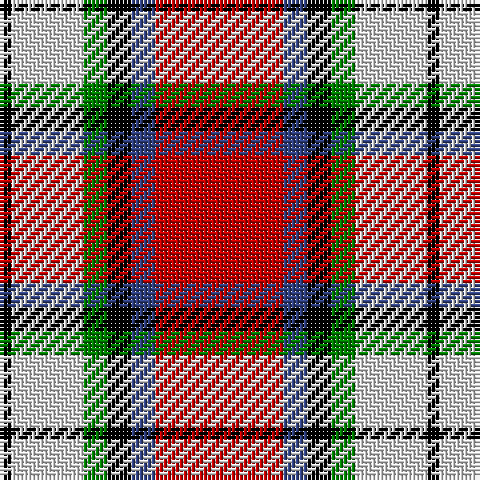

In pattern [KWGKBR](/patterns/kwgkbr/).

This was sourced from weddslist.  It is a [6 stripes tartan](/stripes/stripes6/).

Original link http://www.weddslist.com/cgi-bin/tartans/pg.pl?source=sts

## Thread count
K/3 LN18 G6 K6 B6 R/32

## Palette
Each colour and its ΔE from the base-6 reference it is a variant of.

| Colour | Shade | Base | ΔE (OKLab) |
|---|---|---|---|
| B | <code style="background-color:#304080;">#304080</code> `#304080` | B <code style="background-color:#2A418A;">#2A418A</code> | 0.02 |
| G | <code style="background-color:#008000;">#008000</code> `#008000` | G <code style="background-color:#006100;">#006100</code> | 0.10 |
| K | <code style="background-color:#000000;">#000000</code> `#000000` | K <code style="background-color:#000000;">#000000</code> | 0.00 |
| LN | <code style="background-color:#E0E0E0;">#E0E0E0</code> `#E0E0E0` | W <code style="background-color:#F7F7F7;">#F7F7F7</code> | 0.07 |
| R | <code style="background-color:#C00000;">#C00000</code> `#C00000` | R <code style="background-color:#CC0000;">#CC0000</code> | 0.03 |

# Sample pattern

## Nearest tartans

The nearest existing variants by ΔTartan distance.

1. [Rose Dress White Dress Clan Tartan Tartan Number: 1227. Earliest known date: 1930-50 This sample comes from the MacGregor-Hastie collection which forms the basis of the cloth archive of the Scottish Tartans Society. Stocked by Dalgliesh See products available Copyright © Blair Urquhart, Comrie, 2015](/setts/s6/r32b6k6g6w18k3-b2c2c80-g006818-k101010-rc80000-we0e0e0/) — ΔT 0.33
1. [Rose White Dress](/setts/s6/r96b16k16g16w52k8-b447084-g006818-k101010-r880000-wf8f4d0/) — ΔT 0.54
1. [Siddle, New (Corporate)](/setts/s5/r30b20w15wa3y3-b202060-rc80000-we0e0e0-wa98c8e8-yfccc00/) — ΔT 0.96
1. [Ballater Victoria Week](/setts/s5/b64y48k16r8w8-b780078-k101010-r888888-wfcfcfc-ye8c000/) — ΔT 0.99
1. [MacTavish](/setts/s6/w4r24b4w12k12w2-b00004c-k000000-rc80000-wd0d0d0/) — ΔT 1.08
1. [McGill University](/setts/s5/w6r48b24g16y6-b23138d-g063928-rff0000-wffffff-ycea12c/) — ΔT 1.11
1. [Hearts Football Club (Corporate)](/setts/s9/b6w24k22r8w4r4w4r48y6-b2c2c80-k101010-ra80030-we0e0e0-ye8c000/) — ΔT 1.13
1. [Glasgow](/setts/s7/g40r6ga6r30w38g6b4-b3c82af-g002814-ga808080-rdc0000-we0e0e0/) — ΔT 1.15
1. [Shiel, Claret (Dance)](/setts/s7/w16r10b20ra48w60r4ba4-b500050-ba1c0070-r880000-raa40000-wf0e0c8/) — ΔT 1.16
1. [Keeling (Corporate)](/setts/s7/y34g14y12r86k10ra12k26-g289c18-k101010-rc80000-ra888888-ye8c000/) — ΔT 1.23

## Neighbour map

Every grey dot is one of 15726 variants placed by the first two principal components of the ΔTartan feature space (44% of its variance). Red is this tartan; blue dots are its nearest — click one to open its page.

<svg viewBox="0 0 640 380" role="img" style="max-width:100%;height:auto;border:1px solid #e0e0e0;border-radius:4px;display:block" xmlns="http://www.w3.org/2000/svg"><image href="/nn/cloud.v1.png" width="640" height="380"/><a href="/setts/s6/r32b6k6g6w18k3-b2c2c80-g006818-k101010-rc80000-we0e0e0/"><circle cx="186.8" cy="159.6" r="4" fill="#3465a4"><title>Rose Dress White Dress Clan Tartan Tartan Number: 1227. Earliest known date: 1930-50 This sample comes from the MacGregor-Hastie collection which forms the basis of the cloth archive of the Scottish Tartans Society. Stocked by Dalgliesh See products available Copyright © Blair Urquhart, Comrie, 2015</title></circle></a><a href="/setts/s6/r96b16k16g16w52k8-b447084-g006818-k101010-r880000-wf8f4d0/"><circle cx="200.9" cy="154.1" r="4" fill="#3465a4"><title>Rose White Dress</title></circle></a><a href="/setts/s5/r30b20w15wa3y3-b202060-rc80000-we0e0e0-wa98c8e8-yfccc00/"><circle cx="171.2" cy="181.4" r="4" fill="#3465a4"><title>Siddle, New (Corporate)</title></circle></a><a href="/setts/s5/b64y48k16r8w8-b780078-k101010-r888888-wfcfcfc-ye8c000/"><circle cx="177.2" cy="183.7" r="4" fill="#3465a4"><title>Ballater Victoria Week</title></circle></a><a href="/setts/s6/w4r24b4w12k12w2-b00004c-k000000-rc80000-wd0d0d0/"><circle cx="185.3" cy="176.8" r="4" fill="#3465a4"><title>MacTavish</title></circle></a><a href="/setts/s5/w6r48b24g16y6-b23138d-g063928-rff0000-wffffff-ycea12c/"><circle cx="197.3" cy="185.0" r="4" fill="#3465a4"><title>McGill University</title></circle></a><a href="/setts/s9/b6w24k22r8w4r4w4r48y6-b2c2c80-k101010-ra80030-we0e0e0-ye8c000/"><circle cx="210.7" cy="128.0" r="4" fill="#3465a4"><title>Hearts Football Club (Corporate)</title></circle></a><a href="/setts/s7/g40r6ga6r30w38g6b4-b3c82af-g002814-ga808080-rdc0000-we0e0e0/"><circle cx="132.6" cy="160.2" r="4" fill="#3465a4"><title>Glasgow</title></circle></a><a href="/setts/s7/w16r10b20ra48w60r4ba4-b500050-ba1c0070-r880000-raa40000-wf0e0c8/"><circle cx="210.8" cy="134.5" r="4" fill="#3465a4"><title>Shiel, Claret (Dance)</title></circle></a><a href="/setts/s7/y34g14y12r86k10ra12k26-g289c18-k101010-rc80000-ra888888-ye8c000/"><circle cx="185.0" cy="160.2" r="4" fill="#3465a4"><title>Keeling (Corporate)</title></circle></a><circle cx="179.3" cy="158.1" r="5" fill="#c00000"/></svg>

ID: /setts/s6/r32b6k6g6w18k3-b304080-g008000-k000000-rc00000-we0e0e0/
