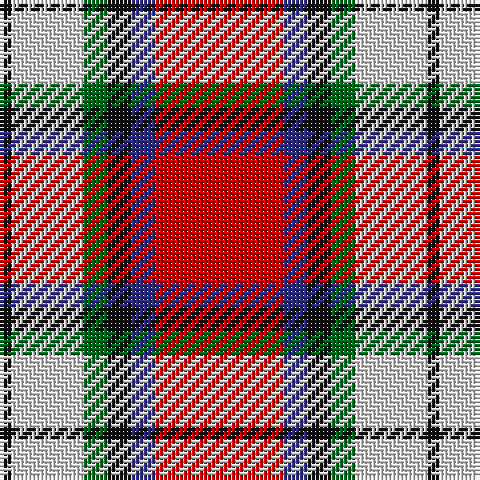

In pattern [KWGKBR](/patterns/kwgkbr/).

This was sourced from house-of-tartan.  It is a [6 stripes tartan](/stripes/stripes6/).

Original link http://www.house-of-tartan.scotland.net/house/TartanViewjs.asp?colr=Def&tnam=1227

## Thread count
K/3 LN18 G6 K6 DB6 R/32

## Palette
Each colour and its ΔE from the base-6 reference it is a variant of.

| Colour | Shade | Base | ΔE (OKLab) |
|---|---|---|---|
| DB | <code style="background-color:#2C2C80;">#2C2C80</code> `#2C2C80` | B <code style="background-color:#2A418A;">#2A418A</code> | 0.06 |
| G | <code style="background-color:#006818;">#006818</code> `#006818` | G <code style="background-color:#006100;">#006100</code> | 0.02 |
| K | <code style="background-color:#101010;">#101010</code> `#101010` | K <code style="background-color:#000000;">#000000</code> | 0.17 |
| LN | <code style="background-color:#E0E0E0;">#E0E0E0</code> `#E0E0E0` | W <code style="background-color:#F7F7F7;">#F7F7F7</code> | 0.07 |
| R | <code style="background-color:#C80000;">#C80000</code> `#C80000` | R <code style="background-color:#CC0000;">#CC0000</code> | 0.01 |

# Sample pattern

## Nearest tartans

The nearest existing variants by ΔTartan distance.

1. [Rose, White dress](/setts/s6/r32b6k6g6w18k3~b304080-g008000-k000000-rc00000-we0e0e0/) — ΔT 0.34
1. [Rose White Dress](/setts/s6/r24b4k4g4w13k2~b447084-g006818-k101010-r880000-wf8f4d0~x4/) — ΔT 0.70
1. [Siddle, New (Corporate)](/setts/s5/r30b20w15wa3y3~b202060-rc80000-we0e0e0-wa98c8e8-yfccc00/) — ΔT 0.83
1. [Ballater Victoria Week](/setts/s5/b8y6k2r1w1~b780078-k101010-r888888-wfcfcfc-ye8c000~x8/) — ΔT 0.95
1. [McGill University](/setts/s5/w3r24b12g8y3~b23138d-g063928-rff0000-wffffff-ycea12c~x2/) — ΔT 0.99
1. [Shiel, Claret (Dance)](/setts/s7/w8r5b10ra24w30r2ba2~b500050-ba1c0070-r880000-raa40000-wf0e0c8~x2/) — ΔT 1.01
1. [Hearts Football Club (Corporate)](/setts/s9/b3w12k11r4w2r2w2r24y3~b2c2c80-k101010-ra80030-we0e0e0-ye8c000~x2/) — ΔT 1.08
1. [Afternoon Tea / Apple Tea](/setts/s6/w15b8r25b72ra98y15~b4c3428-rec34c4-rac82828-we0e0e0-yf8e38c/) — ΔT 1.19
1. [MacTavish](/setts/s6/w2r12b2w6k6w1~b00004c-k000000-rc80000-wd0d0d0~x2/) — ΔT 1.19
1. [Keeling (Corporate)](/setts/s7/y17g7y6r43k5ra6k13~g289c18-k101010-rc80000-ra888888-ye8c000~x2/) — ΔT 1.22

## Neighbour map

Every grey dot is one of 15726 variants placed by the first two principal components of the ΔTartan feature space (44% of its variance). Red is this tartan; blue dots are its nearest — click one to open its page.

<svg viewBox="0 0 640 380" role="img" style="max-width:100%;height:auto;border:1px solid #e0e0e0;border-radius:4px;display:block" xmlns="http://www.w3.org/2000/svg"><image href="/nn/cloud.v1.png" width="640" height="380"/><a href="/setts/s6/r32b6k6g6w18k3~b304080-g008000-k000000-rc00000-we0e0e0/"><circle cx="179.1" cy="160.0" r="4" fill="#3465a4"><title>Rose, White dress</title></circle></a><a href="/setts/s6/r24b4k4g4w13k2~b447084-g006818-k101010-r880000-wf8f4d0~x4/"><circle cx="200.8" cy="156.1" r="4" fill="#3465a4"><title>Rose White Dress</title></circle></a><a href="/setts/s5/r30b20w15wa3y3~b202060-rc80000-we0e0e0-wa98c8e8-yfccc00/"><circle cx="170.6" cy="183.0" r="4" fill="#3465a4"><title>Siddle, New (Corporate)</title></circle></a><a href="/setts/s5/b8y6k2r1w1~b780078-k101010-r888888-wfcfcfc-ye8c000~x8/"><circle cx="176.5" cy="185.7" r="4" fill="#3465a4"><title>Ballater Victoria Week</title></circle></a><a href="/setts/s5/w3r24b12g8y3~b23138d-g063928-rff0000-wffffff-ycea12c~x2/"><circle cx="196.5" cy="187.1" r="4" fill="#3465a4"><title>McGill University</title></circle></a><a href="/setts/s7/w8r5b10ra24w30r2ba2~b500050-ba1c0070-r880000-raa40000-wf0e0c8~x2/"><circle cx="210.9" cy="136.4" r="4" fill="#3465a4"><title>Shiel, Claret (Dance)</title></circle></a><a href="/setts/s9/b3w12k11r4w2r2w2r24y3~b2c2c80-k101010-ra80030-we0e0e0-ye8c000~x2/"><circle cx="211.2" cy="129.9" r="4" fill="#3465a4"><title>Hearts Football Club (Corporate)</title></circle></a><a href="/setts/s6/w15b8r25b72ra98y15~b4c3428-rec34c4-rac82828-we0e0e0-yf8e38c/"><circle cx="220.9" cy="164.5" r="4" fill="#3465a4"><title>Afternoon Tea / Apple Tea</title></circle></a><a href="/setts/s6/w2r12b2w6k6w1~b00004c-k000000-rc80000-wd0d0d0~x2/"><circle cx="184.6" cy="179.4" r="4" fill="#3465a4"><title>MacTavish</title></circle></a><a href="/setts/s7/y17g7y6r43k5ra6k13~g289c18-k101010-rc80000-ra888888-ye8c000~x2/"><circle cx="185.0" cy="161.3" r="4" fill="#3465a4"><title>Keeling (Corporate)</title></circle></a><circle cx="186.7" cy="161.2" r="5" fill="#c00000"/></svg>

ID: /setts/s6/r32b6k6g6w18k3~b2c2c80-g006818-k101010-rc80000-we0e0e0/
