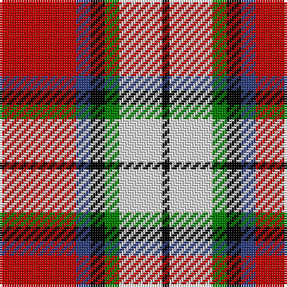

In pattern [KWGKBR](/stripes/kwgkbr/).

This was sourced from weddslist.  It is a [6 stripe tartan](/stripes/stripes6/).

Original link http://www.weddslist.com/cgi-bin/tartans/pg.pl?source=sts

## Also known as

This cloth is also recorded under:

- Rose, White dress

## Attestations

This cloth appears in 2 source records; the oldest owns this page.

- undated — Rose, White dress (weddslist, [record](http://www.weddslist.com/cgi-bin/tartans/pg.pl?source=sts))
- undated — Rose Dress White Dress Clan Tartan Tartan Number: 1227. Earliest known date: 1930-50 This sample comes from the MacGregor-Hastie collection which forms the basis of the cloth archive of the Scottish Tartans Society. Stocked by Dalgliesh See products available Copyright © Blair Urquhart, Comrie, 2015 (house-of-tartan, [record](http://www.house-of-tartan.scotland.net/house/TartanViewjs.asp?colr=Def&tnam=1227))

## Thread count
R/32 B6 K6 G6 LN18 K/3

## Palette
Each colour and the base-6 reference it is a variant of.

| Colour | Shade | Base |
|---|---|---|
| B | <code style="background-color:#304080;">#304080</code> `oklch(39.4% 0.109 270.2)` <small>#304080</small> | B <code style="background-color:#2A418A;">#2A418A</code> |
| G | <code style="background-color:#008000;">#008000</code> `oklch(52.0% 0.177 142.5)` <small>#008000</small> | G <code style="background-color:#006100;">#006100</code> |
| K | <code style="background-color:#000000;">#000000</code> `oklch(0.0% 0.000 0.0)` <small>#000000</small> | K <code style="background-color:#000000;">#000000</code> |
| LN | <code style="background-color:#E0E0E0;">#E0E0E0</code> `oklch(90.7% 0.000 89.9)` <small>#E0E0E0</small> | W <code style="background-color:#F7F7F7;">#F7F7F7</code> |
| R | <code style="background-color:#C00000;">#C00000</code> `oklch(50.7% 0.208 29.2)` <small>#C00000</small> | R <code style="background-color:#CC0000;">#CC0000</code> |

# Sample pattern

## Nearest tartans

The nearest existing variants by ΔTartan distance, with this tartan at the top so the swatches line up against it.

ΔTartan

Tartan

Sett

—

<a href="/ttd/edit/#slug=r32db6k6g6w18k3">Rose, White dress</a> <a class="nn-out" href="/setts/s6/r32db6k6g6w18k3/" title="open its dictionary page">↗</a>

0.54

<a href="/ttd/edit/#slug=r24n4k4g4w13k2~x4">Rose White Dress</a> <a class="nn-out" href="/setts/s6/r24n4k4g4w13k2~x4/" title="open its dictionary page">↗</a>

0.97

<a href="/ttd/edit/#slug=r30db20w15lb3ly3">Siddle, New (Corporate)</a> <a class="nn-out" href="/setts/s5/r30db20w15lb3ly3/" title="open its dictionary page">↗</a>

0.99

<a href="/ttd/edit/#slug=dp8ly6k2o1w1~x8">Ballater Victoria Week</a> <a class="nn-out" href="/setts/s5/dp8ly6k2o1w1~x8/" title="open its dictionary page">↗</a>

1.08

<a href="/ttd/edit/#slug=lb2r12db2lb6k6lb1">MacTavish</a> <a class="nn-out" href="/setts/s6/lb2r12db2lb6k6lb1/" title="open its dictionary page">↗</a>

1.12

<a href="/ttd/edit/#slug=w3r24db12dg8ly3~x2">McGill University</a> <a class="nn-out" href="/setts/s5/w3r24db12dg8ly3~x2/" title="open its dictionary page">↗</a>

1.13

<a href="/ttd/edit/#slug=db3w12k11r4w2r2w2r24ly3~x2">Hearts Football Club (Corporate)</a> <a class="nn-out" href="/setts/s9/db3w12k11r4w2r2w2r24ly3~x2/" title="open its dictionary page">↗</a>

1.15

<a href="/ttd/edit/#slug=dg20r3y3r15w19dg3t2~x2">Glasgow</a> <a class="nn-out" href="/setts/s7/dg20r3y3r15w19dg3t2~x2/" title="open its dictionary page">↗</a>

1.16

<a href="/ttd/edit/#slug=w8r5dp10r24w30r2db2~x2">Shiel, Claret (Dance)</a> <a class="nn-out" href="/setts/s7/w8r5dp10r24w30r2db2~x2/" title="open its dictionary page">↗</a>

1.25

<a href="/ttd/edit/#slug=w4dg20dg10r25b2r2dg2~x2">Caledonian Brewery (Corporate)</a> <a class="nn-out" href="/setts/s7/w4dg20dg10r25b2r2dg2~x2/" title="open its dictionary page">↗</a>

1.25

<a href="/ttd/edit/#slug=k23r27db3r5w3k14ly6~x2">Hoffman Texas German</a> <a class="nn-out" href="/setts/s7/k23r27db3r5w3k14ly6~x2/" title="open its dictionary page">↗</a>

## Neighbour map

Every grey dot is one of 14299 variants placed by the first two principal components of the ΔTartan feature space (44% of its variance). Red is this tartan; blue dots are its nearest — click one to open its page.

<svg viewBox="0 0 640 380" role="img" style="max-width:100%;height:auto;border:1px solid #e0e0e0;border-radius:4px;display:block" xmlns="http://www.w3.org/2000/svg"><image href="/nn/cloud.v1.png" width="640" height="380"/><a href="/setts/s6/r24n4k4g4w13k2~x4/"><circle cx="202.2" cy="151.4" r="4" fill="#3465a4"><title>Rose White Dress</title></circle></a><a href="/setts/s5/r30db20w15lb3ly3/"><circle cx="171.7" cy="178.3" r="4" fill="#3465a4"><title>Siddle, New (Corporate)</title></circle></a><a href="/setts/s5/dp8ly6k2o1w1~x8/"><circle cx="177.9" cy="180.6" r="4" fill="#3465a4"><title>Ballater Victoria Week</title></circle></a><a href="/setts/s6/lb2r12db2lb6k6lb1/"><circle cx="186.0" cy="173.3" r="4" fill="#3465a4"><title>MacTavish</title></circle></a><a href="/setts/s5/w3r24db12dg8ly3~x2/"><circle cx="197.2" cy="181.7" r="4" fill="#3465a4"><title>McGill University</title></circle></a><a href="/setts/s9/db3w12k11r4w2r2w2r24ly3~x2/"><circle cx="212.2" cy="125.3" r="4" fill="#3465a4"><title>Hearts Football Club (Corporate)</title></circle></a><a href="/setts/s7/dg20r3y3r15w19dg3t2~x2/"><circle cx="134.8" cy="157.9" r="4" fill="#3465a4"><title>Glasgow</title></circle></a><a href="/setts/s7/w8r5dp10r24w30r2db2~x2/"><circle cx="211.6" cy="130.9" r="4" fill="#3465a4"><title>Shiel, Claret (Dance)</title></circle></a><a href="/setts/s7/w4dg20dg10r25b2r2dg2~x2/"><circle cx="203.0" cy="153.8" r="4" fill="#3465a4"><title>Caledonian Brewery (Corporate)</title></circle></a><a href="/setts/s7/k23r27db3r5w3k14ly6~x2/"><circle cx="207.4" cy="173.1" r="4" fill="#3465a4"><title>Hoffman Texas German</title></circle></a><circle cx="180.3" cy="154.9" r="5" fill="#c00000"/></svg>

ID: /setts/s6/r32db6k6g6w18k3/
