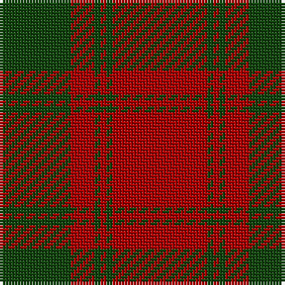

In pattern [GRGRGR](/patterns/grgrgr/).

This was sourced from weddslist.  It is a [6 stripes tartan](/stripes/stripes6/).

Original link http://www.weddslist.com/cgi-bin/tartans/pg.pl?source=tinsel

## Attestations

This cloth appears in 2 source records; the oldest owns this page.

- undated — MacQuarie (weddslist, [record](http://www.weddslist.com/cgi-bin/tartans/pg.pl?source=tinsel))
- undated — MacQuarie (weddslist, [record](http://www.weddslist.com/cgi-bin/tartans/pg.pl?source=x))

## Thread count
DG/24 DR8 DG2 DR2 DG2 DR/32

## Palette
Each colour and its ΔE from the base-6 reference it is a variant of.

| Colour | Shade | Base | ΔE (OKLab) |
|---|---|---|---|
| DG | <code style="background-color:#11450D;">#11450D</code> `#11450D` | G <code style="background-color:#006400;">#006400</code> | 0.10 |
| DR | <code style="background-color:#AA0000;">#AA0000</code> `#AA0000` | R <code style="background-color:#C80000;">#C80000</code> | 0.06 |

# Sample pattern

## Nearest tartans

The nearest existing variants by ΔTartan distance.

1. [MacQuarrie 7](/setts/s6/r32g2r2g2r8g24-g004010-rc00000/) — ΔT 0.91
1. [Cameron](/setts/s6/r4g12r4g12r32y2-g11450d-raa0000-yaaaa00/) — ΔT 0.96
1. [MacQuarrie #5](/setts/s6/r64g4r4g4r16g48-g006818-rc80000/) — ΔT 1.00
1. [Cameron Clan D](/setts/s6/r2g12r2g12r30y2-g11450d-raa0000-yaaaa00/) — ΔT 1.03
1. [MacQuarrie](/setts/s6/r32g2r2g2r8g24-g004c00-rc80000/) — ΔT 1.04
1. [Erskine](/setts/s6/g12r2g48r56g2r8-g11450d-raa0000/) — ΔT 1.18
1. [MacQuarrie Clan Tartan Tartan Number: 892. Earliest known date: 1886 J. Grant's version of the MacQuarrie tartan is the one used today and illustrated in Bain's pocketbook. The earliest reference to a related MacQuarrie sett appears in the Cockburn Collection (c.1815). D C Stewart says, "The MacQuarrie tartan now most often used is related to the red MacDonald...". MacQuarrie's were followers of the Lords of the Isles and held lands on the Isle of Mull. The chiefship today is vacant. See products available Copyright © Blair Urquhart, Comrie, 2015](/setts/s6/r32g2r2g2r8g24-g003820-rc80000/) — ΔT 1.25
1. [Erskine (Vestiarium Scoticum)](/setts/s6/g12r2g48r56g2r8-g00643c-rc80000/) — ΔT 1.42
1. [Monica](/setts/s6/r12ra40r12ra16r80w4-r8c0000-ra8c8c8c-wc8c8c8/) — ΔT 1.49
1. [MacDonald Lord of the Isles](/setts/s4/r76g4r10g32-g11450d-raa0000/) — ΔT 1.51

## Neighbour map

Every grey dot is one of 15726 variants placed by the first two principal components of the ΔTartan feature space (44% of its variance). Red is this tartan; blue dots are its nearest — click one to open its page.

<svg viewBox="0 0 640 380" role="img" style="max-width:100%;height:auto;border:1px solid #e0e0e0;border-radius:4px;display:block" xmlns="http://www.w3.org/2000/svg"><image href="/nn/cloud.v1.png" width="640" height="380"/><a href="/setts/s6/r32g2r2g2r8g24-g004010-rc00000/"><circle cx="456.6" cy="215.2" r="4" fill="#3465a4"><title>MacQuarrie 7</title></circle></a><a href="/setts/s6/r4g12r4g12r32y2-g11450d-raa0000-yaaaa00/"><circle cx="443.3" cy="215.3" r="4" fill="#3465a4"><title>Cameron</title></circle></a><a href="/setts/s6/r64g4r4g4r16g48-g006818-rc80000/"><circle cx="458.5" cy="214.8" r="4" fill="#3465a4"><title>MacQuarrie #5</title></circle></a><a href="/setts/s6/r2g12r2g12r30y2-g11450d-raa0000-yaaaa00/"><circle cx="422.7" cy="211.6" r="4" fill="#3465a4"><title>Cameron Clan D</title></circle></a><a href="/setts/s6/r32g2r2g2r8g24-g004c00-rc80000/"><circle cx="453.7" cy="213.0" r="4" fill="#3465a4"><title>MacQuarrie</title></circle></a><a href="/setts/s6/g12r2g48r56g2r8-g11450d-raa0000/"><circle cx="462.4" cy="209.4" r="4" fill="#3465a4"><title>Erskine</title></circle></a><a href="/setts/s6/r32g2r2g2r8g24-g003820-rc80000/"><circle cx="449.2" cy="210.7" r="4" fill="#3465a4"><title>MacQuarrie Clan Tartan Tartan Number: 892. Earliest known date: 1886 J. Grant's version of the MacQuarrie tartan is the one used today and illustrated in Bain's pocketbook. The earliest reference to a related MacQuarrie sett appears in the Cockburn Collection (c.1815). D C Stewart says, &quot;The MacQuarrie tartan now most often used is related to the red MacDonald...&quot;. MacQuarrie's were followers of the Lords of the Isles and held lands on the Isle of Mull. The chiefship today is vacant. See products available Copyright © Blair Urquhart, Comrie, 2015</title></circle></a><a href="/setts/s6/g12r2g48r56g2r8-g00643c-rc80000/"><circle cx="444.9" cy="198.1" r="4" fill="#3465a4"><title>Erskine (Vestiarium Scoticum)</title></circle></a><a href="/setts/s6/r12ra40r12ra16r80w4-r8c0000-ra8c8c8c-wc8c8c8/"><circle cx="463.3" cy="198.2" r="4" fill="#3465a4"><title>Monica</title></circle></a><a href="/setts/s4/r76g4r10g32-g11450d-raa0000/"><circle cx="559.4" cy="248.9" r="4" fill="#3465a4"><title>MacDonald Lord of the Isles</title></circle></a><circle cx="481.2" cy="228.5" r="5" fill="#c00000"/></svg>

ID: /setts/s6/r32g2r2g2r8g24-g11450d-raa0000/
