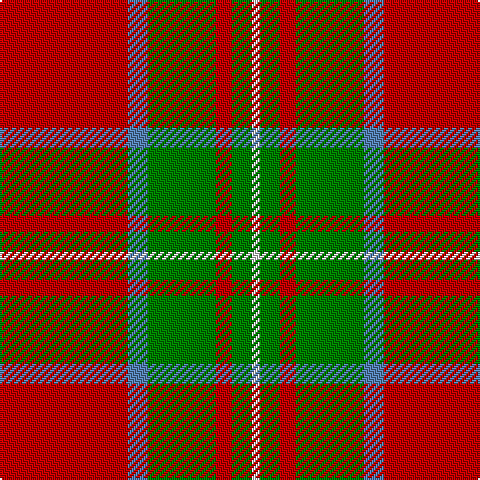

This page is one **sett** — a single exact thread-count. It belongs to the [tartan](/tartans/r32t5g17r4g5w2/)
(the same proportion at any scale), whose colour order is pattern [RBGRGW](/stripes/rbgrgw/).

Sourced from weddslist.  It is a [6 stripe tartan](/stripes/stripes6/).

Original link http://www.weddslist.com/cgi-bin/tartans/pg.pl?source=sts

## Thread count
R/64 B10 G34 R8 G10 LN/4

## Palette

Palette: <strong>Tartan Dictionary</strong> <small style="color:#888">(1 of 4 colours)</small>
<table><thead><tr><th>Colour</th><th>Threads</th><th>Shade</th><th>Base</th><th>OKLCh</th></tr></thead><tbody><tr><td>R/</td><td style="text-align:right;font-variant-numeric:tabular-nums">64</td><td><code style="background-color:#C00000;">#C00000</code> <small style="color:#888">#C00000</small></td><td>R <code style="background-color:#CC0000;">#CC0000</code></td><td><small style="color:#888">oklch(50.7% 0.208 29.2)</small></td></tr><tr><td>B</td><td style="text-align:right;font-variant-numeric:tabular-nums">10</td><td><code style="background-color:#5480B0;">#5480B0</code> <small style="color:#888">#5480B0</small></td><td>B <code style="background-color:#2A418A;">#2A418A</code></td><td><small style="color:#888">oklch(58.8% 0.089 251.5)</small></td></tr><tr><td>G</td><td style="text-align:right;font-variant-numeric:tabular-nums">34</td><td><code style="background-color:#008000;">#008000</code> <small style="color:#888">#008000</small></td><td>G <code style="background-color:#006100;">#006100</code></td><td><small style="color:#888">oklch(52.0% 0.177 142.5)</small></td></tr><tr><td>R</td><td style="text-align:right;font-variant-numeric:tabular-nums">8</td><td><code style="background-color:#C00000;">#C00000</code> <small style="color:#888">#C00000</small></td><td>R <code style="background-color:#CC0000;">#CC0000</code></td><td><small style="color:#888">oklch(50.7% 0.208 29.2)</small></td></tr><tr><td>G</td><td style="text-align:right;font-variant-numeric:tabular-nums">10</td><td><code style="background-color:#008000;">#008000</code> <small style="color:#888">#008000</small></td><td>G <code style="background-color:#006100;">#006100</code></td><td><small style="color:#888">oklch(52.0% 0.177 142.5)</small></td></tr><tr><td>LN/</td><td style="text-align:right;font-variant-numeric:tabular-nums">4</td><td><code style="background-color:#E0E0E0;">#E0E0E0</code> <small style="color:#888">#E0E0E0</small></td><td>W <code style="background-color:#F7F7F7;">#F7F7F7</code></td><td><small style="color:#888">oklch(90.7% 0.000 89.9)</small></td></tr></tbody></table>

# Sample pattern

## Nearest tartans

The nearest existing variants by ΔTartan distance, with this tartan at the top so the swatches line up against it.

ΔTartan

Tartan

Sett

—

<a href="/ttd/edit/#slug=r32t5g17r4g5w2~x2">Wilson's, No 5</a> <a class="nn-out" href="/setts/s6/r32t5g17r4g5w2~x2/" title="open its dictionary page">↗</a>

0.63

<a href="/ttd/edit/#slug=k2r16g6r3g8lb1~x2">MacAulay</a> <a class="nn-out" href="/setts/s6/k2r16g6r3g8lb1~x2/" title="open its dictionary page">↗</a>

0.65

<a href="/ttd/edit/#slug=k2r16g6r3g8w1~x4">MacAulay (Clan)</a> <a class="nn-out" href="/setts/s6/k2r16g6r3g8w1~x4/" title="open its dictionary page">↗</a>

0.77

<a href="/ttd/edit/#slug=r2g6ly1g6r3g2r16db1~x4">Burnett</a> <a class="nn-out" href="/setts/s8/r2g6ly1g6r3g2r16db1~x4/" title="open its dictionary page">↗</a>

0.79

<a href="/ttd/edit/#slug=r3g16r4k6r28g2lo3~x2">McInally (Name)</a> <a class="nn-out" href="/setts/s7/r3g16r4k6r28g2lo3~x2/" title="open its dictionary page">↗</a>

0.82

<a href="/ttd/edit/#slug=r2g6ly1g6r3g2r16t1~x4">Burnett of Leys Family Tartan Tartan Number: 2355. Earliest known date: Unknown In Scottish Tartan Society Files but source unknown. At present woven by Lochcarron. The entry in the Lyon Court Books does not define the pattern. See products available Copyright © Blair Urquhart, Comrie, 2015</a> <a class="nn-out" href="/setts/s8/r2g6ly1g6r3g2r16t1~x4/" title="open its dictionary page">↗</a>

0.90

<a href="/ttd/edit/#slug=k1g6k1g6r16db1~x2">Denny, hunting</a> <a class="nn-out" href="/setts/s6/k1g6k1g6r16db1~x2/" title="open its dictionary page">↗</a>

0.96

<a href="/ttd/edit/#slug=k2r16g6r3g8w1~x2">MacAulay</a> <a class="nn-out" href="/setts/s6/k2r16g6r3g8w1~x2/" title="open its dictionary page">↗</a>

0.97

<a href="/ttd/edit/#slug=r10g3k1g3b1~x16">Espy (Fashion?)</a> <a class="nn-out" href="/setts/s5/r10g3k1g3b1~x16/" title="open its dictionary page">↗</a>

0.98

<a href="/ttd/edit/#slug=r12db2w1db2r3g8r3db1~x2">Chisholm, The</a> <a class="nn-out" href="/setts/s8/r12db2w1db2r3g8r3db1~x2/" title="open its dictionary page">↗</a>

0.98

<a href="/ttd/edit/#slug=r35g16r5g5w2k3~x2">MacGregor</a> <a class="nn-out" href="/setts/s6/r35g16r5g5w2k3~x2/" title="open its dictionary page">↗</a>

## Neighbour map

Every grey dot is one of 14359 variants placed by the first two principal components of the ΔTartan feature space (44% of its variance). Red is this tartan; blue dots are its nearest — click one to open its page.

<svg viewBox="0 0 640 380" role="img" style="max-width:100%;height:auto;border:1px solid #e0e0e0;border-radius:4px;display:block" xmlns="http://www.w3.org/2000/svg"><image href="/nn/cloud.v1.png" width="640" height="380"/><a href="/setts/s6/k2r16g6r3g8lb1~x2/"><circle cx="334.7" cy="190.5" r="4" fill="#3465a4"><title>MacAulay</title></circle></a><a href="/setts/s6/k2r16g6r3g8w1~x4/"><circle cx="330.6" cy="188.3" r="4" fill="#3465a4"><title>MacAulay (Clan)</title></circle></a><a href="/setts/s8/r2g6ly1g6r3g2r16db1~x4/"><circle cx="370.8" cy="167.2" r="4" fill="#3465a4"><title>Burnett</title></circle></a><a href="/setts/s7/r3g16r4k6r28g2lo3~x2/"><circle cx="344.4" cy="171.9" r="4" fill="#3465a4"><title>McInally (Name)</title></circle></a><a href="/setts/s8/r2g6ly1g6r3g2r16t1~x4/"><circle cx="376.7" cy="169.0" r="4" fill="#3465a4"><title>Burnett of Leys Family Tartan Tartan Number: 2355. Earliest known date: Unknown In Scottish Tartan Society Files but source unknown. At present woven by Lochcarron. The entry in the Lyon Court Books does not define the pattern. See products available Copyright © Blair Urquhart, Comrie, 2015</title></circle></a><a href="/setts/s6/k1g6k1g6r16db1~x2/"><circle cx="322.6" cy="169.9" r="4" fill="#3465a4"><title>Denny, hunting</title></circle></a><a href="/setts/s6/k2r16g6r3g8w1~x2/"><circle cx="314.2" cy="181.7" r="4" fill="#3465a4"><title>MacAulay</title></circle></a><a href="/setts/s5/r10g3k1g3b1~x16/"><circle cx="337.3" cy="209.1" r="4" fill="#3465a4"><title>Espy (Fashion?)</title></circle></a><a href="/setts/s8/r12db2w1db2r3g8r3db1~x2/"><circle cx="323.2" cy="178.8" r="4" fill="#3465a4"><title>Chisholm, The</title></circle></a><a href="/setts/s6/r35g16r5g5w2k3~x2/"><circle cx="379.2" cy="162.1" r="4" fill="#3465a4"><title>MacGregor</title></circle></a><circle cx="351.4" cy="178.3" r="5" fill="#c00000"/></svg>

ID: /setts/s6/r32t5g17r4g5w2~x2/
